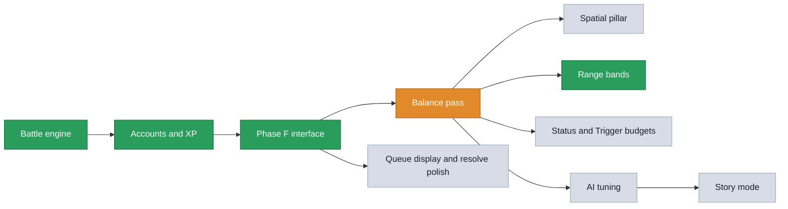

# Isekai Strategem: Current Development Status

This document tracks where the project is: what is done, what we are working on
now, and what is still to do. The detailed design of the combat rework (which is
what most of this project has been) follows in the sections below. For a plain
explanation of the whole game itself, see
[`game_design.md`](game_design.md). For how this project is run, see
[`working_agreement.md`](working_agreement.md).

## Where we are

- **Done: everything up to and including wave 1.** #1, 1b and #2 (the
  battlefield, screening, Bail Out), then wave 1's #14, 5c, #D, 3b's mechanism,
  5b, 13b, #3's rule and the two support spot-fixes. All merged to `main`, all
  playtested, #TWC on 2026-08-29.
- **Now: wave 2, part built.** Done and merged: **4b**'s diagnosis, and **#17**
  (the `attack` to `ability` rename, the Sealed recode, and the Origin Lockout
  fix). **Not started: #16** (the origin re-tag rebalance), **#15** (typed
  Trion) and **#4** itself (the economy). Every decision behind those three is
  taken and recorded in "Wave 2 decisions" below, so they are ready to build.
- **After it:** waves 3 to 7, laid out in "The waves" directly below.

Everything below is detail. The full plan is in "The waves" next; the queue is
in "The work queue"; and what each wave found is in its own section.

## The waves

The single running order. Waves are worked top to bottom, and everything inside
one wave is one branch. This table is the authority on the order; the per-item
detail (what each number is and where it stands) is in "The work queue" further
down, and the reasoning for this particular sequence is in "Why the order
changed, and what it cost". Re-sequenced on 2026-08-23 after the #3 pre-build
audit, approved by the owner as #Q1 to #Q4.

| Wave | Items | Why it sits here |
|---|---|---|
| **0** | ~~Playtest **1b** and **#2**~~ **Done** | Played through the Tests tab's eight scenarios. All eight resolved correctly; three interface defects came out of it and are fixed (see below). Landed before wave 1's two wide refactors, which is where they were much cheaper |
| **1** | ~~#14~~ ~~5c~~ ~~the duration fix (#D)~~ ~~**3b** mechanism~~ ~~**5b**~~ ~~**13b**~~ ~~the Trion drain fix~~ ~~**#3's rule only**~~ ~~two support spot-fixes~~ **wave 1 complete, merged, playtested and closed out (#TWC, 2026-08-29)** | Everything that #4 needs, plus everything that makes a playtest of #4 readable. All of it is independent of the Trion economy. Ordered inside the wave so the two widest mechanical changes land first and everything after is written against them |
| **2** | ~~**4b**~~ ~~**#17**, the rename with the Sealed recode and the Origin Lockout fix~~ **both built**. Left, in order: **#16** the origin re-tag rebalance, then **#15** typed Trion, then **#4** the economy itself. **Current priority; the three left are designed but not built.** | 4b went first and cleared the round limit (it found the long battles are accuracy, not economy). #4's decisions and everything the design pass pulled in are recorded in "Wave 2 decisions" above. Typed Trion follows the origin re-tag; its typed costs price in wave 4 |
| **3** | **1c**, 3b's new abilities and Side Effects, #4's positional traps, and **a home for Sealed** (#12D) | The content pass. It lands after the economy so every new ability is written against the Trion costs that will actually ship, on the rule this document has already recorded: the catalogue is priced once, not twice |
| **4** | **#3's pass** and **#5** | The catalogue is final here: 62 status effects, 75 active abilities, 11 reactive durations, Bail Out's attacker share. Price once. #5's acceptance test is the gate on it |
| **5** | **#6**, carrying #3's tooltip setting | Pending queue with un-queue, the resolve pause, and the squads laid out on the board itself. The tooltip duration setting moves here because it is interface work with no pricing in it |
| **6** | **#7** | AI tuning needs the final economy, the final prices, and the reactions from 3b to value |
| **7** | **#13**, then **#8** | Appendix A prose and the tutorial both want the systems to have stopped moving |

Deferred, out of the order and not in any wave: **#9** (story mode) and **#12**
(sign-in branding).

## Progress by area

```
Battle engine      ██████████ 100%   done
Accounts and XP    ██████████ 100%   live and verified
Phase F interface  ████████▒▒  85%   a couple of items left
Balance pass       █████████▒  85%   P0, initiative, range bands, screening, Bail Out
AI tuning          ▒▒▒▒▒▒▒▒▒▒   0%   not started
Story mode         ▒▒▒▒▒▒▒▒▒▒   0%   scaffold only
```

## Branches

Only these exist, and this list is the authority. Anything else named in an
older note is gone.

| Branch | What it is |
|---|---|
| `main` | The trunk, and up to date. Wave 1, the playtest batch that followed it and the wave 1 close-out are merged here. |
| `gh-pages` | The published web build. Deploy target only; never develop on it. |
| `claude/wave-2-run-4b-diagnosis-mrlfs0` | Wave 2's working branch. It carried 4b's diagnosis and the fixes from it (all merged to `main`, 2026-08-30) and now carries the wave 2 build, starting with #17's rename. Not safe to delete while wave 2 is in progress. |

`claude/tasks-3-3b-r8ceab` carried the #3 audit, the whole wave 1 build and the
wave 1 playtest batch. Every commit on it is on `main`, the local branch was
deleted on 2026-08-29, and **the remote one is now gone too**: this document
said it was still there and the owner's to delete, and `git ls-remote --heads
origin` on 2026-08-29 lists only `main` and `gh-pages`. Every other work branch
was deleted once merged.

Branch names are deliberately absent from the phase table further down: every
phase listed there is merged, so the branch it arrived on no longer exists and
naming it only invites confusion.


## Abbreviations

- **TEG**, Team Efficiency Grade: the D to SSS score for how well a squad is put
  together, with its in-battle dice effects and inverse XP.
- **FAT**, Full Arms Trigger: the burst turn that grants up to three ability uses
  instead of one.
- **SE**, Side Effect: a character's one innate, always-on trait, which the
  Loadout is built to play to. Called a "perk" until item 5c renamed it.
- **SPTV**, Status Points and Trigger Value: the two-part pricing rule from item
  #3. SP prices an effect by magnitude times duration times targets; TV prices a
  whole ability as (damage + SP) divided by Trion cost, adjusted for cooldown. SP
  is an input to TV, so they compose. Anything carrying a magnitude, a duration
  or a target count is in SPTV's scope, including reactive and trap durations.

## Status reactions: the design for item 3b

Approved in principle, not built. The problem it solves: 62 status effects
exist, six of them are unreachable, and none of them talk to each other. A
status is currently a modifier you apply and forget. Reactions turn the
catalogue into a web where applying one thing sets up another, which is where
the depth the project wants actually comes from.

Prior art worth naming: this is the elemental-reaction shape (Genshin Impact's
is the best-known), chosen because it produces combinatorial depth from a small
table rather than from more content.

### The primitive

One new data field on `StatusEffectDefinition`, evaluated in exactly two places
(`_applyDamage` and `StatusEffectEngine.apply`). No switch statements, matching
the "bag of parameters, one generic engine" shape the rest of the engine uses.

```dart
class StatusReaction {
  final DamageType? onDamageType;      // taking this damage type fires it
  final String? onStatusApplied;       // or this status landing does
  final String? becomes;               // the holder gains this
  final bool consumesTrigger;          // the reacting status is spent
  final String? alsoRemoves;           // and this one is removed too
  final double bonusDamageMultiplier;  // extra damage on the triggering hit
}
```

### The reaction table

Every entry uses statuses and damage types that already exist.

| The target is | and is hit by | Result |
|---|---|---|
| **Wet** | Cold | Becomes **Frozen**. Wet is spent. Water freezes. |
| **Wet** | Lightning | Becomes **Electrocuted** and it stacks. Wet is spent. |
| **Wet** | Fire | Wet boils off. Both cancel, no damage (Wet is already Fire-immune). |
| **Scorched** | Cold | Quenched. Both cancel, leaving **Chilled**. |
| **Scorched** | Fire | **Scorched** stacks. Already Fire-vulnerable, so this is the burn build's payoff. |
| **Chilled** | Cold | Becomes **Frozen**. Chilled is spent. |
| **Chilled** | Fire | The ice melts. Becomes **Wet**, which sets up the next Cold or Lightning hit. |
| **Frozen** | Bludgeoning or Thunder | **Shatter**: double damage on that hit, Frozen is spent. |
| **Corroded** | Acid | **Acid** lands on top, deepening the armour shred. |
| **Electrocuted** | Thunder | Arcs to one other enemy standing on the same line. |
| **Bleeding** | Slashing | **Bleeding** stacks. |
| **Poisoned** | Poison | Becomes **Sickened**. |

The Chilled-to-Wet-to-Frozen loop is deliberate: a Cold squad can cycle a target
without ever needing a second element, but it costs them a turn each time, so
the two-element team is still faster.

### Enraged, redesigned

Currently outgoing damage x1.5 and Defense -3, and nothing applies it. It gains
two clauses that make it a real decision rather than a stat swap:

- **Immune to Psychic damage** while it lasts.
- **All of the holder's targeting is chosen at random** while it lasts.

So enraging your own character is a gamble you take for the damage and the
psychic immunity, and enraging an enemy is a control tool that blunts their aim
at the cost of making them hit harder. It is also the first real answer to a
psychic-heavy squad, which currently has none.

### Homes for the five remaining orphans

| Status | Gets applied by | Why there |
|---|---|---|
| **Wet** | A new Mid Range ranged area attack, one enemy line | Soaking a whole line is the setup half of every reaction above, and hitting three targets is worth an action under #5's test. |
| **Enraged** | A Close Range melee taunt (on an enemy) and a psychic self-buff | Both readings of the status get a home, and the melee version gives a front-liner something to do that is not damage. |
| **Adrenaline Rush** | A **Side Effect**, granted on dropping below half health | Passive, so it never has to justify an action, which sidesteps the problem #5 exists to fix. |
| **Battle Trance** | An ally-targeted support ability | FAT Chance +20 on an ally sets up next turn's burst, and it matters far more now that the squad may only cash in one FAT per turn. |
| **Radiant Blessing** | An ally-targeted Mid Range ward | Heal over time plus 10% damage reduction is the support's staple, and it now clamps to the base maximum. |

### Content to redesign around reactions, by subcategory

- **Melee / Close**: a taunt that applies Enraged; a shatter finisher that
  reads Frozen.
- **Ranged / Mid, area**: the Wet applier; a Thunder burst that arcs off
  Electrocuted.
- **Ranged / Long**: a Cold shot that is ordinary alone and freezes a Wet
  target, so a sniper wants a soaker on the squad.
- **Psychic**: abilities that check whether the target already carries a
  status, rewarding setup rather than opening with them.
- **Burst**: the last hit of a burst applies the reaction, so spending the whole
  burst on one target is rewarded.
- **Traps and counters**: a trap that arms a reaction rather than damage, firing
  when the enemy takes a matching damage type. The reactive engine already
  supports conditional firing.
- **Side Effects**: one that makes the holder immune to a chosen reaction; one
  that lets their damage type count as two for reaction purposes.

### Sequencing and pricing

The mechanism and the reaction table belong with **#3**, because SPTV has to
price them: a status that sets up a reaction is worth more Status Points than
one that does not, and a stacking status is worth more again. The new abilities
and Side Effects are a content pass and should land after **#4**, alongside 1c
(pull and push), so the whole catalogue is priced once rather than twice.


## Wave 1 playtest: the interface batch

The owner played all five Tests tab scenarios on 2026-08-27 and filed ten
findings. Wave 1's mechanisms came through: buffs feel worth their action, the
bleed stacked and applied correctly, the freeze chain ran, and the one-turn
lock cost a turn. Everything below is interface, with two exceptions that
turned out to be real engine bugs hiding behind interface complaints.

**Verdicts.** Lock: "works correctly", retired. Bleed: "passed in terms of
stacking and application". Freeze: "did work correctly (I think)". Buff: the
buffs are worth their cost, but the targeting was wrong. Duration: blocked,
could not be cast on the intended target. Buff, Bleed, Freeze and Duration all
stayed in the tab, because each had something new to look at since it was
played.

### The re-play, and the end of wave 1

The owner re-played those four on **2026-08-29** and returned **#TWC**: every
scenario in the tab was played and behaved. The judgement half came with it,
which is the half the script runner cannot answer and the reason Buff was
written in the first place: "feel good".

All four are retired, so **the Tests tab is empty** and shows its "Nothing
waiting" panel. That is the finished state of a testing round, not a gap:
wave 2 writes the next scenarios as its rules land.

**The scripts keep running.** Retiring takes a case out of the tab because a
person has confirmed it; it does not take the board out of the regression net.
`scenario_script_test.dart` plays every scenario that carries a script, retired
or not, which matters most from here: wave 2 re-prices the economy underneath
all four of these boards, and a runner that went quiet the day a case was
confirmed would go quiet exactly when it starts earning its keep.

### Fixed

| # | What was reported | What it was, and what was done |
|---|---|---|
| P1 | "Aegis's description is completely wrong. It's not an attack. It doesn't hit all 3 at once, it applies to allies in the same position." | The opening clause was written off the attack subtype alone, so every area ability called itself an attack that hits "all 3 targets at once" whoever it was aimed at. It is built from three facts now (aimed at yourself, an ally or an enemy; attack or ability; single, line or burst), and a status rider is attributed to whoever actually receives it. `describe_trigger_test` walks the whole catalogue, Black Triggers included. `game_design.md`'s AOE bullet carried the same wrong claim and was corrected. |
| P2 | "An ability should only ever show possible targets for target selection. War Chant should not highlight Mireille, and the queue should not show her either." | The root cause of three separate reports. An area ability auto-selected every target it could reach across every line, while the engine has always narrowed it to whichever line the first target stood on. The picker aims at a **line** now: tap anyone on it and everyone legal there lights up together, capped at what the ability holds. Highlight, queue and resolution read the same rule. |
| P3 | "Sometimes the golden pulse does not show. From Middle with Mireille, Longshot did not highlight Nadia but Frag Grenade did." | Both are Long Range and reach identically; reach was never the difference. The pulse marked **selected** targets only, and the area ability auto-selected while the single-target one waited for a tap. Reachability has its own mark now: a steady gold ring means the ability can be aimed here, the pulse means it has been. Static for what is on offer, motion for what is chosen. |
| P4 | "Buffs used on self/allies should auto apply, not roll die. 'Rurik Voss (1 hit) [Guarded, Braced] -> HP 100' should not read as a hit." | Half interface, half a real bug. The roll was made against the recipient's own Defense and then overridden to a hit, which fixed the answer and left everything the pipeline does on the way there still done: casting a buff burned the ally's once-per-battle Decoy charge, spent First Blood on a full-health teammate, and consumed a Reckoning that should have wrecked the caster's next real attack. A friendly ability skips the attack pipeline entirely now. It rolls nothing, so `attackRolls` is empty, the log counts no hits, and the line reads "Kaito Reyes uses War Chant on Rurik Voss [Empowered x1] -> HP 100". |
| P5 | "'Bleeding builds into Bleeding.' What is Bleeding into Bleeding? How is that a reaction?" | Three of 3b's rows feed a status into itself, and naming both ends says nothing. It reads "the Bleeding builds by one (now Bleeding x2)". |
| P6 | "Mention the number of stacks: [Chilled] should be [Chilled x1]." | Every applied effect in the log and the report carries the stacks the target ended up with, reported by the engine (`TargetHitResult.statusEffectStacks`) rather than guessed at. An ability applying the same effect on several strikes is named once with the pile it ended with, instead of once per strike. |
| P7 | "Some elements do not make it into the report, like the reactions." | They did not: nothing in `report.dart` wrote them, so a chain that visibly fired on screen read in the report as damage from nowhere. Reactions are in, and the sentence has one home (`LogReaction.sentence`) that the log widget and the report both read. Two more found while there: a recall was reprinted once per action in the turn, and a turn whose only event was a Bail Out window closing printed nothing at all. A bent shot is marked. |
| P8 | "Why is there still one stack of Chilled after the log said Chilled turned to Frozen? The whole thing is unclear." | Both were true and nothing said they were about different chills. A reaction fires on what the target walked in carrying; the ability's own rider lands afterwards, so Frost Lance (Cold, applies Chilled) spends the old chill on a Frozen and lays a fresh one on top. The line says "was **already** Chilled", and adds ", and the same attack applies Chilled again (Chilled x1)". |
| P9 | "When a battle is complete, clicking portraits or abilities does not display the description panel." | The panel lived in the else-branch of `if (session.isOver)` alongside End Turn and the queued strip, so the outcome banner swapped all three out while the portraits and slots stayed tappable and went on setting a selection nothing was left to draw. The panel outlives the battle now, under the banner, without the live-turn controls. |
| P10 | The `#TWC` / `#TF` shorthand, and one-word test names. | Written into `working_agreement.md` on `main` (commit `4fd7d7e`). All fourteen scenarios renamed: Buff, Bleed, Freeze, Lock, Duration, Board, Screen, Body, Bend, Window, Targeting, Refuse, Mirror, Last. Ids untouched, so nothing that keys off a scenario moved; what each is for still reads in full in its `goal`. |

### Decided

**#G, statuses on a Bailing Out body.** Asked: can a Bleeding destroy a Trion
body, should it, or should statuses be removed on bail out? It could not, and
nothing said so: a body sits at 0 health and `Battle.startTurn` only ticks the
living, so a Bleeding on a bailing body was a badge that could never fire.
**The owner chose to remove them.** The window already cleared armed reactive
effects because a wreck does not parry; a wreck does not bleed either. What is
left on the board is a screening obstacle with a Trion value, not a fighter. A
damage-over-time landed before the drop cannot deny the Salvage; only somebody
spending an action on the body can. A character who **refuses to bail** keeps
everything, because they are standing and still fighting. `game_design.md`
section 21 records the rule.

### Built after the proposal

**#F, status badge legibility. Built.** The owner picked **A + B + C** off the
proposal below and asked for **D on tap**, so a badge opens into its named pill
rather than being one permanently. The 19x19 square is unchanged in size and now
carries four facts and **no text at all**: a role glyph, a valence colour, up to
three stack pips over a dim track, and a duration rule that shortens over a
track and turns amber on the last turn. Tapping it opens the pill (glyph, name,
count, turns) *and* still shows the full description, so the tap costs the
player nothing it used to give them; tapping again closes it. The guide's Status
Effects tab draws the same glyphs and colours, which is where the vocabulary is
learned.

The classification lives in the engine (`StatusRole`, `StatusValence`, derived
on `StatusEffectDefinition`) and is read off declared fields, never a list:
sixteen roles, all of them populated, and a valence that is **counted** rather
than looked up. An effect whose signals all help is helpful, all hurt is
harmful, and one carrying both is neutral, which is the answer rather than a
shrug: Enraged buys damage and Psychic immunity at the cost of aiming, and the
Vow of the Duel buys damage at the cost of being unhealable. 14 helpful, 42
harmful, 6 neutral. `status_role_test` pins the whole classification so a wave 4
re-tune that moves an effect between roles shows up in the diff.

**Found while there, and then fixed.** The guide's Status Effects tab ran on a
hand-written map of 49 entries (`flavor_text.dart`) with its own durations and
effect text, beside a catalogue of 62. Deferred at first on the grounds that it
rewrote player-facing copy for 50 entries; that turned out to be a reason to
check the rewrite rather than to put it off, and checking it found the gap was
worse than a count. Thirteen effects were missing outright, and four of the
forty-nine that were there said something untrue:

| The guide said | The game does |
|---|---|
| Empowered lasts 2 turns | 3 |
| Electrocuted deals a flat 3 | rolls 1d4 |
| Enraged: "+50% outgoing damage, -3 Defense" | that, plus the Psychic immunity and the random targeting item 3b gave it |
| Radiant Blessing grants +10 maximum health | it does not, and deliberately: raising the ceiling let healing carry a character past it |

The tab is generated now, by the same `describeStatusEffect` the badges and
tooltips use, sorted alphabetically, with durations off the definitions. One
source of truth, so a wave 4 re-tune updates the guide for free.

Comparing all 49 generated strings against the hand-written ones first found
three places the generated text was the weaker of the two, all now fixed and
all of which improve the badge tooltips as well: it said "You roll at a
disadvantage" without naming *which* rolls (so Poisoned and Threatened read
identically), it dropped the damage type from a tick, and it rounded a dice
expression to its average (`1d4` to "3", a number the dice do not promise).
`DiceExpression.label` renders `1d4`, `3d6+9` or a bare `8` for the flat case.
`guide_status_tab_test` holds the tab to the catalogue so a second copy of this
data cannot creep back in.

**Then fixed on the owner's call:** Overcharged and Choked used to draw the
"something else" glyph, because a Trion-cost multiplier was not one of the
roles. They were the only two effects whose badge said "unusual, tap it" where
it could say something specific, which is the exact failure the glyph set exists
to remove. There are **sixteen** roles now: `paysLess` and `paysMore`,
split by direction for the same reason `takesLess` and `takesMore` are, since
the colour already says which way and the glyph saying it too is the point of
encoding it twice. Both draw a hollow Trion diamond with a chevron leading away
from it, mirrored rather than flipped: pointing an up-chevron at the underside
of the diamond merged the two into one blob at ten pixels, close enough to the
glyph for losing the turn to matter. `special` is down from 8 effects to 6, and
those 6 are the ones the rule genuinely cannot read.

The proposal, kept for the two approaches not taken:

**#F, status badge legibility.** Asked for research and ideas rather than a
build, and not built. Findings, all measured rather than estimated:

- **There is no crowding problem.** Across 300 AI-vs-AI battles (42,614
  per-character samples), 99% of living characters carry three status effects
  or fewer and the most ever seen is six, in 3 samples. The 19x19 badge is
  small to solve a constraint the game does not have.
- **The badge carries no information.** All 62 statuses draw the same
  `Icons.blur_on` in the same `Palette.accent`, so a bleed killing a character
  and a ward protecting them are the same picture. That is why the two 8px
  numbers feel so important: they are the only differentiated pixels.
- **The catalogue is narrower than it looks.** The 62 effects do about
  **fourteen different things** at the time of the proposal (4 tick damage, 2 tick healing, 5 deny the
  turn, 8 step a stat down, 7 step one up, and so on, with 15 genuinely
  special), all derivable from fields the definitions already declare. So an
  icon set needs roughly fourteen glyphs, not sixty-two. By the same
  derivation, 13 effects are helpful, 39 harmful and 10 neither.

Five approaches were put to the owner, rendered at true size:
**#A** role glyph plus valence colour (same footprint, badge stops being a
placeholder); **#B** stacks as three pips rather than a digit (the cap is 3 and
the deepest pile measured is 3); **#C** duration as a depleting rule along the
bottom edge rather than a corner digit; **#D** a 64x20 named pill, "make it
bigger" done honestly now that the space is known to be there; **#E** a status
rail under the health bar with helping on one side and hurting on the other.
Recommended: **A, B and C compose into one badge the same size as today's that
carries four facts and contains no text at all**, with D and E as escalations
if a playtest of that still finds the glyphs ambiguous. The owner took A, B and
C, and folded D in as the tapped-open state rather than the resting one. **E is
not built** and is still the escalation if "who is winning the status war" turns
out to be a question players ask.

## Every ability says what it does

Item 13b did this for the 62 status effects. The 17 **unique** abilities were
the hole it left: they carried a `uniqueBehavior` and no description of it, so
Martyr's End introduced itself as "Long Range attack on up to 3 targets. Costs
10 Trion." and stopped, with the mechanic sitting in the engine, in the enum's
own doc comments, and nowhere a player could reach.

`uniqueBehaviorDescription` fills it, in the same shape as the
`reactiveDescription` map that already did this for the ten reactive counters.
Written off **what the engine does today**, not off what the enum comments
specify: several of these were designed with a choice the caster makes, and the
interface offers none of them (nothing passes `uniqueData`), so Called Shot
always zeroes Attack, Forced Choice always locks the cheapest ability, Sensory
Swap always moves the first effect it finds, and Sunder Arms picks the caster's
own loss at random. Promising a choice the player cannot make would be the same
defect in a new place, and `describe_trigger_test` holds the descriptions to it.

Found by rendering the 17 and reading them: an ability aimed at an enemy called
itself an *attack* whether or not it dealt any damage, so Mind's Eye was a
"Long Range attack" that reads a Loadout and hurts nobody. Two questions were
being answered by one flag. Whose side the target is on still decides which
line an area covers; whether the trigger carries a damage type now decides
whether the word "attack" is honest.

## Found closing out wave 1: the Levy stole a flat 20

Not from a playtest. `dart analyze` on the engine carried an unused-variable
warning in `turn_engine.dart`, and the variable turned out to be the whole
mechanic:

```dart
for (final triggerId in state.triggersUsedThisTurn) {
  // Look up trigger cost via cooldown records as a proxy - we don't
  // have direct trigger references here, so use a reasonable default.
  maxCost = max(maxCost, 20);
}
```

`game_design.md` has always said the Levy steals "the Trion from their
costliest action", and `passive_counter.dart` repeats it. The engine charged
**a flat 20 for any ability at all, and 0 if the enemy had used none**,
whatever those abilities cost. So this is a bug rather than an unpriced
first-pass value: the correct number was never a judgement call, it is the
ability's own Trion cost.

It hit both Levy callers: **Coldread**'s correct read, and **Reckoning**'s
discharge at 6 Debt.

**Fixed.** The cause was real: by the time a Levy resolves, the only thing
kept about an ability use is its id, and nothing in scope can resolve an id
back to a Trigger. So the cost is recorded as the ability is used, in
`recordAbilityUse`, which already receives the whole `ActiveTrigger`.
`CharacterBattleState.costliestTrionCostThisTurn` is reset beside
`triggersUsedThisTurn`, and the ordering that already exists in
`Battle.endTurn` (passive counters fire before character bookkeeping) keeps it
populated when the Levy reads it.

Three tests pin it: the Levy takes the dearer of two abilities rather than a
flat rate, an enemy who used nothing is levied nothing, and the cost does not
carry into the next turn. Two existing Coldread tests were setting
`triggersUsedThisTurn` by hand, which is how the flat 20 stayed invisible;
they go through `recordAbilityUse` now.

**Not playtested.** It is verified by tests only, and it changes a live
mechanic's magnitude. Wave 2 owns the Trion economy and should look at it in
play. Two things it deliberately did **not** change, both #4's to decide:
Coldread's Levy takes the costliest action across the marked enemy's whole
squad rather than the marked enemy alone, and the Levy has no cap beyond the
victim pool's contents.

## Playing the Tests tab without playing it

Every scripted scenario carries a `script` beside its prose: the same run
written as instructions a machine can execute (`scenario_script.dart`). The
runner plays **every scenario that has one, retired or not**, so confirming a
case takes it out of the tab without taking it out of the regression net. Run
it with

```
cd app && flutter test test/scenario_script_test.dart --reporter expanded
```

Each scenario is played **fifty times over fixed dice**, and every check comes
back one of three ways.

| Verdict | Means |
|---|---|
| `PASSED` | Held on every seed. Nothing to look at. |
| `DICE 29/50` | Held on some. The honest answer for anything sitting behind an attack roll or an infliction contest. |
| `FAILED` | Never held once in fifty tries, and the report prints what it saw instead. This is a real problem. |

A check whose subject is no longer on the board is **not counted** rather than
failed: how many turns are left of a buff is unanswerable once its holder has
been defeated, and the first version of this runner reported that as a bug in
item #D when the rule was working perfectly.

What this does not replace is judgement. "Does spending a turn on this buff
feel like it bought something" is not a question a runner can answer, and the
prose steps and expectations stay in the brief for a person to read.

**It found two things on its first real run.** Duration's `steps` still told
the tester the badge should read one turn after their next turn, which was
written when War Chant's Empowered lasted two turns and never updated when it
became three; the same scenario's `expectations` said three, so the brief
disagreed with itself and with the game. The step now reads its numbers out of
the catalogue, like the screening briefs already do. And the first script for
it was itself off by one, which is exactly what item #D is about: the turn you
cast on is a free remainder and spends none of the duration.

## What 4b found: long battles come from missed attacks, not the economy

Run with `dart run tool/long_battle_diagnosis.dart` in `packages/battle_engine`,
over 800 battles (200 on each of the four seeds the other pacing claims use).
It plays the same drafts against the same dice as `balance_report.dart` and
records what each battle spent its rounds doing, so the long ones can be
compared against the ordinary ones rather than guessed at. `--seeds` and
`--battles` take the same arguments; `--drop-black-trigger-actives` reproduces
the pre-4b measurement described below.

**Both of the item's named suspects are wrong, and the third possibility the
range bands introduced is wrong too.**

| Suspect | What the 800 battles say |
|---|---|
| Two sustain-heavy squads out-healing each other | **No.** Healing runs **0.02 health per round** against 34.6 damage per round, in every length bucket. Across six drafted characters a battle carries **0.2 healing abilities**. There is no healing in this game to out-heal with |
| A Trion-starved pair trading single cheap abilities | **No, and backwards.** Long battles hold **more** Trion, not less (mean pool at decision 42.1 over 20 rounds against 38.5 inside the band), take the same **1.42 abilities per turn**, and idle *less* often (4% of turns against 5%). Income per turn is flat at 24 to 25 |
| Nobody can reach anybody (screening, after 1b) | **No.** **0%** of turns, in every bucket, had nobody on the acting side able to reach any enemy with anything equipped. `stall_finder`'s finding holds up in play |

### What it actually is

Long battles are battles where the attacks miss. Everything else follows from
that.

| | 8-20 rounds | over 20 | ratio |
|---|---|---|---|
| Damage per round | 34.6 | 19.8 | **0.57x** |
| Hit rate | 52% | 40% | 0.77x |
| Turns dealing no damage at all | 44% | 57% | 1.29x |
| Longest run of no-damage turns | 3.9 | 7.8 | 2.01x |
| Matchup Attack-versus-Defense gap | +1.70 | +0.21 | 0.12x |
| Abilities used per turn | 1.42 | 1.42 | 1.00x |
| Mean Trion pool at decision | 38.5 | 42.1 | 1.09x |

Sorted by the matchup's mean accuracy gap (each squad's mean Attack against the
other's mean Defense, averaged), battle length is almost monotonic:

| Gap | Battles | Mean rounds | Over 20 rounds | Hit rate | Damage per round |
|---|---|---|---|---|---|
| -3 | 12 | 19.0 | 50% | 38% | 23.7 |
| -2 | 33 | 19.5 | 39% | 39% | 24.0 |
| -1 | 82 | 19.3 | 39% | 42% | 26.4 |
| 0 | 103 | 17.7 | 25% | 46% | 27.2 |
| +1 | 143 | 15.8 | 15% | 49% | 30.6 |
| +2 | 160 | 14.9 | 13% | 52% | 33.5 |
| +3 | 119 | 12.5 | 7% | 56% | 38.3 |
| +4 | 97 | 11.7 | 5% | 60% | 41.0 |
| +5 | 30 | 10.2 | 0% | 61% | 48.8 |
| +6 | 18 | 8.5 | 0% | 70% | 51.4 |

And it is the roster's own spread doing it, not a hidden interaction. Attack
runs 4-14 and Defense 2-12 (the P0 bounded-accuracy re-tune), and the five
Defense-type characters carry Attack 5-8 with Defense 10-12. Ranked by how much
more often a battle containing them runs past 20 rounds:

| Character | Attack | Defense | Battles | Past 20 rounds |
|---|---|---|---|---|
| Marren Osei | 5 | 12 | 241 | **1.74x** |
| Sable Whitlock | 6 | 11 | 261 | 1.42x |
| Bastian Cole | 6 | 10 | 229 | 1.35x |
| Dorian Voss | 7 | 10 | 262 | 1.34x |
| Yuki Amaral | 4 | 7 | 214 | 1.30x |
| ... | | | | |
| Kaito Reyes | 13 | 4 | 234 | 0.67x |
| Nadia Kessler | 10 | 5 | 255 | 0.62x |
| Ren Kobayashi | 12 | 4 | 227 | 0.59x |
| Dross | 11 | 5 | 238 | **0.56x** |

Two Defense-heavy squads drawn against each other sit at a gap of about -4 and
grind; two attackers sit at +6 and are over in eight rounds. That is a
**matchup**, and the long battles are the far end of a spread the roster
makes inevitable. **No Trion number will shorten them**, which is what item 4b
was sitting with #4 to find out.

### The measurement defect behind a third of the long battles

Found while instrumenting: **the simulator was under-arming every squad.** A
Loadout may satisfy the required active-ability count through its Black
Trigger, so a character's usable abilities are the Loadout's actives *plus* the
Black Trigger's own. `app/lib/src/game/draft.dart` does exactly that, and
carries a comment saying why. Four other places dropped them, and every pacing
number the project has quoted was measured with them dropped.

| | Actives only (as measured before) | With the Black Trigger's actives (as the app plays) |
|---|---|---|
| Median rounds | 15 | **14** |
| p75 | 20 | **18** |
| p90 | 26 | **23** |
| p99 | 42 | **37** |
| Worst single battle | 73 | **54** |
| Inside the 8-20 band | 73% | **77%** |
| Battles over 20 rounds | 184 of 800 | **132** |
| Battles over 30 rounds | 43 of 800 | **21** |
| Unresolved after 400 turns | 1 | **0** |

Fixed in four places, all of them now drafting the way the app's Play flow
does:

- `app/lib/src/quick_battle/quick_battle_controller.dart`. **Player-facing.**
  Quick Battle was handing its squads fewer abilities than the Loadout rule
  requires.
- `packages/battle_engine/tool/balance_report.dart`, which is where every
  pacing number in this document comes from.
- `packages/battle_engine/test/integration/full_battle_simulation_test.dart`,
  the round-robin test that asserts the 8-20 band.
- `tool/bail_out_sim.dart` and `tool/web_demo/battle_demo.dart`.

**`tool/sptv_baseline.dart` is deliberately left alone**, and gained a
`--black-trigger-actives` flag instead. Its output is the calibration input to
item #3's Status Point scale, and correcting it moves the numbers a long way:
damage per damaging use 11.8 to **17.4**, damage per Trion spent 0.63 to
**0.98**, damage taken per character-turn 5.9 to **7.4**. Re-pricing on those
is #3's wave 4 pass and the owner's approval, not a side effect of a tooling
fix. **The recorded baseline is still the run without the flag.**

### The second defect: squads that cannot deal damage

The single unresolved battle in the old measurement (400 turns, **zero attack
rolls**, both Trion pools climbing past 1,300) turned out to be six characters
each drafted with exactly one active: `refuse_to_bail`, which deals no damage.
Neither squad could ever end the fight.

The cause is `LoadoutBuilder._score`, which adds a flat 200 per matched
preferred tag against a raw damage figure of 20 to 60. `refuse_to_bail` is
self-targeted with no damage type, so it carries the `defense` tag, and a
profile that prefers that tag takes it over anything that hits. Measured over
the same 1,600 squads: **24 of them (1.5%) had no damaging active at all**, and
every one belonged to **The Turtle** (19.3% of its squads) or **The Wall**
(11.4%). Since the app drafts AI opponents with the same builder, a player
could meet an opponent that can never kill them.

The equipped-list fix removes it in practice: a Black Trigger's abilities
always include something that hits, so **0 of 800 battles** now field such a
squad. The scoring flaw underneath it is untouched, and is **AI tuning (#7)**
rather than an economy question: a profile should not be able to prefer its way
into a Loadout with no offence in it.

### What this means for #4's 30-round limit

The item's worry was that the limit would decide fights that had not been won.
Measured, it is cheap:

- **21 of 800 battles (3%)** are still running at round 30.
- Of those, the health leader at round 30 went on to win **17 (81%)**, so the
  limit would have **reversed 4** results.
- That is **0.5% of all battles** decided differently, and none of them level
  on health.

**The limit can land as specified.** What it should not be asked to do is fix
the long battles: it cuts off 3% of battles while the accuracy spread stretches
the whole upper half of the range.

### One thing left open

The measured hit rate sits **below** the opposed-d20 expectation at every gap,
by a consistent 7 to 10 points: 46% against an expected 53% at gap 0, 60%
against 70% at +4. Whatever accounts for it (status penalties, the screening
band, or the model in `balance_report.hitChance` being too simple) is not
answered here. It matters to #3's pricing, which values an infliction against
the chance the attack lands first, so it is recorded rather than fixed.

## Wave 2 decisions: the Trion economy (#4) and what it pulled in

Taken 2026-08-30 in a design pass with the owner, recorded as Signatures #1 to
#8 across that conversation. The typed-Trion idea and the misnomer sweep grew
the wave well beyond the original #4, so the whole picture is here in one place.

### The #4 economy decisions (D1 to D5)

- **D1, the Levy (A1):** it steals the Trion cost of the **costliest ability the
  enemy actually used that turn**, and it is **uncapped**. An enemy who used
  nothing is levied nothing. (The wave-1 fix already made it read the ability's
  own cost rather than a flat 20; this settles the two open questions.)
- **D3, capacity-gated FAT (B):** already the behavior and confirmed as intended,
  so nothing to build. FAT clears cooldowns and grants the extra actions, but
  those actions still cost Trion from the pool, so a thin pool cannot afford the
  burst even when it rolls. Capacity gates by affordability.
- **D4, range as a cost input (A):** build to the spec in the #4 row. Mid Range
  carries the highest cooldowns (up to 4), Long Range the highest Trion costs
  (up to 3x the Close average) on both the equip and the in-battle cost. Watch
  the sniper Capacity budget in the same pass.
- **D5, denial as a real sub-game (B):** the full version. It **splits**: wave 2
  makes the existing denial statuses (Sapped, Choked, Overcharged) pay off under
  the new economy; the sharper half, draining and stealing **typed** Trion,
  rides with typed Trion below.
- **The 30-round limit with a health tiebreak:** build as specified. 4b measured
  it at 3% of battles touched and 4 of 21 reversed, so it lands as-is.
- **The FAT cap:** one character per squad may cash in FAT per turn (from the #1
  playtest).

### Typed Trion: the D2 answer, a new feature

The "steadier income" question (D2) became a new mechanic instead of a number: a
Naruto-Arena style layer of **typed Trion** over the existing pool. The pool
still answers *how much* (tier roll plus Affinity); the tokens answer *what
kind*. Full brief (researched, with the axis comparison and sources):
<https://claude.ai/code/artifact/ac769d9b-f6fa-443b-b9cb-cd3cd0f64247>.

- **Keyed to origin** (physical / energy / afflict / mental). Chosen over attack
  type and range because origin is the only axis already written as an "energy
  type", it maps one-to-one onto Naruto-Arena's four chakra types, and it is
  orthogonal to range so it does not overload the range axis #4 already loads.
- **Signature gate:** ordinary turns run on the pool alone, so a bad roll never
  locks you out. Typed tokens are the currency of the big plays: a Black
  Trigger, a FAT extra action, an ability's signature effect.
- **Wild valve:** one token per living member per turn, banked in a shared squad
  reserve; a share rolls **Wild** (pays any origin), and the roll is biased by
  Team Affinity toward the squad's own origins. This is the fix for the type-
  screw Naruto-Arena players complain about.
- **Denial (D5)** drains and steals typed tokens.
- **Depends on the origin rebalance below.** Its typed costs are priced in wave
  4's SPTV pass like everything else.

### The origin rebalance: a re-tag, not new content

Typed Trion keyed to origin needs the origins roughly even, so all four can
anchor a build. Today the equippable actives are skewed: **physical 23, mental
21, energy 11, afflict 6**.

- **Approach (#1A): re-tag and reflavor existing abilities to ~15 per origin.**
  Not new content. Origin does not feed SPTV pricing, so a re-tag is cheap and,
  crucially, **un-gated from the wave-3 content pass**, which is why typed Trion
  can come back into wave 2 after it (#2A) rather than waiting for wave 3.
- **Also break the psychic-to-mental collapse.** Today all 21 psychic abilities
  are mental origin and all 21 mental are psychic, so for a psychic ability
  origin carries no information attack type does not. Give some psychic abilities
  Energy or Afflict origin and put some mental origin on non-psychic delivery, so
  origin becomes a genuinely independent axis.

### The `attack` to `ability` rename (#3A)

`attackType` / `attackSubtype` are required on every ability, but 25 of 61 deal
no damage and 10 target your own side, so a healing ward is tagged an "attack".
The wave-0 P1 fix already split "attack or ability" in the descriptions but
never renamed the field. Rename `AttackType` to `AbilityType`, `AttackSubtype`
to `AbilitySubtype`, the fields, and the doc prose; the values (melee/ranged/
psychic, single/aoe/burst/unique) stay. Mechanical, the 5c shape, no behavior
change. The **Optional** Trigger category stays as-is (#4B): it is a World
Trigger term.

### Sealed, recoded to seal an ability type (#6B)

`Sealed` zeroes Trion Affinity and FAT Chance today (and always has), but its
name and the doc intend "seal one ability type". The owner's call: the intent is
right and the code is the bug. Recode `Sealed` to block abilities of one chosen
**ability type** (the renamed axis), the way Origin Lockout blocks one origin.
This adds the ability-type lock the catalogue currently lacks. Pairs with the
rename above.

**Built 2026-08-30.** The locked type is **picked at random when the status
lands** (#9B), seeded in `StatusEffectEngine.apply` beside the way Sickened
already picks its damage types, so an explicitly passed value still wins.
**Origin Lockout was fixed in the same commit (#11A)**: it was inert, because
nothing ever wrote `lockedOrigin` outside a test, making it the only one of the
four data-driven locks missing its writer.

**Sealed still has no applier, and that is deferred to wave 3 (#12D).** Nothing
in the catalogue inflicts it, so the recode gave it teeth but not a home. The
owner first chose to home it on an existing Trigger (#10B), and the search for
one turned up a real constraint: **none of the 17 unique-behavior Triggers
declares a status**, and the unique resolution path passes a hardcoded empty
status list, so homing it there would need engine work and would break the
established pattern. Every non-unique psychic or mental Trigger already inflicts
a status, so the home would mean adding a second status to one of them, raising
that Trigger's Trigger Value: a balance change, and not one to make by eye. So
the home goes to **wave 3's content pass**, which already owns finding homes for
the remaining unreachable statuses (3b's spec names that job).

**This is a known, tracked exception to a standing design rule.** The working
agreement says every catalogued status effect must have something that applies
it. Sealed does not, and did not before this work either. It is listed here so
it is an exception on the record rather than a silent one, and wave 3 closes it.

### The status-catalogue reconciliation (#7A, folds into #13)

`game_design.md` section 12 is hand-written and has drifted from the code. A
full diff of all 62 generated descriptions against it found two tiers.

- **Tier 1, clear doc drift (about fifteen), fix the doc:** Radiant Blessing
  still promises "+10 Max Health" that was removed for the no-overheal rule;
  Origin Lockout says "category" for what is an origin; Stunned and Petrified
  also zero Team Spirit; Frozen also zeroes Trion Affinity; Necrotic Wound also
  blocks healing; Forced Repetition also pins to the line; Bleeding, Hastened,
  Slowed, Blinded and Electrocuted each drop a rider.
- **Tier 2, ten genuine forks** where doc and code describe different mechanics,
  each to be resolved with per-status diligence (definition plus git history)
  and brought as a Signature when built, since a couple may be the generator not
  rendering a reactive or unique half: **Poisoned** (doc: a damage-over-time;
  code: attack-roll disadvantage), **Charmed** (turned against own team vs
  cannot-target-the-charmer), **Prone** (easier to hit vs lose a random ability),
  **Shadow-Bound** (pinned vs lose a random ability plus attack disadvantage),
  **Overwhelmed** (takes more damage vs crit zeroed plus attack disadvantage),
  **Silenced** (no abilities vs cannot act at all), **Misfire** (action fails vs
  hits the wrong target), **Echoing Doubt** (20 backlash vs forced miss), **Vow
  of the Duel** (mutual double damage plus stun vs cannot-be-healed plus double
  damage), **Threatened** (softened up vs ranged attack disadvantage).

This is the same problem as #13 (Appendix A prose), so it folds there; the
tier-1 doc fixes are worth pulling earlier since they are simply wrong today.

### Sequencing, after all of the above

Wave 2 now carries: the #4 economy (Levy, range costs, the round limit, the FAT
cap, D5's non-token half), the origin re-tag rebalance, the `attack` to
`ability` rename with the Sealed recode, and typed Trion (after the re-tag,
priced in wave 4). Wave 3's content pass is unchanged except the origin
rebalance is not in it (it became a cheap re-tag). The status reconciliation
folds into #13.

## The work queue

Every item, with what it is and where it stands. **The numbers are names, not
an order.** They were assigned as items were raised and several of them now run
out of sequence, so the order the work is actually done in is the wave table at
the top of this document, under "The waves". Items are referred to by these
numbers everywhere else in this document.

| # | Item | State | Wave |
|---|---|---|---|
| 0 | **Pacing target: 8 to 20 rounds.** Agreed band, replacing the old 15-20 (design section 11). `tool/balance_report.dart` checks it. **Re-measured by 4b**, which found the simulator was under-arming every squad: over four seeds of 200 battles it now runs a median of 13 to 15 with 74 to 83% inside the band, p90 22 to 25 and a worst case of 35 to 54 rounds. The numbers this row carried before (median 14, 83%, p90 23) were measured on squads missing their Black Trigger's abilities. The engine's round-robin integration test asserts the same band, and drafts the same way now. | Set | - |
| 1 | **Range bands as a real battlefield.** Front/Middle/Back positions; distance to an enemy is the two positions added, to an ally subtracted; Close reaches 0-1, Mid 1-3, Long 2-4, and against an ally only the maximum applies. Reposition costs the character's action. Built: the position model and distance rules, range gating inside resolution and at queue time, Reposition with zone lock, starting positions derived from each Loadout's bands, projected position (range judged from where a queued move will put you, with un-queue taking the dependent strikes back out), area attacks catching one position, traps remembering the band and place they were laid, guard redirects needing proximity, the full-width horizontal battlefield strip (your back line on the left through to theirs on the right, with a distance ruler and the move controls in its own cells), an explicit reason on every ability that cannot be used, a distinct pulsing state for one the queued move has brought into band, plain-English status descriptions with the duration in the player's own turns, and AI positional judgement on both AI paths. Playtested by the owner and revised. | Done | - |
| **1b** | **Screening (RPP).** Effective distance to an enemy = my line's step + their line's step + the number of enemies standing on a line strictly in front of the target. (Written as "living enemies" when 1b shipped; item #2 made a dropped character's body screen too, until it is cleared or recalled.) No subtraction. Close Range widens to **0-2**, which is what makes the back line reachable once a screen is broken and, per the 4900-state survey, is what removes every unbreakable board state. Redirect-a-hit becomes a Side Effect rather than a global rule, and goes with 5c's rename rather than here. Being built now as its own item rather than waiting for #4, since the battlefield it changes is already live. Built: the distance rule and the widening (enemy-facing only, so a Close Range ward still reaches just the next line), screening threaded through every reach question, traps deliberately exempt with both of them now checking their reach, the ruler printing the screened number with a pip per screening body, a dash on empty lines, out-of-range copy that names screening and the fix, and the **bending shot** with Trion Backlash and its self-explaining log entry. The design review's decisions are recorded below. **Playtested** through the Tests tab's four screening scenarios: reading the ruler, a screen holding at distance 4, a body going on screening after its owner falls, and the bending shot with its Trion Backlash. All four resolved correctly. | Merged and playtested | 0 |
| 1c | **Pull and push.** Pull drags a target one line towards their own front (removing their screens); push shoves one line back (adding a screen in front of them). Spread across subcategories, with an **Anchored** status as the counter. Forced movement needs its own SPTV term, since moving one character changes every distance on the board. Its own item after #4. | Approved, queued | 3 |
| **2** | **Bail Out, contested.** Not a revive: the operator leaves the engagement. **Merged. Playtested by the owner once and revised** (the same character on both squads, a body reading as defeated in the text report, and the recall's grammar; all three below). Built: `BailOutState` beside health rather than replacing it (the 59 reads of `isAlive` all keep treating a bailing character as gone, and exactly two questions read the new `isOnBoard` instead); the window armed at the start of the enemy's next turn and settled at the end of it, so the turn the kill landed in never counts; Trion Salvage at 20% of base Trion Capacity on a recall and 10% to the attacker on a destruction; any landed hit of any size destroying a body, from either side; bodies screening through all five places that compute screening; damaging abilities as the only thing that may be aimed at a body; **Refuse to Bail** as a 61st Trigger and an eleventh reactive kind; the AI's floor rule for clearing bodies; and the interface (a colourless BAILING pill, the ruler's pip, three new log moments and a plain-English reactive description for all ten counters). Decisions D1 to D8 and the mid-build ones are recorded below. **Re-tested** through the Tests tab's four Bail Out scenarios: the contested window with both endings, what may be aimed at a body, Refuse to Bail (equipped and fired in the real app for the first time), and a squad's last member falling with no window. All four resolved correctly. | Merged and re-tested | 0 |
| 3b | **Status reactions.** **Mechanism, table and Enraged built in wave 1.** `StatusReaction` is a data field on `StatusEffectDefinition`, read in exactly the two places the spec named (the damage path and `StatusEffectEngine.apply`), with no switch statement naming a status anywhere. All twelve rows are on the definitions. Enraged gained Psychic immunity and random targeting. Reactions fire automatically, per decision #G. Found while building: a status ticking its own damage type fired its own reaction, so Bleeding refreshed itself forever; a tick is not a hit, and no longer counts as one. **The other half is still wave 3**, which is the abilities that apply Wet, Frozen and Electrocuted: until then the rows starting from those three cannot be reached from a Loadout. Original spec: A small data table letting statuses react to damage types and to each other (Wet plus Cold becomes Frozen, Frozen plus Bludgeoning shatters, Chilled plus Fire melts back to Wet, and so on), plus homes for the five remaining unreachable statuses and a redesigned Enraged that is immune to Psychic but targets at random. Full spec above. **Split across two waves.** The mechanism, the table and Enraged land in wave 1, because #4's trap pass already includes a reaction-armed trap and the primitive has to exist first, and because none of it depends on the economy. The new abilities and Side Effects land in wave 3 with 1c, and wave 4 prices the lot. **In design: the review asks whether a reaction has to win an infliction contest.** | In design | 1 and 3 |
| 3 | **SPTV (Status Points and Trigger Value), plus the tooltip fix.** **The rule is built, wave 1** (see the section below); the pass over the catalogue is wave 4's. Original spec: SP prices effects and feeds into the TV formula, so the two compose rather than compete; 3 damage per SP as the starting conversion. **In scope:** the 62 status effects, every Trigger's Trion cost and cooldown, and the durations on the reactive counters and traps (`armsReactiveDefaultTurns`), which are all still unpriced Phase B first-pass values. Tooltip duration becomes a 2-10 second setting under the volume slider (needs `shared_preferences`), dismissed by tapping elsewhere. **Split across two waves (#Q1).** Wave 1 builds the rule only: the SP conversion table, the measured baselines it reads, the tool that prices the catalogue from them, and the SP term in Trigger Value. Wave 4 runs the pass over the finished catalogue. The tooltip setting moves to #6, being interface work with no pricing in it. **Audited; the review is waiting on seven decisions.** | In design | 1 and 4 |
| 4 | **Trion economy.** **Decisions taken 2026-08-30 (D1 A1, D3 B, D4 A, D5 B, plus the round limit and FAT cap); full record in "Wave 2 decisions" above, which also carries the typed-Trion mechanic, the origin rebalance, the rename and the Sealed recode this item pulled in.** **Read "What 4b found" first: the round limit is cheap, and battle length is not this item's to fix.** 4b measured the 30-round limit at 3% of battles touched and 4 of 21 results reversed, so it can land as specified; it also showed the long battles are an accuracy problem, so no income number here will shorten them. **Read "Found closing out wave 1: the Levy stole a flat 20" before setting any number here**: the Levy is fixed but two questions about it are this item's (whose costliest action, and whether it caps). Also carries: a **30-round limit with a health tiebreak** (PlaySession has no round cap at all today, only the simulator does) and the FAT cap below. Screening no longer waits for this item; 1b is being built on its own. Steadier income, capacity-gated FAT, and the denial statuses becoming a real sub-game. Plus two additions agreed during the #1 playtest: **only one character per squad may cash in FAT per turn**. FAT still rolls per character per turn as now, and several may roll it; the squad claims it when one of them queues a **second** action, at which point every other character's FAT switches off. Un-queueing that second action releases the claim. The cooldown wipe stays with everyone who rolled; only the extra actions are capped; and **range becomes an input to the cost model**, with Mid Range carrying the highest cooldowns (up to 4) and Long Range the highest Trion costs, both the Loadout equip cost and the in-battle cost, up to three times the Close Range average. Each band then has an economic identity, not just a different window: Close is cheap and fast but demands you stand in the danger, Long is safe and you pay for it twice over, Mid is flexible and pays in tempo. Watch the knock-on: tripling Long Range equip costs shrinks what fits inside a Loadout's Trion Capacity, so the sniper builds may need the Capacity budget revisited in the same pass. **Also carries: more traps, designed around positional play** (see the section below). | Designed, not built | 2 |
| 4b | **Why some battles run long.** **Diagnosed. Both suspects were wrong, and the fix is not an economy number.** Neither squads out-healing each other (healing runs 0.02 health per round against 34.6 damage) nor Trion starvation (long battles hold *more* Trion and use the same 1.42 abilities per turn) explains anything. The cause is **accuracy**: a battle's length tracks the matchup's Attack-versus-Defense gap almost monotonically, from 19 rounds at gap -3 to 8.5 at +6. A third of the problem was also a **measurement defect**, now fixed: four tools and one player-facing mode dropped each character's Black Trigger abilities from the list handed to the AI. Full findings, numbers and the two defects are in "What 4b found" below. New tool: `tool/long_battle_diagnosis.dart`. | Diagnosed | 2 |
| 5 | **Support abilities do not pay for their action.** **The two interim spot-fixes are built (wave 1)**: War Chant and Guardian's Aegis are squad buffs now, priced with #3's rule, at TV 2.06 and 1.38 against 0.30 and 0.46 before. The full re-pricing is still wave 4's. See the section below. Original spec: Was "healing is too weak"; the #1 playtest showed the same problem across every buff and ward, not just heals. One action per turn, the average attack turn deals 37.3 damage, and War Chant buys 9.3, Rally Cry 11.2, Guardian's Aegis 9.3, Cleansing Ward 9. Every one is a net loss of 26 to 28 against simply attacking. Acceptance test for the fix: **on an ordinary one-action turn, a support ability must pay for its own action within its own duration.** No ability may need a FAT turn to be worth using. Re-priced in #3's wave 4 pass, which owns every magnitude and duration. The #3 audit re-derived this table and found the four are not uniformly bad: Rally Cry buys 1.05 actions, Cleansing Ward 0.80, Guardian's Aegis 0.51 and War Chant 0.25, so the work is to lift the bottom two. The bottom two get an interim spot-fix in wave 1 so the wave 2 playtests are not played with support that does nothing. | Queued | 4 |
| 5b | **Stackable statuses.** **Built, wave 1.** `maxStacks` on the definition (1 for fifty of them, 3 for the twelve), `stacks` on the instance, counted in `StatusEffectEngine.apply`. Still one instance with one duration: the stat folding and all three tick kinds multiply by the count, and the badge carries an `x2`/`x3` with the count in its tooltip. Original spec: 12 stack, capped at 3: Bleeding, Electrocuted, Regenerating and Sapped (ticks that add), and Acid, Adrenaline Rush, Battle Trance, Fatigued, Hexed, Inspired, Suppressed and Warded (flat stat steps). The other 50 refresh only. Rallied was the 13th and is now removed. Stacking has to be an explicit flag with a maximum, never the accidental default it used to be. A stackable effect is worth more Status Points, so the flags land in wave 1 ahead of the rule that reads them, and wave 4 prices them. | Approved, queued | 1 |
| 5c | **Rename perks to Side Effects (SEs).** `CharacterPerk` to `SideEffect`, the `perk` field, the charge-tracking flags, the Loadout panel copy and the abbreviation list. Mechanical and wide, so it goes in one commit of its own where it cannot hide a behaviour change. **Built, wave 1.** One commit, 34 files, no behaviour change: the class, its file, the `sideEffect` field, `sideEffectChargeUsed` and `consumeSideEffectChargeIfAvailable`, the TEG sub-score, the guide tab, the picker and log copy, the simulator's JSON keys and page, and the design document. `'perk:feint'`, the one id in a string, became `'side_effect:feint'`. | Done | 1 |
| 6 | **Last Phase F interface bits.** Show the pending queue during a turn with un-queue, and polish the resolve pause. Also carries the deferred battlefield layout: **lay the squads out on the board itself**, so each character's portrait sits in the lane column their position puts them in and moving one visibly moves them, replacing the separate diagram. Deferred out of #1 deliberately: it rewrites the squad panels, portrait selection, target picking and the tutorial's step targeting, which is the machinery every other feature sits on. | Queued | 5 |
| 7 | **AI tuning (Phase G).** Teach the AI to value counters, uniques and statuses, and to play positions once #1 lands. | Queued | 6 |
| 8 | **Tutorialize the depth.** A step-by-step tutorial introducing one system per beat. | Queued | 7 |
| 9 | Story / visual-novel mode. | Deferred | - |
| 10 | Delete the merged branches. | Done. All seven deleted; only `main` and `gh-pages` remain. | - |
| 11 | "Close" overloaded as a dialog button label. | Closed, not an issue | - |
| 12 | Google sign-in branding (needs a paid custom domain). | Deferred | - |
| 13 | **Appendix A prose, and the section-12 reconciliation (#7A).** Add human-readable descriptions alongside the generated ones, and reconcile `game_design.md` section 12 with the code: fix the ~15 tier-1 doc drifts and resolve the 10 tier-2 forks (both listed under "Wave 2 decisions" above), each fork with per-status diligence and its own Signature. | Queued | 7 |
| 14 | **Mirror matches: both squads free to pick any character.** Decided by the owner after the #2 playtest, which found that drafting the same character onto both squads silently corrupted the battle (see the section below). The stopgap forbids it; this item is the real support, so each side can field whoever they want and two Ilona Vances can fight each other. **What it takes:** a battle-scoped combatant id (`A:ilona_vance`, so the character id is still recoverable by stripping the side) replacing the character's own id as the key to everything in a battle. Audited off the live code: **33 maps and sets keyed by a character id** (`Battle.states`, `characterRegistry`, `teamTrionPools`, the TEG profile maps, both `equipped*` maps, the Loadout maps, the Death Ledger swaps, and the per-character id sets on `CharacterBattleState`), **123 reads of `.character.id`**, and 196 mentions of `characterId` across the engine and the app. Three that are not mechanical: **`_teamKeyFor` derives a team's identity by joining its sorted character ids**, so a true mirror (the same three characters both sides) hands both teams the same key and breaks the combo ledger's same-team filter, which means `Team` has to carry its own id; the **interface has to tell two identical characters apart** in the squad panels, the battle log, the target picker and the battlefield strip, which is a copy decision, not a rename; and the **draft screens then drop the cross-squad exclusion** while the engine's duplicate guard stays, re-keyed, since it still catches a genuine repeat within one squad. **Built, wave 1.** A combatant id is the squad's id and the character's joined (`player:ilona_vance`), held on `CharacterBattleState.combatantId` and defaulting to the character's own id so a battle that never needed the distinction is unchanged. The 123 reads of `.character.id` were a mechanical rename; the 42 `states[c.id]` lookups collapsed into one `Battle.statesOf(team)`, which is the thing every one of them actually wanted. `_teamKeyFor` needed nothing: scoped ids distinguish the two squads on their own. The draft screens no longer exclude the other squad, the interface names the squad only where a character is mirrored, and a ninth Tests tab scenario plays one. | Done | 1 |
| 13b | **Every ability and status explains itself.** **Built, wave 1.** All 62 statuses now describe themselves; the placeholder count went 16 to 0, checked by a test rather than by eye. Three of the five field-less ones got real declarative fields (`forcesNextAttackCriticalMiss`, `locksToSingleChosenAbility`, `sharesMagnitudeWithBoundEnemy`), which also removed the last three hardcoded status ids from the engine's own logic. The other two keep written sentences, exactly as decision #B allowed. Original spec: Raised by the owner in the #2 playtest, against Guardian's Aegis: it explains Guarded ("You take 25% less damage") and then says of Braced only "You are affected by Braced", which tells the player nothing. The cause is that `describeStatusEffect` renders some of `StatusEffectDefinition`'s fields and falls back to a placeholder for the rest, and Braced's whole effect lives in an unrendered one (`perRemainingTurnStatModifiers`, +1 Defense per remaining turn). Measured off the live catalogue: **16 of the 62 status effects hit that placeholder** (Wet, Sickened, Sapped, Reeling, Prepared, Braced, Focused, Hastened, Chilled, Origin Lockout, Interdict, Forced Critical Miss, Forced Choice, Karmic Bind, Called Shot, Mind's Eye). The standing rule is already written down in the working agreement: a status effect's description says what it does and how long it lasts in the player's own turns, never just its name. **Moved to wave 1 (#Q3).** It sat after #3 on the grounds that #3 was about to change those magnitudes, but `describeStatusEffect` renders from the definition at runtime, so a re-priced magnitude updates its own description for nothing. It is also the same audit as #3's rule: five of the sixteen set no declarative field at all, which is exactly what a field-derived price values at zero. Doing it in wave 1 makes every playtest from there on readable. | Done | 1 |
| 15 | **Typed Trion (origin-keyed).** The D2 answer: a typed-energy layer over the Trion pool, keyed to origin, with a signature gate and a wild valve. Full design and brief link under "Wave 2 decisions" above. Depends on #16 (the origin rebalance); typed costs priced in wave 4. | Designed, not built | 2 |
| 16 | **Origin rebalance (re-tag).** Re-tag and reflavor existing abilities to ~15 per origin (from physical 23 / mental 21 / energy 11 / afflict 6) and break the psychic-to-mental 1:1 collapse, so origin is an even, independent axis for #15. Not new content, does not touch SPTV pricing. Precedes #15. | Approved, queued | 2 |
| 17 | **`attack` to `ability` rename, and the Sealed recode.** **Rename built 2026-08-30**, one commit: `AttackType` to `AbilityType`, `AttackSubtype` to `AbilitySubtype`, the fields, the `AttackTypeSubtypes` extension and `lastTurnAttackType`, across **794 occurrences in 41 Dart files**; plus the web demo's two JSON keys **and** the `battle_sim.html` reader that consumes them (renaming one without the other would have broken the demo), the guide's player-facing copy, and `game_design.md`'s two taxonomy sections, which also stopped calling a subtype "how the attack lands". **No behavior change**: 1061 engine and 470 app tests pass unchanged, analyzers clean but for the pre-existing `anonKey` deprecation. **Sealed recode built 2026-08-30** as its own commit, since a behavior change does not belong in a rename. `locksAbilityTypeFromData` on the definition, read in `canUseAbility` beside the origin check, and the type **picked at random when the status lands** (#9B), seeded in `StatusEffectEngine.apply` next to the way Sickened already picks its damage types. Sealed stopped zeroing Trion Affinity and FAT Chance, so it also moved from the `statZeroed` badge role to `optionDenied`, beside Origin Lockout. **Found and fixed on the way (#11A): Origin Lockout was inert.** A Black Trigger applies it, but nothing ever wrote `lockedOrigin` outside a test, so the engine compared its lock against null and it blocked nothing; it is the only one of the four data-driven locks whose writer was missing (Prone, Forced Choice and Karmic Bind all seed theirs). Both locks now name what they shut off, and an explicitly passed value still wins. Six new tests; 1067 engine and 470 app tests pass. **Sealed's home is deferred to wave 3 (#12D)**, with the content pass that already owns finding homes for unreachable statuses; it has teeth but nothing applies it until then. | Built | 2 |

### Found in the second #2 playtest, and fixed

The owner ran the Tests tab scenarios. All eight resolved correctly. Three
things came out of it.

**Your own bailing body was painted as a corpse.** The opponent's squad panel
is `TeamPanel` / `FighterRow`, which had the pill, the softer dimming and the
no-strike-through rule. The player's own rows are a separate widget in
`play_flow_screen.dart` that read only `alive`, so a bailing character of yours
was faded to 0.4, struck through and given no badge: identical to a defeated
one, and the exact miscommunication item #2 exists to prevent. Every existing
test pumped the opponent's widget, which is why nothing saw it. Fixed, with a
test that pumps the real battle screen with a body on the player's side and
fails without the fix.

**The badge said BAILING; it now says BAILING OUT**, matching the battle log
and the design document, which both already used the full phrase.

**The damage line was unreadable.** It printed
`Damage starts from the ability's own dice: 1+6+2+3+2+6+23 = 43`, running the
dice and the ability's flat bonus together in one additive chain, so the 23
read as a seventh die. The owner asked, reasonably, what the line meant.
`DiceExpressionRollResult` now carries the die size, and the log renders two
steps instead of one: **"The ability rolls 6d6: 1+6+2+3+2+6 = 20, plus the
ability's flat +23 -> 43."** Six tests in `damage_workings_test.dart` pin it,
including one asserting the old chain cannot come back.

### The scenario briefs compute their own numbers

The "Read the board" brief shipped claiming one screening pip and distances of
3 and 5. The game correctly showed **two pips, 4 and 6**. The scenario was
right and the prose describing it was wrong, which is the worst way round: a
tester who trusts the brief reports a bug that is not there, or misses one that
is.

The cause was that a brief was hand-written prose while only some scenarios had
a matching assertion, and `read_the_board` had none. Writing the correct
numbers in would have fixed this instance and left the class of error open.

**A brief's numbers are now computed.** `steps` and `expect` are builders taking
the scenario itself, so a claim about a distance calls
`s.reachReading('rurik_voss', 'nadia_kessler')`, which computes it through
`BattleDistance`, the engine's own rule. Three tests then assert that the
scenario's arithmetic agrees with a live battle for **every pair of characters,
every screen count and every position in every scenario**, and a fourth pins
the specific numbers the playtest reported.

### #14 as built: a combatant id, and what it did not cost

The design was approved as "a battle-scoped combatant id replacing the
character's own id as the key to everything in a battle", audited at 33 maps,
123 reads of `.character.id` and 196 mentions of `characterId`. That is the
blast radius, and it turned out to be much cheaper to cross than the count
suggests, because almost none of it needed judgement.

**The id.** `CombatantIds.of(teamId, characterId)` gives `player:ilona_vance`
against `ai:ilona_vance`. The squad's own id is the prefix rather than a
separate side enum, so the two can never disagree about which squad a
combatant is on. `CharacterBattleState.combatantId` carries it and **defaults
to the character's own id**, which is what kept this affordable: 130 test
constructions and every tool harness went on working untouched, and a battle
that never needed the distinction behaves exactly as it always did.

**The 123 reads were mechanical.** Every one was `<a state>.character.id`, so
all 123 became `<a state>.combatantId` by one substitution, in the engine, the
app and both test trees. Not one needed a decision.

**The 42 lookups collapsed rather than converted.** Every `states[c.id]` was
some spelling of "give me this squad's states", written out longhand because
each site had to know how the map was keyed. `Battle.statesOf(team)` answers it
once, and `Battle.stateOf(team, characterId)` and `stateById(id)` cover the
callers that hold an id instead. `stateById` **throws** when handed a character
id both squads are fielding, rather than guessing: that is precisely the
question a character id cannot answer, and answering it either way is the
silent corruption this item exists to remove.

**Two of the three "not mechanical" problems dissolved.** `_teamKeyFor` joins
sorted ids, and scoped ids are already distinct per squad, so a true mirror no
longer hands both teams the same key and `Team` needed no new id (it had one
already). The draft screens' cross-squad exclusion was three call sites and a
helper, all deleted; the within-squad rule stays, and `Battle` still refuses
the same character twice on one squad.

**The third was real work, and small.** The interface names the squad **only
where a character is mirrored**: "Ilona Vance (yours)" against "Ilona Vance
(theirs)", computed once per battle by `combatantDisplayNames` and threaded
through the snapshots and the log. An ordinary battle reads exactly as before,
which is the point: nobody should pay for a feature they are not using.

**The boundary is where the care went.** A combatant id must never reach the
roster, which is keyed by character. `roster[]` throws on an unknown id, so a
leak is loud rather than silent, and it caught the one that got through
(Simulate mode's results table). Five sites now strip the prefix with
`CombatantIds.characterOf`, which is tolerant of a plain id and so is safe
wherever it is called.

**Verified.** 956 engine tests and 359 app tests pass, analyzers unchanged at
their 3 and 6 pre-existing warnings. Fourteen new tests in
`mirror_match_test.dart` play a **true** mirror, the same three characters on
both sides: six states not three, separate health, separate teammates,
separate statuses, separate positions, defeating one squad not the other, and
a full battle running to a conclusion. Pacing was measured either side of the
change and did not move: median 14 rounds, 80% in band, 14847 attack rolls at
a 52% hit rate, identical to the run before it. Driven in a browser on the
built web app through the new **Mirror match** scenario in the Tests tab, with
both "(yours)" and "(theirs)" on screen and no console errors.

### 5c as built: a rename that had to prove it changed nothing

A character's innate trait is a **Side Effect (SE)** now, not a perk. The word
was the only thing wrong with it: the mechanism, the once-per-battle charge and
every one of the twenty traits are untouched.

**What it touched.** 34 files. `CharacterPerk` became `SideEffect` and its file
`side_effect.dart`; `Character.perk` became `Character.sideEffect`; the
charge-tracking pair became `sideEffectChargeUsed` and
`consumeSideEffectChargeIfAvailable`; the TEG's fifth sub-score became
`sideEffectUtilization`, reading "Side Effect Utilization" on the badge; the
guide's tab, the two pickers, the loadout panel, the log's character popup and
the intel popup all say Side Effect; the simulator page and the JSON its tool
emits use `sideEffectName` and `sideEffectDescription`; and `game_design.md`'s
section 18, its TEG table and its roster table follow. The one id living in a
string, the Feint disadvantage source, went from `'perk:feint'` to
`'side_effect:feint'`.

**Why it is one commit of its own.** A wide mechanical rename is the easiest
place in a codebase to hide a behaviour change, and the only defence is a diff
where every hunk is obviously the same edit. Nothing else rides along in it.

**Verified.** 956 engine tests and 365 app tests pass unchanged, and both
analyzers sit at their pre-existing 3 and 6 warnings. No test was edited beyond
the rename itself, which is the point: the suite that passed before the rename
is the suite that passes after it. Not checked by running: the built web app,
since no rendering path changed.

### Found in the #14 playtest, and fixed

The owner played the **Mirror match** scenario on the built web app. It behaved
correctly: two Ilona Vances, two health pools, "(yours)" and "(theirs)" telling
them apart. One defect came out of it, and it is not a mirror-match defect at
all.

**The health readout was unreadable on a hurt character.** The number on the
portrait's health bar (`79/100`) sits on top of the whole bar, and the bar is
two colours at once: a bright green, amber or red fill on the left and a
near-black empty track on the right. The label was dark, so it read on the fill
and vanished into the track. The more damage a character had taken, the less
legible their health became, on both squads. Exactly backwards, and worst at
the moment the number matters most.

Fixed in `PortraitHealthBar`: the label is white with a one-pixel dark outline
drawn as four offset shadows, which is the one treatment that holds over both
halves of the bar. The treatment no longer varies with health at all. Four
tests in `app/test/health_readout_test.dart` pin it, three of which fail
without the fix. Quick Battle's own bar is unaffected: it puts its label beside
the bar rather than on it.

### Retiring a scenario once its case has been confirmed

The Tests tab was listing all nine scenarios, including the eight already
played and confirmed in wave 0 and the mirror match confirmed since. The owner
asked for it to carry only what still needs playing.

`TestScenario` gained a `retired` flag. `allScenarios` is every scenario ever
written and stays under test; `testScenarios`, which is what the tab lists, is
the unretired ones. All nine wave 0 scenarios are retired, and the tab has
carried the **two new #D scenarios** since. When it does empty it shows an
explicit **"Nothing waiting"** panel rather than an empty control, because an
empty list here is the finished state of a testing round and not a fault.

A retired scenario is kept rather than deleted for three reasons: it is still
shipped code that must stay well-formed, it is what a re-check after #4
re-prices the economy would start from, and its numbers are quoted in this
document. The tests were repointed at `allScenarios` so retiring one does not
quietly stop checking it, and two new tests assert that the tab lists exactly
the unretired set and that the empty state renders.

**All fourteen are retired as of 2026-08-29**, so the tab shows its "Nothing
waiting" panel. The script runner was repointed the same way the assertions
were, at every scenario carrying a script rather than at the live ones, for
the same reason: retiring says a person has confirmed the case, not that the
board stopped mattering. Wave 2 writes the next scenarios as its rules land.

### #D as built: one word, one meaning

**The bug it kills.** A duration counted down at the *start* of its holder's
turn, next to the damage ticks. So a 1-turn Stun put on an enemy was
decremented to zero and removed at the start of their turn, before they acted,
and did nothing whatsoever. Eleven effects carried a 1-turn default. Worse than
one broken number: a debuff of N delivered N damage ticks but only N-1
afflicted turns, while the same duration on yourself covered N of the
opponent's turns and N-1 of your own. One word meant three things.

**What changed.** The countdown moved to the **end** of the holder's turn, and
it never counts the turn the effect was applied on. Damage and heal ticks stay
at the start of the turn, untouched. `StatusEffectInstance` carries a
`skipsNextCountdown` flag, set by `StatusEffectEngine.apply` when the effect
lands on a character who is mid-turn; `CharacterBattleState.isTakingTurn` is
what tells it so, and `Battle` is the only thing that maintains it.

**A duration of N now means the holder's next N turns.** For every effect,
whoever applied it and whenever.

**The fork this ran into, and the correction.** The approved decision was to
move the countdown and compensate wards with +1, plus Illusory Double's
Untargetable 1 to 2. Tracing it against the engine turned up a second question
the decision had not seen: whether an effect counts the turn it was applied on.
Both answers fix the hostile bug identically and differ only for your own side.
Not skipping it costs wards one opponent turn (hence the approved +1) and
quietly costs self-applied heal-over-time one tick. Skipping it leaves wards
and heal-over-time exactly as they were, and instead gives self-buffs whose
value lands on your own turn one extra turn of yours. **The owner chose to
skip**, after a correction: the first description of that option said nothing
self-applied would change, which was wrong, and the self-buff gain is real. So
no ward compensation was needed, Illusory Double keeps its 1, and about ten
self-buffs (Empowered, Focused, Hastened, Prepared, Overcharged, Adrenaline
Rush, Battle Trance, Mind's Eye, Called Shot, Inspired's attack half) are one
of your turns longer than they were. #3's pass prices them under the honest
meaning rather than the broken one.

**The copy had to move with it.** `describeStatusDuration` used to warn that a
1-turn effect was gone before its holder acted again, because it was. It now
says "Lasts through your next N turns" and nothing else. The badge tooltip used
to strip the default duration back off the description **by splitting the
string on its own wording**, which stopped matching the moment the wording
changed and printed both numbers with a doubled full stop. That is a proper
`includeDuration` flag now, and a test pins that the tooltip never contains
"..".

**Verified.** 968 engine tests and 370 app tests pass; both analyzers sit at
their pre-existing 3 and 6 warnings. Eleven new tests in
`status_duration_test.dart` drive real turns through `Battle` rather than
calling the status engine directly, because the whole question is about turn
boundaries. Four of them fail against the old timing, and the other seven are
the guarantees that must not have moved: damage over time still ticks N times,
a ward still covers the same two opponent turns, self heal-over-time still
heals three times, an untimed effect still never expires, and a body on the
board does not spend turns. Pacing was re-measured after the change and did not
move: median 14 rounds, 82% of battles in the 8-20 band against 80% before,
14885 attack rolls at 51% landed. **Not checked by running:** the two new Tests
tab scenarios have not been played by a person yet, which is what they are
there for.

### 3b as built: twelve rows, no switch statement

**What it is.** `StatusReaction` is a field on `StatusEffectDefinition`, and
the whole table lives on the definitions themselves. Two places in the engine
read it: the damage path, and `StatusEffectEngine.apply`. Nothing anywhere
names a status by id in a conditional, which is the shape the rest of the
engine already uses and the reason twelve rows cost twelve entries rather than
twelve branches.

**Read before the damage, settled after.** The reacting status is usually what
decides the damage (Wet is Fire-immune, Scorched is Fire-vulnerable, Frozen
doubles the hit that breaks it), so the reactions are looked up before the
breakdown runs and applied after it. Spending the trigger first would throw
away the interaction that made the row worth writing.

**Never contested**, per decision #G. Once the status is on and the hit lands,
the reaction happens.

**Found while building, and fixed.** Bleeding ticks Slashing damage each turn,
and Slashing is what Bleeding reacts to, so the bleed set off its own reaction
and refreshed itself every turn: a bleed that never ended. A status ticking its
own damage is not somebody hitting you with that damage type, and the tick path
no longer fires reactions. A test pins it by playing turns until the bleed runs
out. There is also a re-entrancy guard on the status-triggered axis: no shipped
row can loop, but the table grows in wave 3 and a pair of statuses that each
reacted to the other would hang a battle rather than misbehave visibly.

**Enraged, redesigned.** Psychic immunity and random targeting on top of the
damage and Defense it already had. The targeting rule reads a `targetPool` the
caller passes: with nothing to choose between, the aim stands. Nothing applies
Enraged until wave 3's content pass, so no ability can inflict it yet, and
wiring the pool through the player and AI target pickers lands with the
abilities that need it.

**How much of the table is reachable today.** Five of the eight reacting
statuses can be applied by a Trigger that exists: Chilled (Frost Lance, Cryo
Burst), Scorched (Cinderburst), Corroded (Shatterpoint, Acid Spray), Bleeding
(Whirlwind Slash, Rapid Fire) and Poisoned (Venom Needle, Caustic Cloud, Venom
Spray). **Wet, Frozen and Electrocuted have no applier**, so the rows starting
from them are unreachable in play until wave 3. Frozen is reachable
*indirectly*, which is the whole point of the table: chill a target, hit them
with Cold again, and the reaction freezes them.

**The log says it.** A reaction that fires appears as its own REACTION line
under the action, always visible rather than behind the details toggle. A
player who watches a badge vanish and a number double has no other way to
connect the two.

**A reading taken, and flagged.** The table says Electrocuted hit by Thunder
"arcs to one other enemy standing on the same line". Arcs *what* was not
specified. It is built as the status spreading (one more character on the
holder's line becomes Electrocuted) rather than the damage splashing, because
the table is written in status terms throughout. Say the word if it should be
damage instead.

**Verified.** 993 engine tests and 373 app tests pass; both analyzers at their
pre-existing 3 and 6. Twenty-five new engine tests in
`status_reaction_test.dart` check every row of the table against the catalogue
rather than against a copy of it, plus the bleed that used to feed itself and
Enraged's three clauses. A new Tests tab scenario, **Freeze, then shatter**,
runs the whole chain in one turn with three characters, and an app test plays
that scenario until the dice cooperate and then holds the two reactions to the
letter. **Not checked by running:** nobody has played the scenario yet.

### 5b as built: one badge, one timer, a bigger effect

Twelve effects stack, capped at three, exactly as decision #F approved.
`StatusEffectDefinition.maxStacks` declares it (1 for the other fifty) and
`StatusEffectInstance.stacks` counts it. Re-applying still refreshes the one
instance rather than adding a second, so a character never carries two badges
for one effect or two timers running out of step. What changes is the
magnitude: the stat folding multiplies each step by the count, and all three
tick kinds (damage, heal, Trion drain) multiply too. Every one of the twelve
turned out to use only those field families, so nothing needed a special case
for a multiplier that cannot simply be multiplied.

**The badge says it.** An `x2` or `x3` in the corner opposite the duration, and
the tooltip spells out that everything the status does is multiplied by the
count. A single stack shows nothing at all, because an `x1` on every badge in
the game would mean nothing.

**Worth knowing before #3 prices this:** a burst applies a stack per strike.
Rapid Fire strikes three times, so one use can take a bleed from nothing to
the cap. That is not a bug (each strike is an application that had to win its
own infliction contest) but it does mean the cap is reachable in one action
for a burst and takes three for anything else, which is a real difference in
what a stack is worth by ability. #3's pass should price a stacking rider on a
burst differently from one on a single strike.

**Verified.** 1007 engine tests and 379 app tests pass; analyzers unchanged.
Fourteen new engine tests in `status_stacking_test.dart` pin which twelve
stack and that the other fifty do not, that a stack is one instance rather
than two, that the cap holds, that every magnitude family multiplies, and that
a single stack leaves the old numbers exactly where they were. Five app tests
cover the badge and its tooltip. A new Tests tab scenario, **A bleed that
piles up**, is waiting to be played.

### 13b as built: sixteen effects that said nothing now say what they do

**The count.** Sixteen of the 62 fell back to "You are affected by X", which
tells a player nothing they can act on. It is zero now, and a test asserts it
stays zero rather than leaving it to be spotted again in a playtest.

**Why they were mute.** Every one of them carried its whole effect in a field
`describeStatusEffect` did not read: `perRemainingTurnStatModifiers` (Braced,
Prepared, Reeling, Chilled), `damageTypeInteractions` (Wet), 
`vulnerableToRandomDamageTypesCount` (Sickened), 
`trionCapacityDrainPercentToCauser` (Sapped), `advantageRollTags` (Focused,
Hastened), `locksOriginFromData` (Origin Lockout) and
`repeatAbilityDamageMultiplier` (Interdict). All of them render now, and so do
3b's and #D's additions, so Enraged states all three of its clauses in one
sentence.

**The five with no field at all.** Decision #B said to give them real ones,
and three could have them: Forced Critical Miss became
`forcesNextAttackCriticalMiss`, Forced Choice became
`locksToSingleChosenAbility`, and Karmic Bind became
`sharesMagnitudeWithBoundEnemy`. That was worth more than the descriptions:
those three were the **last hardcoded status ids in the engine's own logic**,
and the engine now reads the fields instead of matching `'karmic_bind'` and
`'forced_critical_miss'` by name. Mind's Eye and Called Shot keep written
sentences, which is the exception #B named: what they are worth is
information, and a field saying "reveals something" would be a placeholder in
a field's clothing.

**Verified.** 1007 engine tests and 386 app tests pass; analyzers unchanged.
Seven new tests in `describe_status_test.dart`, one of which is the guard that
no effect falls back to its own name and another that only the two named
exceptions are written by hand.

### #3's rule as built: a price nothing can hand-write

**What wave 1 owns.** The rule, not the pass. `Sptv` in the engine holds the
conversion table, `SptvBaselines` in `constants.dart` holds what the rule is
priced against, `tool/sptv_price.dart` walks the whole catalogue with it, and
`tool/balance_report.dart` now calls the same rule instead of keeping its own
copy of the formula. Wave 4 runs the pass.

**The baselines, re-measured after wave 1** (`tool/sptv_baseline.dart`, 200
battles, seed 7):

| | Measured | What it prices |
|---|---|---|
| An action | **12.0** damage | Denying one (Stunned, Silenced) |
| A character-turn | **6.1** damage dealt, and taken | Every damage multiplier |
| Ability uses | **0.60** per living character-turn | Why "worth an action" is a soft bar |
| Attack rolls | **1.11** per character-turn, **50.7%** land | Every opposed stat point |
| A landed roll | **10.7** damage | What a stat point is leveraging |
| A Trion | **0.64** damage | Trion costs and drains |
| Healing | **0.02** per character-turn | Preventing it |
| A rider that hits | wins its contest **89%** | The rider factor in TV |

Two of those disagree with the review's figures and the measurement wins.
Damage per Trion is **0.64**, not the review's 1.28: that figure was derived
from income rather than measured against spend, and 0.64 is what the same 200
battles say when you divide damage landed by the Trion spent landing it.
Healing per character-turn is **0.02**, which is not a rounding error but item
#5 showing up in the data: the AI almost never spends an action healing,
because healing is a net loss against attacking. Everything priced off it
re-prices itself when #5 fixes that, which is the entire reason prices are
formulas.

**Two conversions are derived from the dice rather than measured**, because
they are properties of two d20s and not of how the game is played: one point
of an opposed stat moves the contest 4.75 percentage points, and advantage is
worth 3.8 points of flat modifier. Both are computed in code, so neither can
be a number somebody typed.

**What it says about the catalogue.** 34 of the 62 statuses price in full, 14
price at zero because every field they carry is unpriced, and the tool names
all of them rather than letting a zero read as an answer. Of the 60 abilities,
**18 are invisible to the rule**: their whole effect is a unique behaviour or a
reactive counter, neither of which has a conversion. Of the 42 it can see, the
median TV is **2.80** against the approved 2.0-3.0 band, and the SP term lifts
five abilities into band that damage alone left below it. That was the review's
own test of whether the pricing is right, and it passes.

**What is deliberately not priced**, and named in `Sptv.unpricedFields`:
`misfireChance`, `preventsTargeting`, `cannotTargetSource`,
`locksRandomAbilityEachTurn`, and 3b's `reactions`. `preventsHealing` was on
that list and is priced now, since the measurement it needed has been taken.

**Verified.** 1031 engine tests and 386 app tests pass. 22 new tests in
`sptv_test.dart` check the conversions against the dice, that a duration, a
target count and a stack each multiply, that an unpriced field is always
flagged rather than silently zero, that a price re-derives itself when a
baseline moves, and the reachability guard decision #E asked for.

### The two support spot-fixes, priced rather than guessed

**The interim fix item #5 asked for**, so wave 2's playtests are not played
with support that does nothing. The real pass is wave 4's; what makes this
different from guessing is that #3's rule now prices both, so every number
below was computed before it was typed.

**What they were worth.** War Chant **0.30** and Guardian's Aegis **0.46**
against the approved 2.0 to 3.0 band. The reason is measurable: +25% of the
6.1 damage a character deals in a turn is 1.5 a turn, and an action is worth
12.0. A self-buff at those magnitudes cannot pay for the action that casts it,
whatever its cooldown.

**The shape the owner chose (#A): make them area buffs.** Both go from self to
ally with three targets, which triples their Status Points without touching a
single magnitude. War Chant also gets Empowered 2 turns to 3, since the wider
reach alone still left it under band. Final prices: **War Chant 2.06**, in
band. **Guardian's Aegis 1.38**, still under, and deliberately.

**What "area" means here, and it is not "the squad".** An area ability catches
one line, the same for a buff as for an attack. So a chant sung over a line
with two characters on it buffs two, and a squad spread one-per-line gets one.
That is the decision the ability now asks for, and it is the same decision
Cleave and Whirlwind Slash ask of an attacker. It also means both prices
assume the full three targets, exactly as every area attack's price does: on a
spread squad both are worth less than the number says. The Tests tab scenario
puts two characters on a line and one apart, so the tester sees precisely
this.

**Why Aegis stops short, and this is the interesting part.** Dropping its
cooldown to 1 priced it at 2.07, squarely in band. It also made the round-robin
integration test's **Wall-against-Wall mirror run past 150 rounds**: a
squad-wide 25% ward every single turn out-sustains what two defensive squads
can deal, and the battle never ends. Under band and concluding beats in band
and endless, so the cooldown stays at 2. The pricing rule and the pacing target
disagreed, and the pacing target won.

**Both stay Close Range**, which was a decision rather than an oversight. For
an ally, Close reaches one line either side, so a caster on the middle line can
aim at any of the three. Moving them to Mid would have broken the catalogue's
20/20/20 split across the three bands, which a test enforces.

**The second invariant, and what it cost.** An area buff needs the area
subtype: a single-target ability resolves against one target however high its
target count reads, which is what the tests caught after the first attempt
promised three and delivered one. That took melee to 8 single and 7 area
against an authored 10 and 5. **The owner chose to rebalance rather than move
the invariant**, and the two abilities converted to single-target were picked
by the pricing rule: Whirlwind Slash at **8.17** and Cinderburst at **6.03**
were the catalogue's two worst over-band outliers, and as single-target they
price at **2.72** and **2.01**, both in band. The invariant holds and two
outliers came home in the same move. Catalogue-wide the maximum TV fell from
8.17 to **4.25** and the in-band count went from 13 to **16 of 42**.

**Found while doing it.** `PlaySession.queue` normalised the acting
character's id but not the target ids, so a caller naming a character rather
than a combatant (a test, a script) was told the target was out of range when
it was not. It only surfaced because these two stopped being self-targeted,
which is the one path that skipped the check. Fixed, and pinned.

**Pacing re-measured** after the whole change: median 15 rounds, 78% inside
the 8-20 band. Median TV across what the rule can see is 2.81.

### The seven SPTV decisions, as approved

Approved by the owner as recommended, after the review was re-read against the
re-sequenced queue. Wave 1 builds against these; the review artifact carries
the options and trade-offs behind each.

| | Decision | What was approved |
|---|---|---|
| **#A** | What one Status Point is | SP **is** damage-equivalent, at face value, with no conversion constant. Stored as formulas over a named, re-measurable baseline (an `SptvBaselines` config beside the other `*Config` classes) rather than as frozen numbers, so the rule outlives the economy #4 is about to change |
| **#B** | Where a status effect's SP comes from | Give the five field-less statuses real declarative fields, then compute every price from the fields. 13b is in the same wave and needs those fields anyway, and it removes five hardcoded-id lookups from the engine. Two written overrides remain, for `minds_eye_reveal` and `called_shot_stat_zero`, whose value is not mechanical |
| **#C** | The Trigger Value band | Keep the design director's 2.0 to 3.0. **Needed at the start of wave 2**, not wave 4: #4 cannot set costs without a target. Wave 4 verifies rather than chooses |
| **#D** | The 1-turn debuff timing | Move the countdown to the end of the holder's turn, leaving the damage and heal ticks at the start. Duration then means one thing for everyone. **Built, and the compensation clause fell away**: the build found a second question (whether an effect counts the turn it was applied on), the owner chose to skip that turn, and skipping it leaves wards and heal-over-time untouched, so no ward +1 and no Illusory Double bump were needed. What moved instead is about ten self-buffs, one of your turns longer each. See the section above |
| **#E** | The 24 unreachable statuses | Price all 62, let the reaction table home four for free, and land a reachability test naming the rest. The list is expected to empty in wave 3 |
| **#F** | Stacking | One instance carrying a stack count, one shared duration, refreshed on re-application, capped at 3. Magnitudes and SP both multiply by the count |
| **#G** | Whether a reaction is contested | No. Reactions fire automatically. A contested two-step play would come off 21% of the time, which nobody builds around |

### The Tests tab: pre-arranged boards for the wave 0 playtests

**Used, and wave 0 closed with it.** All eight scenarios were played and all
eight resolved correctly. A ninth, the mirror match, was added and confirmed
with #14. All nine are now **retired**: they stay in the code and under test,
but the tab lists only cases that still need playing (see the section above).
They are kept rather than deleted because the same cases will need re-checking
after #4 re-prices the economy, and rebuilding this each time is the expensive
way.

Built because the two outstanding playtests are for cases an ordinary battle
rarely produces. Screening only bites at a particular formation, and half of
Bail Out only happens in a one-turn window after a kill. Fishing for those
across a twenty-round match is how a playtest gets abandoned.

**Where it is.** A fourth mode tab on the Home screen beside Play, Simulate
and Guided Tutorial. It wraps to two rows of two below 560 logical pixels, so
four tabs do not crush the labels on a phone. Pick a scenario from the
dropdown, read what it is for, and start it: the battle runs in the ordinary
battle screen, because what is being tested is whether the real interface
explains the rules, and a bespoke harness would only prove the harness works.

**Wave 0's eight**, all played, all correct, all retired now:

| Scenario | Item | What it puts in front of you |
|---|---|---|
| Read the board | 1b | The ruler with an empty enemy line, a screening pip, and the same target reading a different distance from each of your lines |
| The screen holds | 1b | Two enemies in front of a third puts that third outside Close Range entirely, at distance 4 |
| A body still screens | 1b and #2 | Kill the front and the distance does not drop, because the body screens. Clear the body and it does. The one place the two items meet |
| The bending shot | 1b | A body is already down. Destroy it and a queued Long Range shot bends to reach a target that just came too close, and the squad pays Trion Backlash |
| The window: recall or destroy | #2 | One setup, both endings. Leave the body and they bank 20%; hit it and you bank 10% |
| Only damage may be aimed at a body | #2 | The target picker offers a body to a damaging ability and refuses it to Charm Whisper |
| Refuse to Bail | #2 | The one thing that has never been equipped and fired outside a test |
| The last one does not bail | #2 | A squad's final member falls with no window and no Salvage |

**Wave 1's five**, which is what the tab offers today. **None has been played
by a person:**

| Scenario | Item | What it puts in front of you |
|---|---|---|
| A one-turn lock costs a turn | #D | Silence an enemy for one turn and watch them lose the turn. Before #D a 1-turn lock expired before its victim acted and did nothing whatsoever |
| A buff you cast lasts your turns | #D | A buff reading 3 covers three of your own turns, counting from your next one, and never spends the turn you cast it on |
| Freeze, then shatter | 3b | The whole reaction chain in one turn: chill a target, freeze the chill with a second cold hit, break the ice with Thunder for double damage. Two reactions, neither of them rolled for |
| A bleed that piles up | 5b | One badge and one timer showing x2 then x3, a fourth application changing nothing, and the tick going up with the count |
| A buff worth the action | #5 | Whether a squad buff feels like it bought something, and what an area buff reaches: the line it was aimed at, not the squad |

**How they are set up.** `PlaySession.start` gained two optional parameters,
both null in ordinary play: `opponentLoadouts` pins the enemy kit instead of
letting the profile builder pick it, and `arrange` runs on the fully wired
battle immediately before the opening turn, which is the only point where
health, positions and a body already on the board can be set without the
engine having acted on them. The player always moves first and both squads
start on 120 Trion, so nothing under test is blocked by an economy #4 has not
fixed yet.

**Each scenario carries its own brief**: a goal, numbered steps, what should
happen, and a caveat where the case depends on an attack landing. The brief is
on the picker and again behind a button in the battle screen's app bar, because
a tester four turns deep should not have to go back to remember what they are
watching.

**Verified.** 31 tests in `app/test/test_scenarios_test.dart`, which check that
every kit is a legal Loadout, that every scenario opens on the player's turn
with the board arranged as its brief claims, and that each one renders the real
battle screen rather than an error. The geometry claims in the briefs are
asserted against the engine's own distance rule, so a brief cannot quietly
disagree with the game. Driven in a real browser on the built web app: the tab,
the dropdown, launching a scenario into an arranged battle, and the in-battle
brief all work. Glyphs did not paint in that container because its proxy blocks
the Google font, which is a sandbox artefact rather than an app fault.

**Found while building it, and fixed:** the battle screen reads the opponent's
AI profile to show who you are playing, and the first version of the scenario
path never set it. A release web build renders a caught exception as a blank
grey page, so it failed silently. The unit tests missed it because they built
the session directly; the widget tests that now pump the real screen exist
because of it.

### Why the order changed, and what it cost

The queue used to run #3 and 3b before #4. The audit that opened #3 found that
it cannot, and splitting #3 is what resolves it.

**Trigger Value is `(payload + SP) / Trion cost x cooldown factor`, and #4
rewrites the denominator of every one of them.** Range becomes an input to the
cost model in #4: Long Range up to three times the Close average on both the
equip and the in-battle cost, Mid Range carrying cooldowns up to 4. That is the
Trion cost and the cooldown factor of all 75 active abilities. Three of the
eight measured baselines SP is calibrated against move with it as well: damage
per Trion, abilities used per living character-turn, and damage landed per
damaging use. Pricing before #4 means pricing 75 abilities twice.

**But #4 cannot pick those costs without the rule.** The working agreement says
numbers come from SPTV rather than from a value that looks plausible, so #4
needs a Long Range multiplier, a Mid Range cooldown ceiling and an income curve
that come from somewhere. The rule is cheap and durable; the pass is expensive
and perishable. So the rule goes before, the pass goes after, and that split is
**#Q1**.

**3b's mechanism moves to wave 1 (#Q2)** because #4's own trap section already
says the reaction-armed trap belongs in that pass, so the reaction primitive
has to exist before it. The mechanism is also entirely independent of the
economy, and it homes four of the 24 orphans for free.

**13b moves to wave 1 (#Q3)** because the reason it was held back does not
hold. It sat after #3 on the grounds that #3 was about to change the
magnitudes, but `describeStatusEffect` renders from the definition at runtime,
so a re-priced magnitude updates its own description with no work at all.
Better than that, 13b and the SP rule are the same audit of the same 62
definitions: measured off the live catalogue, 16 statuses render as "You are
affected by X", 11 of them because a field is not rendered and the other five
because they set no declarative field at all. Those five are exactly the ones a
field-derived price values at zero. Pricing a field and describing a field is
one pass, and doing it once makes every playtest from wave 1 onward readable.

**#14 moves to wave 1 (#Q4), and this one has a price.** The owner chose it
over the cheaper position. Doing it first means every line written after it is
written against the battle-scoped combatant id rather than the character's own,
and it retires the "no duplicate characters across squads" stopgap before the
wave 2 playtests rather than after them. What it costs: #6 rewrites the squad
panels, portrait selection and the target picker, so the copy #14 adds to those
places to tell two identical characters apart will be written twice. That is
roughly a fifth of #14's interface half and none of its engine half, which is
where the 33 maps, 123 reads and 196 mentions live.

### More traps, designed around positional play: part of item #4

Raised while designing 1b, and the counts below are what argued for it. The
battlefield made a trap's band and the line it was laid from into real
information, and the catalogue has not caught up.

What exists today, counted off the live catalogue rather than estimated:

| | Count |
|---|---|
| Triggers that arm a reactive at all | 10 (5 Triggers, 5 Black Trigger abilities) |
| Placed **on an enemy**, which is what "trap" means here | **2** |
| Placed on yourself or an ally (wards and counters) | 8 |
| Trapper-category Triggers that arm anything | 2 of 24 |

The two enemy-placed traps are **Deadfall** (Long Range, Paradox Shard) and
**Death Ledger** (Mid Range). So the whole trap game is two abilities, one of
which lives on a Black Trigger, and **there is no Close Range trap at all**. The
other 8 are all Close Range wards and counters placed on your own side, which
screening never touches, since ally distance is unchanged.

What the pass should produce:

- **A trap in every band.** Close especially, which currently has none, so a
  front-line Trapper is a build that cannot exist. Bands now carry economic
  identity under #4, so a Close trap is cheap and demands you stand in the
  danger to lay it, and a Long one is safe and paid for twice over.
- **Traps that read position rather than only actions.** The recorded band and
  armed line already exist and are only used to ask "does this still reach". A
  trap that fires when the target *moves*, or one that fires only while the
  target is unscreened, turns the battlefield into the trigger condition.
- **Something for the Trapper category to actually do.** 22 of its 24 Triggers
  are control and debuff work that any category could carry.
- **The reaction-armed trap already sketched for 3b** (a trap that arms a status
  reaction rather than damage, firing on a matching damage type) belongs in the
  same pass rather than on its own.

Sequencing, and why here: new content should land once, priced once. #3 owns the
durations (`armsReactiveDefaultTurns`) and #4 owns range as an input to the cost
model, which is exactly what prices a positional trap. So the content lands with
#4, alongside 1c and 3b's content pass, on the same rule 3b already records: the
whole catalogue gets priced in one pass rather than two.

### Decisions taken for 1b, from the design review

Answered by the owner against the 1b design review. Recorded here so the build
does not re-open any of them.

| | Decision |
|---|---|
| **Traps and screening** | Screens do **not** block a trap. A trap is a hazard already attached to the target, and bystanders moving about does not undo it. Distance still applies, unscreened. |
| **Both traps check their reach** | Deadfall re-checks whether it still reaches; Death Ledger never did, which read as an oversight rather than a rule. Death Ledger now checks too. This is a behaviour change to a shipping Trigger: it stops nullifying area attacks from outside its own Mid Range window. |
| **The battlefield strip** | The distance ruler prints the **screened** number, and a screened enemy carries one pip per body shielding them, so "who do I kill to get closer" is readable without counting lines. At distances 5 and 6, where no band reaches, the real number is printed and the band shading stays dark. |
| **Out-of-range copy** | Names screening as the cause and names the fix, rather than the current "and nobody is standing there", which screening makes false. |
| **A kill that invalidates your own queued shot** | **The shot bends.** Band minimums mean a target can become *too close* to shoot, and killing a screen shortens the distance, so your own squad can walk your own committed shot out the bottom of its band. Rather than being called off, it curves onto the target and lands at full effect, and the squad takes **Trion Backlash**: next turn's income is forced to the Low tier. Revised from an earlier decision to refund the shot, on the grounds that breaking a screen should never cost you the attack it set up. Complexity, not complication. |
| **Bailing Out bodies** | Screen while they are still on the board. The body is still targetable, so clearing it is a real choice that also denies the Trion Salvage. Sets the rule item #2 inherits. |
| **Zone lock with no legal attack** | Acceptable. A pinned character at effective distance 6 has no move and no shot, but it needs two things to go wrong at once, and the honest fix is a duration or a cost, which belongs to #3 and #4. |
| **Pacing** | Screening only ever lengthens distances, so battles get slightly longer. 1b measures the before and after and changes no numbers; #3 and #4 own every magnitude. |

`packages/battle_engine/tool/trap_screening_sim.dart` runs both readings of the
trap question against a real battle, and is what the first two decisions were
made from.

### The bending shot, in full

Only screening can create the case. Killing a body standing in front of someone
brings them closer, so an earlier action can drag a later one under its own
band's minimum. Distances never grow mid-turn, because every Reposition
resolves in the arm phase before any ability, so "too close" is the only way a
committed shot can fall out of band.

- **Which bands.** Any band with a minimum, so Mid (1) and Long (2). Close
  Range's minimum is 0, so a Close shot can never be too close and never bends.
- **Both sides.** The opponent bends on the same terms. The AI breaks screens
  by accident often enough that a one-sided rule would read as a bug.
- **Full effect.** A bent shot is not weakened. The Trion is the whole price.
- **The price.** `forceLowestTier` already existed for the first-move handicap;
  Backlash sets the same switch. Income is rolled per squad per turn as Low 10,
  Medium 20 or High 35, so a typical squad (three characters, about 20 Trion
  Affinity each) gives up roughly **21 Trion**, more than a whole Long Range
  Trigger costs to fire. The cost scales with Trion Affinity, from 7.6 at the
  bottom of the roster to 25 at the top: the squad that generates the most has
  the most to give up, and a poor squad can bend almost freely.
- **A flag, not a counter.** Bending three shots in one turn costs exactly what
  bending one does. That is the clause that stops the rule taxing the combo it
  exists to reward, and the log says so explicitly, because a player who has
  just been charged will otherwise assume the next bend charges again.
- **One turn** is a first-pass duration, queued with every other duration
  awaiting the SPTV pass.
- **The log explains itself.** A violet `BENT` pill with a curving-arrow icon
  on the line, and a Details panel answering the four questions in the order a
  player asks them: why was this legal when I committed it, what changed, why
  did it still hit, and what did it cost. Violet because it is the one hue the
  battle log had not already spent: amber is FAT, gold is critical hits and
  stat values, red is death, cyan is status effects and your own squad, green
  is healing.

**Measured after the build, four runs of 200 simulated battles on each side.**
Screening only ever lengthens distances, so the worry was that it would push
pacing out of the 8-20 band. It does not:

| | `main` | 1b |
|---|---|---|
| Median rounds | 14 to 15 | 14 |
| Inside the 8-20 band | 78 to 82% | 80 to 82% |
| Mean | 15.2 to 15.9 | 14.9 to 15.3 |
| p90 | 23 to 24 | 23 |
| **Worst single battle** | **40, 52, 65, 106** | **35, 41, 41, 47** |

The middle of the distribution does not move at all. The **longest battles are
consistently shorter**, which is item 4b's problem and is worth confirming with
more runs before 4b leans on it: the likely reason is that fewer board states
now exist in which neither squad can reach the other, so fewer battles grind.
No numbers were touched; #3 and #4 still own every magnitude.

**The widening is enemy-facing only.** Found after the review was answered: an
ally-targeted ability uses only the band's maximum, and ally distance is the
difference between two lines, at most 2. So widening Close Range would have
silently given three ally-targeted Close Range abilities (**Foresight Counter**,
**Mirror Ward**, **Puppet Strings**) the whole formation instead of a
neighbouring line, as a side effect of a decision taken to let Close Range
*attacks* reach the enemy back line. Decided: the widening applies to the
enemy-facing window only, and Close Range ally reach stays at 1. A band
therefore carries two maximums, 2 against an enemy and 1 towards an ally, and
Mid and Long are unaffected because their maximums already exceed the widest
possible ally distance.

### Decisions taken for #2, from the design review

Answered by the owner against the #2 design review, which is where the options
and the reasoning behind each of them live. Recorded here so the build cannot be
re-opened by accident.

| | Decision |
|---|---|
| **D1, when the body is recalled** | **At the end of the enemy's next full turn.** The turn the kill landed in was committed before the body existed, so it was never a decision. This way both players get one: the enemy decides whether the body is worth an action, and the bailing squad gets a turn in between to make it harder to reach. It also behaves identically whoever's turn produced the drop. |
| **D2, the last member** | **The battle ends immediately.** `isTeamDefeated` is untouched: a squad is defeated when all three are at zero health, bailing or not. A window on the last body would only hold a finished battle open to settle Trion that can no longer buy anything. |
| **D3, what can touch a body** | **Damaging enemy abilities only.** No heals, wards, cleanses, stuns or debuffs, and the body's statuses stop ticking. The narrowest exception, and it settles "not a revive" in the interface rather than only in the rules: a heal is never offered, so it never has to be explained. |
| **D4, what destroys it** | **Any landed hit, of any size, from either side.** A miss does nothing; a fully mitigated hit still ends it; a misfire from the bailing squad's own side ends it and denies their own Salvage. One sentence a player can hold, and it needs no new number. |
| **D5, the attacker's gain** | **10% of the destroyed character's base Trion Capacity**, so 10 to 13, mean 10.8. Exactly half the Salvage and drawn from the same base, so #3 can re-price either without them drifting apart. **An unpriced first-pass value.** |
| **D6, Refuse to Bail** | **Stay standing, shipped now.** Armed on your own turn like a ward; the next drop to zero does not happen, the holder stays on 1 health and acts one more turn, and is then gone for good with no window and no Salvage. One more action against 20 to 26 Trion. |
| **D7, the AI** | **The floor rule, now.** It clears a body only with an action that has no living target in its band, so it never trades a live shot for a wreck and never stands idle beside one. Item #7 owns weighing the two properly. |
| **D8, how it reads** | **A colourless BAILING pill**, with the body drawn drained but still on its line and still carrying its pip on the ruler. Every hue in the interface already means something and the only one left (a cold blue) sits on top of your own squad's cyan; drained of colour is also what the state is. |

### Decided during the #2 build

Three things the design review did not foresee. Each is a decision, not a
detail, so they are recorded with the eight above.

- **A kill no longer opens the lane; clearing the body does.** This is the
  biggest consequence of the item and it lands on 1b's own mechanic. Bodies
  screen (1b's decision, which #2 inherited), so killing a screen no longer
  shortens the distance: the body is still standing there. Breaking a screen is
  now a two-step job, the kill and then one more hit on the body. **The bending
  shot survives on those terms** and only fires when a body is destroyed
  mid-turn, which makes it rarer than 1b measured it. 1b's three bend tests were
  rewritten around the new case and a fourth was added for the half that
  changed: `play_session_screening_test.dart`, "a kill no longer opens the lane
  on its own, because the body screens".
- **Refuse to Bail is the 61st active Trigger, and sits outside the catalogue's
  even splits.** The catalogue is guarded on three axes: 20/20/20 by attack
  type, an exact subtype distribution, and 20/20/20 by band. A 61st Trigger
  breaks all three. Rather than loosen the guards, the two tests now measure the
  **60 combat Triggers** and exclude Refuse to Bail by id, on the grounds that it
  is self-targeted and deals nothing, so `canReach` short-circuits before its
  band is consulted and its attack type never rolls against anything. Counted in,
  it would make psychic 21 and Close Range 21 while changing nothing anyone can
  play against. **Worth the owner's eye before merge**, since it is the one place
  the build touched a designed balance property rather than adding to it.
- **A self-removal bails out too.** Martyr's End puts its own caster at zero
  deliberately. The rule is applied uniformly rather than special-cased: the
  operator leaving the engagement is what Bail Out is, however they came to leave
  it. So Martyr's End now leaves a body that screens and can be cleared.

Smaller calls made in the same pass, recorded because they are behaviour rather
than style: a body's own armed counters are cleared when it enters the window (a
wreck does not parry, and an enemy trap waiting for it to act goes with it); a
Guardian's Instinct redirect will not fire to protect a body (a once-per-battle
charge spent on a wreck would be the worst trade in the game); and a hit that
destroys a body applies no status riders, because there is nothing left to
afflict.

### Measured for #2: pacing, and whether the Salvage is ever collected

**Pacing.** Bodies screen for a full round, and screening only ever lengthens
distances, so the worry was the same one 1b had. Four runs of 200 simulated
battles on each side, through `tool/balance_report.dart`, which now seeds every
source of chance so a run can be reproduced (`--seed N --battles N --sim-only`):

| | main (1b) | with #2 |
|---|---|---|
| Median rounds | 14, 14, 14, 14 | 14, 14, 14, 13 |
| Inside the 8-20 band | 81, 74, 75, 79% | 79, 76, 82, 82% |
| Mean | 15.5 to 16.2 | 15.6 to 15.9 |
| p90 | 25, 26, 25, 26 | 25, 25, 23, 24 |
| Worst single battle | 45, 49, 51, 84 | 59, 43, 46, 62 |
| Unresolved after 400 turns | 0 | 0 |

The middle does not move. p90 is consistently a touch lower and the worst case
is less extreme, but on four samples that is a hint rather than a finding, and
it is 4b's question rather than this item's. No magnitudes were touched.

**Is the Salvage ever collected?** The review flagged that under D4 any
incidental hit clears a body, so the reward might be denied nearly every time.
It is not. `tool/bail_out_sim.dart` counts the windows themselves, 200 battles
per seed:

| | seeds 1 to 4 |
|---|---|
| Windows opened | 592 to 614, about 3 per battle |
| Recalled, Salvage banked | 75 to 79% |
| Body destroyed, Salvage denied | 16 to 19% |
| Still open when the battle ended | 24 to 40 |
| Defeated with no window at all | exactly 200, one per battle |

That last row is D2 working: the one character per battle who gets no window is
the last member of the losing squad. The 16 to 19% denial rate is a **floor**,
because it is what the AI's deliberately conservative rule (D7) produces; a
player who values denial will push it higher, and that is the number the
playtest should watch.

### Fixed after the #2 playtest: the same character on both squads

The owner's playtest drafted Ilona Vance on their own squad while the random
opponent squad also drew her, and the battle came apart: targeting one
highlighted both, the opponent could be ordered to attack themselves, and when
the player's Ilona went down the opponent's died with her.

The cause is older than #2 and has nothing to do with it. `Battle.states` is a
`Map<String, CharacterBattleState>` keyed by the character's own id, so a
character drafted onto both squads produces **five states for six characters**
and the two of them are literally the same object: one health pool, and each
squad counting them as a teammate. Reproduced exactly before fixing.

Fixed in two places, because either alone would leave the door open:

- **The engine refuses the battle.** `Battle`'s constructor throws when an id
  appears twice across the two squads. It throws rather than asserting, because
  an assert is compiled out of the release web build and this failure is silent
  corruption rather than a crash.
- **The draft cannot produce one.** Play mode and Simulate mode now exclude the
  other squad's picks from both the randomiser and the manual roster, which is
  what Quick Battle already did. The Guided Tutorial's two squads never
  overlapped.

**This makes mirror matches impossible, and that is a stopgap rather than a
rule.** Put to the owner, who decided: each side should be free to select
whatever characters they want, even if the other side has the same character.
Supporting that properly means a battle-scoped id rather than the character's
own, which is a wide change and not a hotfix, so it is queued as **item #14**
with its audit. Until it lands, the restriction stands and the design document
says so as a temporary one.

### Fixed after the #2 playtest: a body was reading as defeated

Three copy faults the playtest found, all in the same family: the interface knew
one ending and there are four.

- **The text battle report** (`report.dart`, the shareable one) had not been
  taught any of them, so it wrote DEFEATED for a drop, for a destroyed body, and
  even for a miss aimed at a character who was already down. It now writes the
  same four endings the in-app log does, and prints the recall and its Trion
  Salvage.
- **A target still inside the window is no longer "defeated" anywhere.**
  `logTargets` computes `died` as "not alive **and** not bailing out", so a
  second action against a body cannot print DEFEATED over a decision the player
  has not made yet.
- **"You banks 22 Trion"** was the recall line, built from a squad name that is
  "You" in the battle screen. Rephrased to "Trion Salvage to You: +22 Trion",
  which reads properly whatever the squad is called.

### Found during the #2 build, not fixed: the Quick Battle log reads end-of-turn

Seen by driving the real web build rather than by a test. The Quick Battle
screen builds its log entries **after the whole turn has resolved**, so every
line prints the health and the state as they stand at the end of the turn rather
than after that action. A hit that took a character from 100 to 36 renders as
"64 dmg -> HP 0" if somebody else finished them later in the same turn.

This is pre-existing (`healthAfter` and `died` have always worked this way) and
it is confined to the Quick Battle viewer; the Play-mode battle log resolves
action by action and is unaffected. Bail Out makes it more visible, because two
hits on the same character in one turn can now both read "BAILING OUT" when one
of them was the drop and the other was not.

The fix is not free: `takeTurn` resolves the entire turn before returning, so
per-action state needs `AiActionResult` to carry it, which is an engine API
change for a secondary screen's display. Left for a later pass rather than
widened into #2's diff. Evidence: `quick_battle_controller.dart` builds
`QuickBattleTargetResult` from `battle.states[...]` after the `takeTurn` loop.

### Fixed during the #2 build: a stale claim in a tool

`tool/trap_screening_sim.dart` printed "Death Ledger never consults its recorded
band at all" as its closing note. That stopped being true when 1b shipped the
decision that both traps re-check their reach. The tool's *output* was right (the
trap fires, because the check is deliberately unscreened and 1 + 2 is still
inside Mid Range); only its explanation was stale. Corrected, since a tool whose
conclusion contradicts the code is exactly what the handoff rules exist to catch.

### Fixed during the #1 playtest: the no-fight stall

The owner played six turns in which neither squad moved or attacked, the AI just
re-casting War Chant. Reproduced on the first attempt with both squads on their
back lines: `war_chant` three times, then `guardians_aegis` three times, then a
cooldown gap, then round again, forever.

The cause was in the "am I stuck?" test added with #1. `reachableAbilityCount`
counted **every** equipped ability, and a self-buff or ally ward reaches from
anywhere, so a character standing four squares outside every attack's band still
scored as having something to do and never moved. It now counts only triggers
aimed at an enemy. Guarded by a case in `test/ai/ai_positioning_test.dart`.

Note that fixing this does not fix the underlying hole: after the change the AI
correctly closes from back to front, and is *still* out of range of a back-line
enemy, because Close Range cannot reach that far. See the structural hole below.

### Fixed during the #1 playtest: a status could be applied twice

Applying a status added a second instance rather than refreshing the first, so a
character could carry two Bleedings ticking separately and two Braced badges
counting down out of step. Re-applying now refreshes the existing instance and
takes the longer of the two durations, so a short re-application never cuts a
long one short, and no character can show the same badge twice. A genuinely
stacking effect would need an explicit flag on its definition; none has one.

### Not reproduced: Guardian's Aegis on consecutive turns

The owner saw it fire on two consecutive opponent turns despite a 2-turn
cooldown. Not reproducible: used on turn 1, blocked on turns 2 and 3, usable
again on turn 4, and `canUseAbility` rejects a live cooldown before it ever
looks at the FAT count, so there is no FAT bypass. Awaiting a full battle report
from a session where it happens.

One related gap did turn up: an **AI fallback reposition is applied directly and
never written to the battle log**, so a turn where the opponent only moved
renders as nothing at all. That can make two separated turns look adjacent.

### Fixed during the #1 playtest: friendly abilities were contested

Found by sweeping every Trigger and measuring how often its advertised effect
actually happened. A heal, a ward or a buff aimed at your own side was being run
through the entire hostile pipeline: rolled to hit **against the recipient's own
Defense**, then contested **against their own Status Effect Resistance**.

The measured landing rates before the fix, on the character's own squad:

| Ability | Landed |
|---|---|
| War Chant (self) | 25% |
| Rally Cry (ally) | 20% |
| Cleansing Ward (ally) | 25% |
| Guardian's Aegis (self) | 48% |

So a character resisted their own War Chant three times in four. The engine's own
note on `StatusEffectEngine.apply` had always said self-buffs are granted
unconditionally rather than inflicted; the two call sites in `resolveAbilityUse`
did not honour it. Both now skip the contest, and the to-hit roll cannot make a
friendly ability fizzle. All four land 100% of the time, and a hostile status is
still contested. Guarded by `test/engine/friendly_abilities_test.dart`, which
sweeps the whole catalogue.

### Not a bug, but badly communicated: the FAT cooldown penalty

Using two or more abilities in one Full Arms Trigger turn **doubles every
cooldown set that turn**. That is the documented FAT price, but nothing said so,
so a 1-turn ability coming back with a 2 on it read as a cooldown bug. Measured:
base 1 becomes 2, base 2 becomes 4. Ability descriptions now state both numbers.

### Structural hole: Close Range cannot reach the back line

Found by computing position against ability range across the live catalogue,
after the owner played six turns in which neither squad moved or attacked.

Distance to an enemy is the two lines' steps added together, so the closest any
character can get to an enemy standing on their **back** line is **2** (my front,
step 0, plus their back, step 2). Close Range reaches 0 to 1. Therefore:

**Close Range can never reach a back-line enemy, from anywhere, ever.** That is
14 of the 51 offensive Triggers, 27% of the catalogue, permanently dead against
one posture that costs the opponent nothing.

How many of the 51 offensive Triggers reach, by line pairing:

| | Their front | Their middle | Their back |
|---|---|---|---|
| **My front** | 14 | 32 | 37 |
| **My middle** | 32 | 37 | 37 |
| **My back** | 37 | 37 | 19 |

The two corners are the dead zones. Everyone on the front lines (distance 0)
leaves only the 14 Close Triggers live, because Mid and Long both have minimums.
Everyone hanging back (distance 4) leaves only the 19 Long ones, which is the
stall the owner played through.

Exposure, summed over the three lines an enemy could occupy: front 83, middle
106, back 93. Middle is the most exposed and the only line with no band it is
safe from. Back is not the lowest number but it is the only line a whole band
cannot touch, which matters more.

Consequences, all of which argue that this is not a tuning problem:

- **Back plus Long Range is dominant.** From the back, Long reaches every enemy
  line (2, 3 and 4 all sit inside its window) while Close cannot answer at all.
- **Position is decided before the first turn** and never revisited, because one
  line is best against nearly everything and moving costs a whole action.
- **The three-snipers-at-the-back spam is currently unanswerable** by a Close
  squad, which is exactly the pattern the owner predicted.

Five options were put to the owner (see the positional analysis review):
widen Close to 0-2; add pull and push effects; a closing pressure on the
battlefield; a charge that crosses the line; or leave it to #4's costs. The
recommendation is **widen Close plus add pull/push, landing with #4**, because
#4 already owns the range cost model, and because a cost you can afford is not
an answer to a posture you cannot reach.

### Removed: Rallied, and five more status effects nothing can apply

A sweep of all 63 status effects as the catalogue then stood, against every
Trigger, Black Trigger, Side
Effect and engine path found **six that nothing in the game can apply**:
`wet`, `rallied`, `enraged`, `adrenaline_rush`, `battle_trance`,
`radiant_blessing`.

Two of those were load-bearing in the documentation. **Wet** was the design
document's flagship example of damage-type interaction (immune to Fire,
vulnerable to Lightning and Cold). **Radiant Blessing** was cited in item #5 as
a healing example. Both were described as live and were not.

**Rallied is removed** (catalogue entry, its two magnitude constants, its
engine test, the interface flavour text and the design document line), taking
the catalogue to **62**. It granted maximum health +20, which also broke the
rule that nothing heals past the base 100: healing clamps to the *effective*
maximum, so a Rallied character could sit above 100.

Two things follow that are still open:

- **Radiant Blessing keeps its heal and loses the ceiling raise.** It now heals
  a little each turn and clamps to the character's maximum, so at 99 of 100 it
  restores 1 and nothing is banked above the maximum. Guarded by
  `test/models/health_ceiling_test.dart`, which asserts that **no** status
  raises maximum health, so this cannot come back by another route.
- **The five remaining orphans get homes rather than deletion.** See the status
  reactions spec above. A test asserting every catalogued status is reachable
  should land with that work, once nothing is orphaned.
  **Superseded: the count is 24, not five.** The #3 pre-build audit re-ran this
  sweep as a reachability closure and found this one had counted a status as
  reachable whenever anything in the repository named it, including
  `combo_catalog.dart`, which only groups statuses for combo recognition, and
  the tests, which apply them directly. See the audit section below.

`tool/reach_check.dart` now checks the enduring invariant, that no status
raises maximum health, rather than the specific Rallied case.

### Design rule, and the measurement behind it: no ability may rely on FAT

Agreed during the #1 playtest, and it is a rule rather than a preference: **no
ability should need a Full Arms Trigger turn to be worth using.** FAT is a
sometimes-bonus, so an ability that only pays off inside one is an ability that
mostly does nothing.

Two separate things came out of checking that.

**The wording was wrong, and is fixed.** The buff descriptions led with "on a
Full Arms Trigger turn an attack queued alongside this already gets the
benefit", which reads as FAT-dependence. It is not: Empowered lasts two turns,
so a buff cast on an ordinary turn is still up for the attack you make on your
next turn. The description now says that instead.

**The value is wrong, and is not fixed.** A turn grants one action, and the
average attack turn deals 37.3 damage across the catalogue, so any non-damaging
ability has to beat that to be worth its action. None of them come close:

| Ability | What the turn buys | Against 37.3 from attacking |
|---|---|---|
| War Chant | Empowered, +25% on one later attack, about 9.3 | **-28.0** |
| Rally Cry | Inspired, +2 Attack and Defense on 3 allies, about 11.2 | **-26.1** |
| Guardian's Aegis | Guarded, 25% less damage for one enemy turn, about 9.3 | **-28.0** |
| Cleansing Ward | Regenerating, 3 health a turn for 3 turns, 9 | **-28.3** |

So every buff in the game is a net loss of roughly 26 to 28 damage against
simply attacking, with or without FAT. That is the same root cause as item #5
(healing is too weak) rather than a separate problem: a full action buys far
less than an attack does.

**Corrected by the #3 audit: the table above prices stat buffs wrongly.** It
values +2 Attack as though Attack added damage. It does not; `resolveDamage
Breakdown` never sees the attacker's Attack stat, so Attack and Defense are
modifiers on an opposed d20 and nothing else, worth 4.5 percentage points of
that roll per point. Re-priced against the measured baseline, the four
abilities are spread across a factor of four rather than being uniformly bad:
Rally Cry buys 1.05 actions, Cleansing Ward 0.80, Guardian's Aegis 0.51 and
War Chant 0.25. The acceptance test stands; the diagnosis behind it does not,
and #5's work is to lift the bottom two rather than all four.

Re-pricing belongs to **#3 (SPTV)**, which owns every magnitude and duration,
folded together with #5. The rule above is the acceptance test: after the
re-pricing, each buff must pay for its own action within its own duration on an
ordinary one-action turn. Deliberately not fixed now, because picking numbers
outside SPTV is exactly the guessing the working agreement rules out.

### Balance note for #3: hostile status infliction is weak

The same sweep measured hostile status riders landing between 10% and 85%, with
most clustered around 20-25% (Status Effect Infliction 5 against a typical
Resistance of 6 to 8). That is a pricing question, not a correctness one, and
belongs with SPTV.

**Re-measured by the #3 audit, and it is not the infliction contest that is
weak.** Over 200 battles a hostile rider lands **46.0%** of the time, and about
**89%** of the time once the attack carrying it has hit. The contest is
attempted inside `resolveHitAgainst`, after the miss branch has already
returned, so a rider mostly fails because the attack failed and attacks land
51.8% of the time. Raising Status Effect Infliction would buy very little.

### Open correctness question: 1-turn effects on an enemy

**Fixed in wave 1 as item #D.** The section below is the original finding, kept
because it is the clearest statement of what was wrong; what was built, and the
decision behind it, is in "#D as built: one word, one meaning" above.

Found while writing the duration wording during the #1 playtest fixes. It
belonged to #3, which owns every status effect's duration.

Effects tick down at the **start of their holder's turn**, decrementing and then
expiring at zero. For a self-buff that works: it covers the rest of the turn it
was cast on plus the opponent's answer. For a **debuff put on an enemy** it does
not: the enemy's turn begins, the effect ticks to zero and is removed, and then
they act unimpeded. A 1-turn Stun therefore does nothing at all.

Verified directly against the engine: applying `stunned` on your turn leaves
`isActionPrevented() == true`, and at the start of the victim's next turn the
effect list is empty and `isActionPrevented() == false`.

Eleven effects carry a 1-turn default and are affected: Stunned, Frozen,
Silenced, Prone, Marked, Untargetable, Forced Choice, Genjutsu Trapped, Echoing
Doubt, Coldread Seize, and the critical-miss penalty. The self-targeted ones
among those are fine; the ones meant to interrupt an enemy's turn are not.

Two candidate fixes, both a decision for #3 rather than a mechanical one:

- **Tick at the end of the holder's turn** instead of the start. A 1-turn debuff
  then covers exactly the enemy turn it was meant to. The cost is that a 1-turn
  self-buff would then expire at the end of your own turn and no longer cover
  the opponent's answer, which changes what defensive wards do.
- **Skip the first tick** on the turn an effect is applied. Everything gains
  effectively one more turn of life, which is a balance change across all 62
  effects and needs SPTV to re-price them.

### What the #3 pre-build audit found

Run before any of SPTV was designed, per the working agreement's rule that
designs are checked against the code rather than against the documents. Two
tools were written for it and are committed, so every number re-runs:
`tool/sptv_audit.dart` reads the catalogues, `tool/sptv_baseline.dart` plays
200 AI battles. The design review that came out of it, with the seven
decisions it needs, is at
<https://claude.ai/code/artifact/4b024194-f3ec-4147-a2ab-a4dc49f31d41>.

**Three findings change what #3 has to do.** Each is corrected in place in the
section it contradicts, above.

- **24 status effects are unreachable, not five.** Reachability is a closure:
  23 statuses are named on a Trigger, 12 more are applied by engine code, and
  three (Weakened, Fatigued, Hexed) exist only because Unmaking can invert a
  buff that is itself reachable. Two inversion pairs are dead at both ends, so
  Unmaking can never produce them: `prepared -> reeling` and
  `overcharged -> choked`. Frozen, Sickened, Prone, Marked, Threatened,
  Petrified and Sapped are all in the 24, alongside the five already known.
- **Hostile riders land 46%, and about 89% once the attack has hit.** The
  weakness is the attack missing, not the infliction contest.
- **The support-ability table prices stat buffs wrongly**, because Attack is a
  to-hit modifier and never reaches the damage pipeline.

**One latent bug, found by pricing it. Fixed in wave 1.** Sapped drains 25% of
the target's Trion Capacity per turn "to the causer", and Genjutsu Trapped 15%.
`TurnEngine.tickStatusEffects` credited the causer's pool and **never debited
the victim's**, so on a typical Capacity of 105 it conjured 26 Trion a turn out
of nothing against a team income of about 15. It had never fired in a played
battle only because both statuses are among the 24 nothing applies.

**A drain is a transfer**, which is the reading both the design document ("Sapped
drains a quarter of the target's Trion Capacity", under "attacking the enemy's
Trion is a real strategy") and the field's own name
(`trionCapacityDrainPercentToCauser`) already carried. The victim's squad is
debited what the causer gains, and what is actually taken is what they have: an
empty pool pays nothing and the causer gains nothing. Three tests pin it,
including one asserting the two numbers are equal, which is the thing that was
wrong. **How much** a drain should move is still #3's to price.

**Two structural notes for the pricing itself.**

- **Five statuses set no mechanical field at all** on their definition:
  `called_shot_stat_zero`, `forced_choice`, `forced_critical_miss`,
  `karmic_bind` and `minds_eye_reveal`. Their behaviour lives in engine code
  reading per-instance `data`. A price computed from the definition's fields
  values all five at zero, so the method needs an answer for them. They are
  also five of the sixteen item 13b found rendering as "You are affected by X".
- **The design director's illustrative SP weights disagree with each other by
  up to threefold** when checked against the measured baseline: damage over
  time is underpriced by half, and the damage-taken multiplier is overpriced
  about threefold. They were offered as illustrative, and the disagreement is
  the argument for deriving each weight from a measurement.

**The measured baseline**, from 200 battles on seed 7. Every figure is well
below the catalogue's face value, and pricing off face value is how a status
rider ends up costing the same as the damage it is bolted to.

| Measure | Value | What it anchors |
|---|---|---|
| Damage landed per damaging use | 12.3 | What one attack action buys. Face value is 37.3. |
| Damage taken per living character-turn | 6.2 | What a point of damage reduction is worth. |
| Abilities used per living character-turn | 0.60 | Four turns in ten spend nothing at all. |
| Attack rolls per living character-turn | 1.11 | Made per acting character, and faced per character. |
| Attacks that land | 51.8% | 10.8 damage per landed roll. |
| One point of an opposed stat | 4.5pp | Attack, Defense, Infliction and Resistance are the same roll. |
| Advantage | 4.2 points of modifier | Rolling two and keeping the higher. |
| Damage per Trion | 1.28 | Income averages 14.6 a turn and buys 18.6 damage. |

The 0.60 is the uncomfortable one: an action is not a reliably available
resource, so "worth an action" is a softer bar than it sounds. That is #4's
problem, but every number above that divides by an action inherits it.

### Where #2 stands, verified honestly

Written as the item was merged. The three buckets are kept apart on purpose:
tests passing and a feature being right are different claims.

**Verified by running it.**

- `dart test` in `packages/battle_engine`: **956 tests pass**. `dart analyze`:
  3 warnings, all pre-existing on main before #2 started.
- `flutter test` in `app`: **305 tests pass**. `dart analyze`: 6 issues, again
  the pre-existing baseline.
- `flutter build web --no-web-resources-cdn` compiles.
- The built web app boots in a browser with **zero console errors**, and a
  Quick Battle plays end to end with the new log copy rendering correctly.
- Pacing over 8 batches of 200 simulated battles (4 seeds each side) and the
  Bail Out window census over 4 more. Numbers and commands are in the two
  measurement sections above.

**Verified only by tests.** Nearly all of the Bail Out behaviour: the window's
timing at the turn boundary, the Salvage and the attacker's share, bodies
screening through all five reach computations, what may be aimed at a body, the
AI's floor rule, and the four log endings. There are 18 engine tests and 21 app
tests in its own files, plus the 1b screening and battlefield-rail cases it
changed, but a green suite is not a played game.

**Closed by the second playtest.** Every item that stood in this bucket has
since been played through the Tests tab, and all of them behaved:

- ~~#2 has not been re-tested since the playtest fixes landed.~~ Re-tested
  across four scenarios.
- ~~Refuse to Bail has never been equipped and fired in the real app.~~
  Equipped, armed and fired. It behaved as designed, and the owner read the
  log's account of it.
- ~~1b has never been playtested at all.~~ Played across four scenarios.
- ~~The battlefield strip and squad panel showing a live bailing body were seen
  only in widget tests.~~ Seen on screen, and this is where the player-side
  panel's missing pill was found.

**What is still not checked, honestly.** The scenarios are arranged boards,
each isolating one rule in a turn or two. What has *not* been played is a full
ordinary battle that happens to contain screening and a Bail Out along the way:
the interactions between these rules and a twenty-round match's Trion pressure,
cooldowns and AI decisions. #4 (wave 2) is the first item that will be
playtested that way, and it will exercise both of these in passing.

### What the next session will trip over

- **The toolchain installs itself.** `.claude/hooks/session-start.sh` pins
  Flutter and fetches both packages, so `dart test` and `flutter test` work
  immediately. It is remote-only.
- **Two commands with non-obvious flags.** The web build needs
  `flutter build web --no-web-resources-cdn`; the design PDF is re-rendered
  with `python3 docs/render_pdf.py`, which needs `pip install markdown` first
  in a fresh container.
- **Which tool answers which question**, in `packages/battle_engine/tool/`.
  Read the directory rather than trusting any list, including this one:
  `stall_finder` for unreachable board states, `balance_report` for pacing
  (now `--seed N --battles N --sim-only`, and **every source of chance is
  seeded**, so a run reproduces; it did not before #2),
  `long_battle_diagnosis` for why a given battle ran as long as it did,
  `bail_out_sim` for what
  happens to Bail Out windows, `reach_check` and `formation_matrix` for reach,
  `screening_model` and `trap_screening_sim` for the screening rules,
  `stackable_statuses` and `doc_facts` for catalogue questions.
- **The app suite had a flaky case, and it was not a flake.**
  `widget_test.dart`'s "Play mode: Home screen squad builder" failed perhaps
  one full-suite run in five, and it took down `main`'s deploy on the #3 merge.
  The CI log named it exactly: a `RenderFlex` overflow in
  `battlefield_rail.dart`, where a lane cell 95.2 logical pixels wide could not
  fit a token's name beside its screen pips. It never reproduced locally
  because the cell width follows the surface size, and the runner's differs.
  **Fixed:** the name is now `Flexible` with an ellipsis, so the pips always
  survive and the name is the half that gives way, which is the right priority
  for a widget whose whole job is showing what is in the way. Five tests in
  `battlefield_rail_test.dart` pin the rail at 560, 420, 360 and 300 pixels
  wide; all five fail without the fix.
- **The design review for #2**, with the eight decisions as options and
  trade-offs rather than just their answers:
  <https://claude.ai/code/artifact/2f6444f8-b695-42bc-a425-506fec978848>

### What the pre-build code audit changed

The designs were checked against the code before any of them was built, which
caught five things worth recording:

- **Bail Out's window was inert.** As first written the body could not act, be
  targeted or be healed, so neither player made a decision, and it would have
  made three existing Side Effects ambiguous for a turn. It became contested (see #2),
  and that is the version that shipped.
- **Trion Salvage had no base to be a share of.** Trion Capacity is a per
  character Loadout budget spent at draft time; in battle there is only the
  squad's shared pool. Salvage is a share of *base* Capacity, and 20% rather
  than 30%, because 30% of a typical 110 exceeds a whole High income turn.
- **Ability legality is checked at queue time**, so range has to be evaluated
  against projected position (current plus any queued Reposition) or move then
  strike would be impossible and the FAT engage plan would not work. Built that
  way, and building it turned up two more: the interface's own legal-target
  list applied no range filter at all (it called `canTarget` with no trigger,
  and skipped it entirely for ally-targeted abilities), and the AI's target
  selection did the same, so the opponent was spending Trion on abilities the
  engine then dropped at resolution.
- **Area attacks currently auto-select every legal target.** Making them hit one
  position turns them into an aimed choice, which is a change to the target
  picker as well as the engine.
- **The randomized-playthrough self-test never resolved its queue.** It queued
  actions and called `endTurn`, which does not resolve them, so the simulated
  player landed zero hits across all 30 battles and every "playthrough" was
  really the AI beating up a statue. Found because the range work made the
  resulting stalls visible. Fixed; 360 probe battles across six seeds now
  conclude with no stalls.
- **`isAlive` is simply health above zero and thirty-eight places read it**, so a
  targetable bailing body needs one narrow exception in damaging-ability target
  selection, not a general "still alive" state.

Pipeline (green is done, orange is in progress, grey is to do):



---

## About the sections below

The rest of this document is the original combat-rework design spec and its
detailed build tracker (the queue model, resolution order, counters, uniques,
the Team Efficiency Grade, the build phases, and a per-phase status list in the
Progress section). It remains the deeper reference behind the summary above.

Numbers marked "tunable" are proposals to be finalized during balancing.

---

# Combat rework design and detailed build tracker

## 1. Goals

1. Replace immediate ability resolution with a **queue then resolve** turn
   model, so reactive/counter abilities can exist and so the framework is
   ready for server-authoritative multiplayer.
2. Add a large set of **counter** abilities (active, Black Trigger, and
   passive) that reward reading the opponent, in the spirit of
   Naruto-Arena, Hunter x Hunter Nen restrictions, World Trigger traps, and
   Bleach constant effects.
3. Add a real **Unique** attack subtype: bespoke-resolution abilities that
   do not fit single/AoE/burst.
4. Rebalance the base Trigger catalog to 20 melee / 20 ranged / 20 psychic by
   attack type. (The balance pass later added a second, independent axis: 20
   close / 20 mid / 20 long by range band, with every attack type present in
   every band.)
5. Add a **Team Efficiency Grade (TEG)** that scores squad build quality and
   feeds a set of dice-advantage effects (see section 5.2).

## 2. Turn model (alternating queue resolution)

Alternating turns, Naruto-Arena style:

> you queue -> end turn -> your queue resolves -> opponent queues -> end
> turn -> their queue resolves -> repeat.

Rules:

- **Trion is spent at queue time** (prevents over-queuing). **Un-queueing
  refunds it.**
- **Cooldown is applied at resolve time**, not queue time, so an un-queued
  ability is not stuck on cooldown.
- The player may add/remove/change queued actions freely until End Turn.
  Once End Turn is pressed, the queue is locked (no un-queue mid-resolution).
- A cosmetic "Resolving..." delay (about 1.5 to 2 seconds) precedes results.
  VFX/animation can slot in here later.
- **Counters/traps are set on your turn and trigger on the opponent's
  turn.** Nothing peeks a live pending queue (impossible under alternating
  turns). You place a ward/trap/mark on your turn; when the opponent acts
  into it during their resolution, it fires. This is the correct framing for
  Deadfall, Puppet Strings, Foresight Counter, etc.

## 3. Resolution-order formula

When a team's queue resolves, actions do NOT resolve in click order. Each is
sorted into a phase; phases resolve in fixed order; within a phase, ties
break by Initiative.

Phases:

1. **Arm / Setup**: wards, traps, marks, untargetable, vows, Mind's Eye
   reveal (anything that only sets state, no damage). Live before anything
   else.
2. **Buffs**: self/ally buffs (empower, guard). So your own later attacks
   benefit.
3. **Control**: pure debuffs with no damage (stun, silence, Called Shot,
   Seal of Severance, forced-miss). Land before damage.
4. **Attacks**: anything that deals damage (including damage-plus-status
   riders). Each attack is resolved against the target's standing reactive
   stack (counters, wards, redirects, resonance, passives) which can negate,
   reflect, dodge, redirect, or modify it. This is the "compare against the
   opponent" step.
5. **Heals / Drains**: non-damage healing and siphons, after damage so the
   math is sane.
6. **Cleanup**: delayed detonations, end-of-turn triggered actions (for
   example Gravehour's free finisher), end-of-turn ticks.

**Initiative:**

- **Cross-team** (both teams' effects would resolve at the same instant -
  for example a reactive trigger from each side clashing): does not arise
  under alternating resolution, because the two teams never resolve in the
  same pass. The earlier design used TEG as a cross-team resolution-order
  tiebreak here; that has been **retired** (it can never fire). TEG's
  mechanical role is now the dice-advantage effect set in section 5.2, plus
  the earned-initiative weighting below. Turn order (who acts first) is no
  longer an even coin flip: the balance pass replaced it with a
  TEG-weighted roll (equal grades 50/50, 5 points per tier of separation,
  capped at 65/35), so the opening move is something a squad builds toward
  rather than something it is handed. See `openingTurnChanceFor` in
  `app/lib/src/game/team_efficiency.dart`.
- **Within a single team's own queue**, phase order governs; ties within a
  phase break by the acting character's **Team Spirit deviation from
  midpoint** (bigger commitment = higher initiative), then queue order. TEG
  cannot tiebreak here because it is shared across the team.

Worked example: you queue War Chant (self-empower), Longshot (single-target
on EnemyX), Frost Lance (single-target damage+chill on EnemyX). EnemyX has
Mirror Ward standing. Phase 2 empowers you. Phase 4 resolves Longshot, which
is single-target, so Mirror Ward reflects it back onto your shooter at full
effect, boosted by your own empower. Frost Lance likewise reflects. Lesson:
an AoE would have bypassed the ward.

## 4. Team Spirit model (unchanged) and display

Team Spirit is [0, 100] with 50 neutral (constants.dart). Toward 0 it scales
offense (up to +30% single/burst damage, +20 crit at TS 0). Toward 100 it
scales sustain (up to +30% heal regen, +20 FAT chance at TS 100). At 50, all
bonuses are 0. There is no negative TS and no 0-centered model. Both extremes
are good, for different builds.

UI: when TS is displayed, also show the live effects at the current value,
for example "TS 45 -> +6% damage, +4 crit (offense pole)", so the
dual-direction stat is legible.

## 5. Team Efficiency Grade (TEG)

A squad-level grade, D to SSS, shown under Player Info, measuring how well
tuned a squad is (not how powerful).

### 5.1 What TEG scores (six sub-scores)

Six sub-scores (each 0 to 100), weighted into a 0 to 100 composite (weights
tunable):

| Sub-score | Weight | Rewards |
|---|---|---|
| Team Spirit Alignment | 25% | Whether each character's loadout leans offense or sustain, and whether their TS sits on the matching pole. Committed matching extremes score highest; a mismatch tanks it. This is the "is high or low TS actually right for this squad" factor. |
| Stat Coherence | 20% | Each character's raw stats fitting their loadout's role (attacker kit wants ATK/Crit, defender kit wants Armor/DEF, afflictor wants Infliction). |
| Loadout Synergy | 20% | Complementary abilities across the three: setup to payoff chains, debuff-applier plus debuff-exploiter, protector plus carry, counters that fit the plan. |
| Side Effect Utilization | 15% | How well the loadout plays to each character's Side Effect. |
| Trion Economy | 10% | Whether the squad can afford its per-turn ability costs given Capacity/Affinity. |
| Resonance Fit | 10% | Only if Black Triggers are equipped: each BT's resonance grade with its wielder's type. No BT means this weight is dropped and the other five renormalize. |

Tier ladder (composite to grade, tunable): D 0-39, C 40-54, B 55-67,
A 68-78, S 79-88, SS 89-95, SSS 96-100. SSS is deliberately hard.

### 5.2 TEG's mechanical effects (the combination amplifier)

Design decision (supersedes the earlier cross-team resolution-order
tiebreak, which cannot occur under the alternating resolution we are
keeping: two teams never resolve in the same pass, so there is never a
cross-team tie). TEG expresses itself as a **combination amplifier routed
through the existing d20 / RollContext advantage system**
(`util/dice.dart`: `RollMode`, composable `RollContext`, `D20RollResult`
with nat-20/nat-1 crits). Higher TEG does **not** inflate damage or stats;
it changes how often the dice favor a coordinated squad. Low TEG is never
penalized in combat; instead it earns more post-battle XP, so TEG is a
risk/reward dial, not a strictly-better stat. All numbers below are
first-pass and tunable (Phase H).

**Effect 1 - Coordination (offensive advantage).** Per qualifying
**offensive** d20 (attack to-hit and, by design, status-infliction rolls),
the squad has a TEG-scaled chance to gain **advantage**. Engine hook (code):
`TurnEngine._applyTegOffenseAdvantage` rolls the chance and calls
`addAdvantage('teg_offense')` on the attacker's `RollContext` before
`resolveAttackRoll`. Wired today on the attack to-hit roll only; the
status-infliction roll site uses the same helper but is not yet wired.

| TEG | D | C | B | A | S | SS | SSS |
|---|---|---|---|---|---|---|---|
| Adv chance | 0% | 3% | 6% | 9% | 12% | 16% | 20% |

**XP counterweight (inverse).** Battle XP is scaled inversely to TEG, so a
weaker-graded squad levels faster (an underdog playstyle) and an elite squad
pays an "elite tax." Depends on real, server-authoritative XP + an account
system (see section 15, product roadmap). Drafted as a bonus multiplier on
base XP; exact formula pinned by that task.

| TEG | D | C | B | A | S | SS | SSS |
|---|---|---|---|---|---|---|---|
| Battle XP bonus | +75% | +63% | +51% | +40% | +28% | +16% | +5% |

**Effect 2 - Operator's Read (defensive advantage, inverted).** Advantage on
the squad's **defensive** d20s only: the defender's roll in an opposed attack
contest (`resolveAttackRoll`'s `defenderContext`) and status-resistance rolls
(`rollContextFor(StatusRollTag.statusResistanceRoll)`). **Inverted** vs TEG:
the less in sync a squad is, the more it runs on instinct. Note (verified in
code): counters/traps themselves do **not** roll (they fire on a condition
match, not a contest), so Effect 2 attaches to these two real defensive
rolls, not to counter resolution.

| TEG | D | C | B | A | S | SS | SSS |
|---|---|---|---|---|---|---|---|
| Def adv chance | 20% | 16% | 12% | 9% | 6% | 3% | 0% |

**Effect 3 - Synergy Refunds (Trion). BUILT and merged to main.** On a
recognized **setup->payoff** combo (a payoff offensive ability landing on an
enemy under a control/debuff status **an ally applied**), refund part of the
payoff's Trion cost. **SS caps at 20%; SSS is 0%** and takes Effect 5 in its
place. In code: the engine computes the refund at the payoff's resolution
(`AbilityUseResult.trionRefund`) and the app credits the acting team's pool.

| TEG | D | C | B | A | S | SS | SSS |
|---|---|---|---|---|---|---|---|
| Trion refund | 0% | 4% | 8% | 12% | 16% | 20% | 0% (-> fx5) |

**Effect 4 - Focus Fire / combo amplifier. BUILT and merged to main.** When
the squad executes a **recognized combo**, the payoff gains advantage, its
strength scaled by the combo and **hard-capped at 20%** (the universal
advantage-chance ceiling; focus fire is how sub-SSS squads climb to it). This
is deliberately **not** positional: it consumes the **Combo Recognition
system** (Phase I) over a live per-turn ledger. In code: before the payoff's
attack roll the engine probes the recognizer against the ledger and, on a
recognized combo, rolls a strength-scaled advantage chance
(`comboAdvantagePercentPerStrength`, capped 20%) to grant advantage.

**Effect 5 - Crit Range Widener (SSS only).** Always-on at **SSS only**: the
squad's attack rolls crit on a **natural 18-20** on the kept die (vs nat-20
normally; hooks `criticalHitThreshold` / kept-die crit eval). Compounds with
advantage. This is what SSS gets **instead of** Effect 3 refunds.

### 5.3 Resulting tier identities (sanity check)

- **D (instinct survivor):** 0% offense adv, best defense (20%), no refunds,
  no crit widen, most XP (+75%). Fast-leveling underdog.
- **SS (peak economy):** strong offense (16%), thin defense (3%), max refunds
  (20%), low XP. The combo-engine sweet spot.
- **SSS (coordination glass cannon):** max offense (20%), no defensive read
  (0%), no refunds, crit on 18-20, least XP (+5%). All-in on offense.

Display: letter grade prominent under Player Info; tap to expand the six
sub-scores. Also surface which effects are live at the current grade so
players can optimize toward it. Draegor's counter also reads the grade as a
threshold (section 6.2), and its "raise TEG 2 tiers" effect now has teeth
again because TEG shifts the roll-advantage tables above.

## 6. Counters

### 6.1 Active / Black Trigger counters (13)

Each is a distinct archetype. Home = the existing Trigger or Black Trigger it
attaches to.

| Ability | Home | Mechanic |
|---|---|---|
| Foresight Counter | Bastion Frame (BT) | Call one attack class when set; if the opponent's move against the warded ally matches, negate it and Stun the attacker 2. Wrong guess: nothing. |
| Mirror Ward | Wellspring (BT) | The only reflect. Any non-AoE hit against the wielder bounces back onto its user at full effect. AoE bypasses. |
| Seal of Severance | Ashbringer (BT) | On hit, lock out one origin category (Physical/Energy/Afflict/Mental) for 2 turns; every ability the target owns in that category becomes uncastable. |
| One More Breath | Gravebind (BT) | Enriches the survive-at-1-HP world ability: on trigger, double all the wielder's current status durations and Stun whoever landed the blow. |
| Puppet Strings | Paradox Shard (BT) | Name a target; if the opponent's next queued ability attacks it, redirect onto one of their own allies. Wielder is Exposed while armed. |
| Deadfall | Paradox Shard (BT) | Mark an enemy; during their next turn, if the marked enemy uses a damaging ability, it is countered and they take the trap damage. |
| Root Snare | binding_snare (trigger) | On hit, apply forced_repetition: target is locked to only their last-used ability; if it is on cooldown, they have no legal action until Forced Repetition expires or that ability returns. |
| Predictive Parry | Twin Fang Strike (trigger) | The only dodge. Once/battle: a melee single-target attack is dodged and answered with a free counter-hit. |
| Numbing Toxin | Venom Needle (trigger) | Burst mitigation: a multi-hit Burst against the wielder only lands its first hit. |
| Death Ledger | Marked for Death (trigger) | Mark one enemy (once per enemy per battle). If they use an AoE against your team, it is nullified and the wielder swaps their nearest-Trion-cost Trigger with that AoE Trigger for 2 turns, then reverts. |
| Scramble | Mind Shatter (trigger) | For 2 turns, the target's queued attacks have a chance to misfire onto their own teammate (random, not chosen). |
| Stored Retribution | Guardian's Aegis (trigger) | While Guarded/Braced, incoming damage is banked as a charge; the wielder's next ability deals bonus damage from the store. |
| Frozen Tempo | Frost Lance (trigger) | The ranged attack lands, but the attacker's ability takes twice as long to come off cooldown next. |

### 6.2 Passive-trigger counters (6)

Each is stateful/reactive, sits on a distinct system lever, encourages
forward play, and is not a flat stat buff.

**Draegor** (lever: the resolution engine).
- Each time the holder uses an ability, +1 Enmity.
- At 5 Enmity, consume all 5, gain 1 Regret (lasts 2 turns).
- While Regret is up, if the opponent chains 2+ abilities in a FAT turn,
  consume 1 Regret and for 2 turns: raise your TEG by 2 tiers (cap SSS).
  Exception: if TEG is already SS or SSS, instead double the Trion Affinity
  of your highest-TA ally for those 2 turns.
- Hard cap: your team may only gain 3 Regret total per battle; then Enmity
  and Regret generation stop.
- Design notes: the player controls when the 5th ability lands, so they
  choose when the window opens. Your own FAT can force a window open
  prematurely (a self-imposed timing dilemma). The 3-Regret cap is team-wide,
  so running multiple Draegors is redundant (no extra windows) and
  simultaneous windows waste (one FAT-chain is caught once). Spread windows
  over time with a single Draegor; concentrate on a turn you can read a
  forced FAT-chain.

**Nullhymn** (lever: power-investment; anti-BT and anti-affliction).
- +1 Discord when an enemy uses a Black Trigger active against your team; +1
  when an enemy inflicts a status on the holder (deduped per status per
  turn).
- At 5 Discord, discharge (max twice per battle): if any enemy runs a BT,
  the most-recently-active one permanently loses a resonance grade
  (A to B to C to D). If no enemy runs a BT, purge all debuffs on your team
  and reflect them onto the enemy who applied the most, at remaining
  duration.

**Reckoning** (lever: luck and tempo debt).
- +1 Debt when an enemy lands a crit on your team; +1 when an enemy uses a
  2+ cooldown ability against your team.
- At 6 Debt, comes due (reset, internal lockout): the enemy who ran up the
  most Debt has all current cooldowns extended +1, their next attack roll is
  forced to a critical miss, and your team levies Trion (see Levy below).

**Gravehour** (lever: punishing indecision; merges Bloodclock and
Deathknell).
- At the end of each opponent turn, if the opponent either dealt no damage
  (stalled) or left any enemy alive at 30% HP or below: the holder makes a
  free, uncounterable finisher on the lowest-HP living enemy, and that enemy
  cannot be healed on the opponent's next turn.
- After it fires: 3-turn cooldown, and one of the holder's own abilities is
  put on cooldown 1 turn at random (if already on cooldown, extend by 1).
- The free finisher resolves as a Phase-6 triggered action during the
  opponent's turn (like a trap), attributed to the holder, uncounterable, no
  Trion, no queue slot.

**Coldread** (lever: prediction).
- At the start of each of your turns, secretly mark one enemy (hidden from
  the opponent).
- Resolves at the end of the opponent's next turn. On a **correct read**
  (the marked enemy took a damaging action) grant a reward that
  **alternates** each successful read, **Levy first**:
  - 1st successful read: **Levy** the marked enemy's costliest action's
    Trion (the shared steal rule below).
  - next successful read: **Seize** - grant the whole squad a flat **+2 to
    all their rolls for 1 turn**.
  - alternates thereafter (Levy, Seize, Levy, ...). A wrong read does not
    advance the alternation.
- On a **wrong read** (no damaging action from the marked enemy), your Trion
  gain is docked next turn.
- After a read resolves (right or wrong), 1-turn cooldown before the next
  call.
- Note: Seize's +2 is a flat roll **modifier** (added to the d20's
  `modifier`), distinct from advantage, applied squad-wide for 1 turn. This
  makes Coldread self-contained and independent of the TEG effects (it does
  NOT rely on the retired cross-team tiebreak).

**Ironvow** (lever: type discipline; merges Interdict and Ironvow).
- At the start of each of the holder's turns, one attack type is sanctioned
  at random, but never the type the holder attacked with last turn (forced
  rotation = Interdict's anti-repetition).
- Attack with the sanctioned type -> Sanctioned Strike: unblockable/
  undodgeable, strips one active buff, and brands the target with Interdict
  (if that enemy uses the same ability two consecutive turns, the repeat
  lands at heavily reduced power).
- Cost: honoring the vow leaves your other living allies Vulnerable to the
  sanctioned type until your next turn, unless the holder is the last one
  alive.
- Caps: 3 Sanctioned Strikes per battle, 2-turn cooldown between them.
  Attacking off-sanction is a normal attack. Mono-type loadouts self-punish
  (after their type is used, the rotation sanctions a type they do not own),
  so diverse kits earn the full 3.

**The Levy** (shared refund rule for Coldread and Reckoning): a steal, plus
your pool and minus theirs, capped at whatever Trion the enemy team actually
has. Not "give back what you spent," not free generation. An actual transfer.

## 7. Unique subtype

Unique is the bespoke-resolution subtype: each Unique ability defines its own
targeting (chosen, auto, self, or none) and its own resolution rule. It is
now legal for melee, ranged, and psychic (a one-line change to
AttackTypeSubtypes.validSubtypes). Engine-wise it is a closed set of named
behaviors the engine dispatches on (mirrors WorldAbilityEffect / SideEffect),
not open scripting.

### Melee unique (5)

- **Shared Agony**: auto-targets a random enemy the caster has melee-hit this
  battle. Roll damage; deal it to self in full (can kill the caster), and
  +20% to that enemy. Needs new fields on ActiveTrigger:
  selfDamagePercentOfDealt and linkedTargetDamageMultiplier.
- **Grave Bargain**: chosen. Spend a chunk of current HP; deal that exact
  amount as unavoidable true damage (no roll, ignores armor/defense).
- **Martyr's End**: none. Only usable below 25% HP. The caster is removed
  from the battle; every enemy takes massive damage.
- **Vow of the Duel**: chosen. Bind to one enemy for 3 turns: double damage
  to them, but the caster cannot act on anyone else or be healed. If they are
  alive when it ends, the caster is Stunned 2.
- **Sunder Arms**: chosen. Strike plus permanently destroy one random
  equipped Trigger of theirs for the battle; the caster permanently loses one
  of their own (their choice).

### Ranged unique (2)

- **Curving Shot**: chosen. Ignores the first ward/dodge/counter the target
  has up and always resolves.
- **Called Shot**: chosen plus a declared stat. Zero that stat on the target
  for 2 turns. No damage.

### Psychic unique (10)

- **Mind's Eye**: reveal one enemy's full loadout in their panel, clickable,
  for N turns. Cannot be used by the caster.
- **Forced Choice**: next turn the target may only use their cheapest or
  priciest ability (caster declares which).
- **Memory Theft**: copy the target's last-used ability; the caster may cast
  it once next turn. The copy occupies Memory Theft's own slot, so the caster
  never exceeds 4 active abilities.
- **Sensory Swap**: swap one active status effect between two characters
  (enemy to enemy, or self to enemy).
- **Dread Resonance**: damage scales with the total damage that enemy has
  dealt this battle.
- **Isolation**: for 2 turns, that enemy cannot be healed/buffed by allies
  and cannot heal/buff them.
- **Illusory Double**: 0 Trion cost, 2-turn cooldown always. Starts with 1
  charge; +1 charge each time an ally is defeated. Target self or an ally:
  that character is untargetable for the whole of the opponent's next turn
  (visible icon).
- **Echoing Doubt**: force the target's next attack to whiff while they still
  pay Trion and cooldown, then backlash plus Silence. Deterministic, rewards
  the play (not RNG).
- **Karmic Bind**: 3-turn damage/heal link with a chosen enemy; both
  fractions scale with the caster's Team Spirit (about 25% at low TS up to
  about 60% at high TS).
- **Unmaking**: invert all the target's active buffs into their debuff
  equivalents for the remaining duration (Empowered to Weakened, Guarded to
  Exposed, etc.).

### 7.1 Cross-team unique wiring (done in Phase E)

Two unique behaviors were implemented at the engine-state level in Phase C
but needed cross-team wiring that lives in the Battle layer, not
`TurnEngine`. Both are now wired (Phase E):

- **Karmic Bind live propagation** - done, "Punish" (one-way) semantics.
  `TurnEngine` gained an optional `characterRegistry` (set by the Battle
  constructor); `_propagateKarmicBind` fires from `_applyDamage` and both
  heal sites, dealing a Team-Spirit-scaled fraction of any damage the
  caster takes or healing it receives to the bound enemy as unavoidable
  true damage. Reads the fraction from the caster's `karmic_bind` status,
  so it stops when that 3-turn status expires; guarded against recursion.
- **Illusory Double charge-on-ally-death** - done.
  `Battle.initializeIllusoryDoubleCharges` grants holders their starting
  charge; `Battle.checkForDefeats()` grants a holder +1 charge per ally
  defeat (idempotent), called at start/end of turn and exposed for a host
  to call after mid-turn resolutions.

## 8. Trigger catalog rebalance to 20 / 20 / 20

Base Trigger catalog only (Black Triggers stay a bespoke 10-entry set).
About 26 new Triggers needed. Subtype distribution (respecting
AttackType.validSubtypes: melee has no burst/unique historically but unique
is now allowed; ranged has no unique historically but 2 are now allowed;
psychic has no burst):

| Type | Single | AoE | Burst | Unique | Total |
|---|---|---|---|---|---|
| Melee | 10 | 5 | 0 | 5 | 20 |
| Ranged | 5 | 5 | 8 | 2 | 20 |
| Psychic | 5 | 5 | 0 | 10 | 20 |

Exact ability list and dice/Trion/cooldown numbers to be finalized in
Phase D, following existing tuning conventions.

## 9. New engine primitives required

UniqueBehavior / unique target-rule dispatch; reactive-stack evaluation
during Phase 4 (generalize Sable's redirect); reflect / dodge / negate /
redirect / category-lockout / forced-repetition / forced-miss /
burst-mitigation / damage-banking / cooldown-sabotage; buff inversion;
status relocation and status steal; ability copy; persistent bidirectional
links; trigger swap and permanent trigger destruction; loadout-reveal state;
HP swap; cheat-death enrichment; selfDamagePercentOfDealt and
linkedTargetDamageMultiplier fields on ActiveTrigger; TEG scoring; FAT
activation hook; runtime-mutable resonance grade; crit tracking; the Levy
(Trion steal); the Interdict brand; charges-on-ally-death; untargetable
status; Enmity/Regret/Discord/Debt stateful counters; TEG dice-advantage
hook (feed a per-team advantage chance into the attacker/defender/resistance
RollContexts, plus SSS crit-range widening); a combo-recognition action
ledger + closed condition primitives + combo catalog (section 12, Phase I);
inverse-TEG battle XP scaling.

## 10. UI tasks

- Queue display: show each character's pending queued actions; allow un-queue
  before End Turn.
- Resolve beat: End Turn plays the cosmetic "Resolving..." delay, then
  reveals results.
- Battle log readability. (done) The whole event line is the tap target with a
  "Details" pill; the scroll area has an always-visible scrollbar; the expanded
  breakdown is plain-English (to-hit, step-by-step damage buildup, status-effect
  explanations, result) with colour-coded numbers (die roll / stat / total /
  damage); and character names, ability names, and target names are clickable
  to open an info popup (character stats/Side Effect/flavor, or the ability's
  description). See `widgets/log_view.dart`.
- Clickable portraits (both teams) open the home-screen character detail
  panel. Your own characters: full detail. Opponent characters: public info
  only (type, base stats, Side Effect, current HP, visible statuses, rank); equipped
  loadout stays hidden unless Mind's Eye has revealed it. (done:
  `_characterInfoPanel` gates on own vs enemy - own shows FULL INTEL with the
  equipped loadout, enemy shows PUBLIC INTEL with base stats/Side Effect/rank and a
  hidden-loadout hint.)
- Mind's Eye: populate a revealed enemy's abilities in their panel,
  clickable, for the duration. (done: once `PlaySession.revealedEnemyIds`
  includes the enemy, the panel lists their abilities as tappable chips that
  open the ability description dialog.)
- TEG display under Player Info with the six-sub-score breakdown on expand.
  (done: `TegBadge`, tap to expand six sub-scores + the live dice-advantage
  effects at that grade.)
- Team Spirit: show the live offense/sustain effects next to the value.
  (done: `teamSpiritEffectHint` in `CharacterStatRow`, offense/sustain/neutral
  readout computed from `TeamSpiritCurve`.)
- Surface the currently hidden stats (Trion Affinity, Team Spirit, Armor,
  Max HP, Infliction, Resistance) in CharacterStatRow, which today shows only
  ATK/DEF/CRIT/FAT/Trion Capacity. (done.)
- Loadout builder: preview info for triggers/BTs you have not selected
  (tap to inspect even when unaffordable/locked, with a "why unavailable"
  note); EQUIP/UNEQUIP labels; per-character clear, plus squad-level
  Randomize / Reset / Unequip-all. (done.)
- Passive-counter descriptions: the six stateful counters
  (Draegor/Nullhymn/Reckoning/Gravehour/Coldread/Ironvow) now describe their
  behaviour instead of reporting "No stat effect". (done.)

## 11. AI

The AI builds a queue and resolves through the same path as the player
(important for future server authority), with a simulated thinking delay
before it commits. AI must also learn to value and play the new counters and
uniques.

## 12. Build phases

Ship Phase A first, in stages, with a commit and review at the end of each
stage. Nothing goes to main without explicit approval. When a phase is
complete, merge its branch to main, delete the branch, and start a new
branch for the next phase.

- **Phase A: turn-queue resolution engine** (no new content; all existing
  abilities keep working). Staged:
  - A1: Queue data model plus Trion-at-queue. Queue/unqueue, Trion spent at
    queue and refunded on unqueue, cooldown deferred to resolve. Resolution
    stays batched-at-end-turn in click order (interim). Tests: queue/unqueue,
    Trion accounting.
  - A2: Phase-priority resolution formula. Replace click-order with the
    6-phase sort, within-phase tiebreak by TS deviation then queue order, and
    add the Phase-4 reactive-stack hook (generalizing Sable's redirect, no
    new counters yet). Tests: ordering correctness, determinism.
  - A3: AI queues plus thinking-time. Refactor the AI to build a queue and
    resolve through the same path, with a simulated thinking delay. Tests:
    full-battle integration stays green.
  - A4: UI queue display plus resolve beat. Verify via the Playwright
    harness.
  - A5: Team Efficiency Grade compute plus display plus wire as cross-team
    Initiative. Tests: TEG scoring on known loadouts, opening-turn
    initiative. Deferrable/splittable if Phase A should stay lean.
- **Phase B: reactive/counter engine plus the 13 active and 6 passive
  counters.**
- **Phase C: Unique subtype plus the 17 unique abilities.**
- **Phase D: trigger rebalance to 20/20/20** (about 26 new triggers).
- **Phase E: new-content wiring** (Death Ledger swap, One More Breath, mutable
  resonance for Nullhymn, etc.).
- **Phase F: remaining UI** (clickable portraits, Mind's Eye panel, and any
  UI not already delivered in Phase A).
- **Phase G: AI tuning** for the new counters and uniques.
- **Phase H: balancing pass** (after all content phases are done). A
  dedicated tuning pass over the numbers that were set to first-pass,
  convention-following values during implementation: dice/Trion/cooldown
  for the 17 unique Triggers and the Phase D fillers, the Phase D
  `equipCost` values (note the LoadoutBuilder depends on a cheap-active
  tier existing - see the cheap-tier fix in Phase D), the UniqueConfig
  magnitudes (Shared Agony/Grave Bargain/Martyr's End/Dread Resonance/
  Karmic Bind/Echoing Doubt backlash), and status-effect durations. Play/
  sim-test for outliers rather than balancing each in isolation.
- **Phase I: Combo Recognition system.** A deterministic, data-driven
  subsystem that recognizes real combos from live battle state, so combos
  can drive rewards (TEG Effect 4, and Effect 3's setup->payoff). Follows
  the codebase's closed enumerable-behavior discipline (no open runtime
  scripting); the engine *matches* encoded combos, it does not *judge*
  narrative sense at runtime - that is an authoring-time decision. Staged:
  - I1: **Action ledger.** A battle-level rolling record of resolved
    actions this turn (actor id, trigger id and its tags - OriginTag /
    AttackType / AttackSubtype / category - target ids, statuses applied,
    sequence index). Extends today's thin per-character history
    (`lastUsedTriggerId`, `triggersUsedThisTurn`). Bounded and cheap.
  - I2: **Condition primitives + recognizer.** A closed set of composable
    predicates (`allOf` / `anyOf` / `not` + leaf matchers over the ledger,
    the payoff action, and the target's live state: ally-applied status
    present, ally used tag/origin, target hp threshold, character/Side Effect
    identity, same target, within-turn). `ComboRecognizer.recognize(payoff,
    ledger, state) -> List<RecognizedCombo>`, deterministic and unit-tested.
  - I3: **Layer 1 - generic/emergent combos.** A seed catalog of combos
    that apply to anyone (control-then-strike, affliction-then-detonate,
    same-origin chain). Satisfies Effect 3 and unblocks Effect 4.
  - I4: **Layer 2 - signature/authored combos.** Named `ComboDefinition`
    entries in a `combo_catalog.dart` referencing specific characters,
    Side Effects, triggers, and world/story context, each with flavor and a
    stronger reward. Added incrementally as content.
  - I5 (optional): **authoring tooling** (may be AI-assisted at design
    time, never at runtime) that proposes signature combos from the content
    data for human approval.
  - Consumers: Effect 4 maps a recognized combo's strength to advantage
    chance (capped 20%); Effect 3 refunds; later, combo VFX, combo-seeking
    AI, and story beats read the same recognizer output.
- **Phase J: TEG mechanical effects** (section 5.2). Implements the five
  dice-advantage effects. Effects 1, 2, 5 are self-contained (feed a
  per-team advantage chance / crit-range into the existing RollContext /
  crit path from an app-computed TEG). Effect 3 depends on Phase I's
  recognizer (setup->payoff category). Effect 4 depends on Phase I in full.
  The inverse-TEG XP counterweight depends on the server-XP + accounts task
  (section 15). App computes TEG and injects one scalar per team into the
  Battle at setup, so the engine stays pure and never compares two grades
  inline (the coupling that killed the old cross-team tiebreak).

## 13. Progress

**DONE (merged to main): the 6 passive counters are integrated into the
resolution loop and work in-game.** `play_session.dart`
(`_resolveAction` / `useAbility`) now feeds `notifyAbilityResolved`,
`notifyStatusInflicted`, `recordDamageDealt`, and `checkSanctionedStrike`,
and `battle.startTurn` ticks `tickReactiveEffects` once per turn. Coldread's
re-specced Seize (alternating with the Levy, +2 to the squad's rolls for 1
turn) is built too. So Draegor / Reckoning / Nullhymn / Ironvow now
accumulate, Coldread reads correctly, and Gravehour no longer over-fires.

**TEG mechanical role: DECIDED, partially built (Phase J).** We are
KEEPING alternating resolution, under which TEG's originally-specced
cross-team resolution-order tiebreak can never fire (two teams never resolve
in the same pass). That tiebreak is retired. TEG's new role is the
**combination amplifier**: five dice-advantage effects routed through the
existing d20 / RollContext system, plus an inverse-TEG XP counterweight (full
spec in section 5.2). **All five effects are now built** (1/2/5 merged to
main; 3/4 green on the branch): coordination + inverted Operator's Read
advantage on every roll site, the SSS crit widener, Effect 4's recognized-
combo payoff advantage over a live per-turn combo ledger, and Effect 3's
setup->payoff Trion refund. Only the inverse-TEG XP counterweight remains,
and it depends on the server-XP + accounts task (section 15). So TEG is no
longer display-only: its roll-advantage, crit, combo, and refund effects
apply in-game. Turn order is now TEG-weighted rather than a coin flip (see
section 3). NOTE: Draegor's
"raise TEG 2 tiers" now has a real effect target (it shifts the roll-
advantage tables) but is not yet wired to it. Coldread's "seize" has been re-specced (section 6.2) and **built**: a
flat +2 to the whole squad's rolls for 1 turn, alternating with the Levy on
successful reads (Levy first), self-contained and no longer dependent on the
retired tiebreak.

| Phase | Status |
|---|---|
| Phase A: turn-queue resolution engine | done + merged to main: queue model with Trion-at-queue / refund-on-unqueue and cooldown-at-resolve; the 6-phase within-team resolution ordering (Team-Spirit-deviation tiebreak, then queue order); AI builds and resolves a queue through the same path; TEG computed + displayed. (Turn order shipped here as an even 50-50 coin flip; the balance pass has since made it TEG-weighted.) (Its deliverables are also itemized in 13.1 "Built and working".)  |
| Phase B: reactive/counter engine + 19 counters | done + merged to main. The 13 active/reactive counters run inside `resolveAbilityUse`; the 6 passive counters are now fed by the app (see passive-counter integration row) and reactive expiry is ticked. All 19 work in-game.  |
| Phase C: Unique subtype + 17 unique abilities | done (merged to main): C1 engine seam, C2 5 melee, C3 2 ranged + 10 psychic  |
| Phase D: trigger rebalance to 20/20/20 | done (merged to main): 17 unique Triggers wired + catalog balanced to exactly 20/20/20 (60 active)  |
| Phase E: new-content wiring | done + merged: the two deferred unique hooks (7.1), Coldread "seize", Nullhymn's real resonance-grade downgrade (per-wielder step count on the const grid; targets the most-recently-active enemy BT), and Death Ledger's nullified-AoE loadout swap (engine signals; app borrows the AoE into the wielder's loadout for 2 turns, then reverts)  |
| Phase F: remaining UI | mostly done + merged to main: TEG badge (six-sub-score expand + live effects), surfacing the hidden stats, the Team Spirit live offense/sustain readout, the loadout-builder preview/EQUIP-UNEQUIP/Randomize-Reset-Unequip-all pass, passive-counter descriptions, the clickable-portrait detail panel with own-full / enemy-public gating + Mind's Eye reveal, the sign-in flow (`AccountSheet`) + post-battle XP-award readout, and the battle-log rework (tap-anywhere-to-expand, always-visible scrollbar, plain-English breakdowns, clickable names/abilities → info popups). Remaining: queue display + resolve-beat polish.  |
| Phase G: AI tuning | not started  |
| Phase H: balancing pass | in progress. Done: the five reskin Trigger clusters differentiated; critical hits capped at a natural 17 and doubling the damage dice only; the four dominant Triggers (Whirlwind Slash, Twin Fang Strike, Longshot, Cinderburst) re-costed; and the P0 bounded-accuracy re-tune, which compressed Attack to 4-14 and Defense to 2-12 and rebuilt every damage expression so roughly half the number comes from dice; and earned initiative, which replaced the opening coin flip with a Team-Efficiency-Grade-weighted roll (equal grades 50/50, 5 points per tier, capped at 65/35); and the range-band rework, which renamed `RangeTag` from melee/ranged (it collided with the attack type names) to close/mid/long and, more importantly, gave it content: the tag used to be perfectly derivable from the attack type, and is now assigned per ability so that all three attack types appear in all three bands (melee 12/5/3, ranged 3/8/9, psychic 5/7/8). `tool/balance_report.dart` prints the accuracy band, the per-Trigger dice share and value, and a batch of simulated battles; `test/balance/bounded_accuracy_test.dart` guards both the combat math and the type-by-band grid. The spatial pillar then landed on top of those bands as item #1: real Front/Middle/Back positions, distance measured across the gap, and range enforced at queue time and again at resolution. Screening (1b) then landed on top of that: bodies in the way add to the distance, Close Range widened to 0-2 against an enemy, and a shot dragged under its band's minimum bends rather than being wasted. Bail Out (#2) then landed on top of that: zero health is the operator leaving rather than dying, the body they leave stays on the board for one contested turn and keeps screening while it does, and clearing it rather than landing the kill is now what opens a lane. Remaining: pull and push (1c), status/Trigger point budgets (#3), and the Trion economy (#4).  |
| Passive-counter integration (design 13.1 gap #1) | done + merged to main: all six counters fed from `play_session.dart`; reactive expiry ticked; Coldread Seize built  |
| Phase I: Combo Recognition system | I1-I5 done and merged to main: action ledger + condition primitives (structural + identity leaves) + recognizer + Layer-1 generic catalog + Layer-2 signature catalog (seeded with thematic trigger chains), live ledger population, and a design-time signature-combo proposer (`tool/propose_signature_combos.dart`). The signature roster grows as designer content  |
| Phase J: TEG mechanical effects (section 5.2) | done + merged: Effects 1-5 (fx1/fx2 on all four roll sites, SSS crit widener, live combo ledger + Effect 4 payoff advantage, Effect 3 setup->payoff Trion refund), Draegor's "raise TEG 2 tiers" wired, and the inverse-TEG XP (section 15.8) now live server-side (see section 15 row).  |

### 13.1 Build status (verified against code)

Read this before starting engine/game work; it is the accurate map of
what exists vs. what is only specced. Two layers, dependency app -> engine
(the engine is pure Dart and cannot import app code):

- `packages/battle_engine/` - engine: combat resolution, counters, uniques,
  status effects, catalogs (triggers/black triggers/roster), AI, story
  engine. 31 test files.
- `app/` - Flutter app: the queue/resolution orchestration
  (`lib/src/game/play_session.dart`), TEG (`lib/src/game/team_efficiency.dart`),
  draft/loadout/target selection, screens and widgets. 7 test files.

**Built and working:**
- Turn + queue model with 6-phase within-team resolution ordering
  (`play_session.dart` `_resolvePlan`: phase, then Team Spirit deviation,
  then queue order). Trion spent at queue, refunded on unqueue.
- Turn order (who acts first) = a TEG-weighted roll: equal grades are 50/50,
  each tier of separation moves it 5 points, capped at 65/35.
- TEG computed and displayed (six sub-scores, D-SSS). App layer only.
- Phase B active/reactive counters (13): wired into `resolveAbilityUse` and
  work in-game - armed on your turn, fire when the opponent acts into them.
  Reactive expiry (`tickReactiveEffects`) is now ticked once per turn in
  `battle.startTurn`, so timed wards/traps/marks time out.
- The 6 passive counters are now integrated (merged to main): fed from
  `play_session.dart` via `notifyAbilityResolved` / `notifyStatusInflicted` /
  `recordDamageDealt` / `checkSanctionedStrike`. Coldread's Seize is built.
- Combo Recognition (Phase I1-I4): action ledger, condition primitives
  (structural + identity leaves), recognizer, Layer-1 generic catalog and
  Layer-2 signature catalog (I1-I3 merged to main; I4 green on branch). The
  ledger is populated live during resolution and cleared each turn.
- TEG Effects 1-5 (Phase J; 1/2/5 merged, 3/4 green on branch): roll-
  advantage (coordination + inverted Operator's Read) on all four roll
  sites, the SSS crit widener, Effect 4's recognized-combo payoff advantage
  over the live ledger, and Effect 3's setup->payoff Trion refund (engine
  computes, app credits the team pool).
- Phase C: all 17 unique behaviors, wired to equippable Triggers.
- Phase D: active catalog balanced to exactly 20/20/20 (60 active).
- Phase E so far (merged to main): Illusory Double charge-on-ally-death
  and Karmic Bind live link (Punish, one-way).
- One More Breath (survive-lethal enrich) is implemented in the engine.

**Now built since the earlier "gaps" list:**
- **Accounts + server-authoritative XP (section 15) is LIVE.** The inverse-TEG
  formula (D +75% ... SSS +5%) runs server-side in Supabase (project
  `zzsjkanssxhejhotbrca`): `SupabaseAccountService` (guest = anonymous,
  passwordless email, Google OAuth, guest-upgrade keeps the id) and
  `SupabaseXpLedger` (authoritative `award_battle_xp` RPC), behind the
  `AccountService`/`XpLedger` interfaces via a `Services` locator that falls
  back to local stubs if the backend is unreachable. Schema + RLS
  (`supabase/schema.sql`), daily keep-alive workflow, and dashboard setup
  (`docs/supabase_setup.md`) are all in place and verified end-to-end on the
  deployed build (guest sign-in -> battle -> XP awarded -> `xp_ledger` row).
- **Most of Phase F UI** (see the Phase F row): TEG badge, hidden stats, Team
  Spirit readout, loadout-builder pass, passive-counter text, clickable-portrait
  detail panel + Mind's Eye, the `AccountSheet` sign-in flow, the post-battle
  XP-award readout, and the battle-log rework (readability + clickable popups).

**Still to build (the real remaining work), most important first:**
1. **Trigger differentiation (`#balance`).** Several of the 60 active Triggers
   are near-duplicates (reskins of the same 3-hit burst, etc.). Make each
   mechanically distinct. This is the next content phase.
2. **The last Phase F UI bits**: the queue display (show/allow un-queue of
   pending actions) and resolve-beat polish.
3. **Google sign-in branding polish** (optional): the consent screen shows the
   Supabase callback domain; a custom domain (paid) is needed to fully rebrand.
4. **Phases G/H** (AI tuning, balancing pass) once content is locked.

## 14. Open / tunable items

- TEG weights and tier thresholds.
- Exact dice/Trion/cooldown numbers for the 26 new triggers and all new
  abilities.
- TEG name (currently "Team Efficiency Grade").
- Whether A5 (TEG) ships inside Phase A or as its own slice.

## 15. Post-combat-v2 product roadmap (after Phases A-G)

These are app/product tasks, not combat-engine phases. They are scheduled
after the combat rework (Phases A-G) is complete. PvP is AI-backed for now;
real online multiplayer comes later (it does not gate these items).

1. Redesign the Guided Tutorial for the new systems (queue resolution,
   portrait-based targeting, counters/uniques).
2. Update How to Play with screenshots and worked examples; flesh out
   character backgrounds and world state; include the artwork the owner
   will provide.
3. Quick Battle becomes a first-class button like Play and drops you
   straight into a battle like Play, but auto-selects a random squad for
   you.
4. Redo Simulate to match the new systems and designs.
5. Replace Play with **Start Training Battle** (PvE) - the third home option.
6. Replace Quick Battle with **Start Quick Match** (PvP) - the second home
   option.
7. Add **Start Ladder Battle** (PvP) - the first home option.
8. **Accounts + server-authoritative player XP.** Stand up an account system
   with easy sign-in (Google first, room for Apple / email) and a server
   that owns the XP ledger. Real player XP must be server-authoritative (not
   client-trusted). The server applies the **inverse-TEG XP multiplier**
   (section 5.2: D +75% ... SSS +5%) at battle end from a client-reported,
   server-validated result. This gates TEG's XP counterweight (Phase J) and
   is a prerequisite for real online multiplayer generally. Capture: auth +
   provider sign-in, the XP ledger service and its multiplier formula, and a
   client hook that reports battle results.
