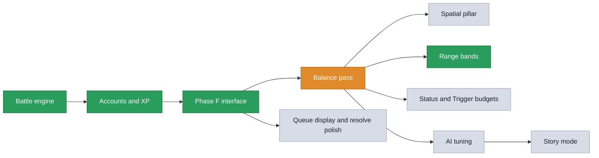

# Isekai Strategem: Current Development Status

This document tracks where the project is: what is done, what we are working on
now, and what is still to do. The detailed design of the combat rework (which is
what most of this project has been) follows in the sections below. For a plain
explanation of the whole game itself, see
[`game_design.md`](game_design.md).

## Status at a glance

| Done | Current priority | To do |
|---|---|---|
| Battle engine: queue-and-resolve turns, 6-phase resolution, reactive + passive counters, 17 unique abilities, 60 Triggers, 10 Black Triggers, 62 status effects, combo recognition, FAT, and the Team Efficiency Grade with its in-battle effects and inverse XP. | #2 Bail Out. #1 (range bands) is complete; #1, #2 and #3 are designed, audited against the code and approved, and work runs in queue order from here. | The approved queue runs #1 to #13 in order. #9 (story mode) and #12 (sign-in branding) are deferred, #10 (branch deletion) is mostly done and the rest is the owner's, #11 is closed as a non-issue. |
| Accounts and XP backend: Supabase, live and verified end to end (guest, email, and Google sign-in; server-authoritative XP; keep-alive). | | Remaining Phase F interface: show the pending queue during a turn, and polish the resolve pause. |
| Most of the Phase F interface: grade badge, all stats shown, Team Spirit readout, Loadout builder, passive-counter descriptions, clickable character and enemy panels with the Mind's Eye reveal, sign-in flow, post-battle XP screen, and the rebuilt battle log. | | AI tuning (Phase G): teach the AI to value the counters, uniques, and status effects. |
| Documentation: the complete game design doc, four player-persona balance reviews plus a design-director synthesis, and a refreshed README. | | Story / visual-novel mode (only scaffolded so far). |
| Balance: the five near-duplicate ("reskin") Trigger clusters differentiated; critical hits capped at a natural 17 and doubling dice only; the four dominant Triggers re-costed; the P0 bounded-accuracy re-tune landed (Attack compressed to 4-14, Defense to 2-12, and every damage expression rebuilt to about half dice); the opening turn is now earned, weighted by the Team Efficiency Grade instead of a coin flip; and the range tag became three real bands (Close/Mid/Long, 20 each, with every attack type present in every band). | | Optional polish: a custom domain so Google sign-in shows the game name instead of the Supabase URL. |

## Branches

Only these exist, and this list is the authority. Anything else named in an
older note is gone.

| Branch | What it is |
|---|---|
| `main` | The trunk. Everything below the "in progress" line has been merged here, and the design document describes `main`, not any branch. |
| `gh-pages` | The published web build. Deploy target only; never develop on it. |
| `claude/range-band-positions` | The active work branch, carrying #1 (range bands as a real battlefield). Merges to `main` when #1 is signed off. |

Two leftovers are fully merged into `main` and carry no unique commits, so they
are safe to delete and are awaiting the owner's action:
`claude/range-bands-close-mid-long` (remote) and
`claude/balance-bounded-accuracy-ylhvao` (local only).

Branch names are deliberately absent from the phase table further down: every
phase listed there is merged, so the branch it arrived on no longer exists and
naming it only invites confusion.

Progress by area:

```
Battle engine      ██████████ 100%   done
Accounts and XP    ██████████ 100%   live and verified
Phase F interface  ████████▒▒  85%   a couple of items left
Balance pass       ███████▒▒▒  70%   P0, initiative and range bands done
AI tuning          ▒▒▒▒▒▒▒▒▒▒   0%   not started
Story mode         ▒▒▒▒▒▒▒▒▒▒   0%   scaffold only
```

## Abbreviations

- **TEG**, Team Efficiency Grade: the D to SSS score for how well a squad is put
  together, with its in-battle dice effects and inverse XP.
- **FAT**, Full Arms Trigger: the burst turn that grants up to three ability uses
  instead of one.
- **SPTV**, Status Points and Trigger Value: the two-part pricing rule from item
  #3. SP prices an effect by magnitude times duration times targets; TV prices a
  whole ability as (damage + SP) divided by Trion cost, adjusted for cooldown. SP
  is an input to TV, so they compose. Anything carrying a magnitude, a duration
  or a target count is in SPTV's scope, including reactive and trap durations.

## Status reactions: the design for item 3b

Approved in principle, not built. The problem it solves: 62 status effects
exist, six of them are unreachable, and none of them talk to each other. A
status is currently a modifier you apply and forget. Reactions turn the
catalogue into a web where applying one thing sets up another, which is where
the depth the project wants actually comes from.

Prior art worth naming: this is the elemental-reaction shape (Genshin Impact's
is the best-known), chosen because it produces combinatorial depth from a small
table rather than from more content.

### The primitive

One new data field on `StatusEffectDefinition`, evaluated in exactly two places
(`_applyDamage` and `StatusEffectEngine.apply`). No switch statements, matching
the "bag of parameters, one generic engine" shape the rest of the engine uses.

```dart
class StatusReaction {
  final DamageType? onDamageType;      // taking this damage type fires it
  final String? onStatusApplied;       // or this status landing does
  final String? becomes;               // the holder gains this
  final bool consumesTrigger;          // the reacting status is spent
  final String? alsoRemoves;           // and this one is removed too
  final double bonusDamageMultiplier;  // extra damage on the triggering hit
}
```

### The reaction table

Every entry uses statuses and damage types that already exist.

| The target is | and is hit by | Result |
|---|---|---|
| **Wet** | Cold | Becomes **Frozen**. Wet is spent. Water freezes. |
| **Wet** | Lightning | Becomes **Electrocuted** and it stacks. Wet is spent. |
| **Wet** | Fire | Wet boils off. Both cancel, no damage (Wet is already Fire-immune). |
| **Scorched** | Cold | Quenched. Both cancel, leaving **Chilled**. |
| **Scorched** | Fire | **Scorched** stacks. Already Fire-vulnerable, so this is the burn build's payoff. |
| **Chilled** | Cold | Becomes **Frozen**. Chilled is spent. |
| **Chilled** | Fire | The ice melts. Becomes **Wet**, which sets up the next Cold or Lightning hit. |
| **Frozen** | Bludgeoning or Thunder | **Shatter**: double damage on that hit, Frozen is spent. |
| **Corroded** | Acid | **Acid** lands on top, deepening the armour shred. |
| **Electrocuted** | Thunder | Arcs to one other enemy standing on the same line. |
| **Bleeding** | Slashing | **Bleeding** stacks. |
| **Poisoned** | Poison | Becomes **Sickened**. |

The Chilled-to-Wet-to-Frozen loop is deliberate: a Cold squad can cycle a target
without ever needing a second element, but it costs them a turn each time, so
the two-element team is still faster.

### Enraged, redesigned

Currently outgoing damage x1.5 and Defense -3, and nothing applies it. It gains
two clauses that make it a real decision rather than a stat swap:

- **Immune to Psychic damage** while it lasts.
- **All of the holder's targeting is chosen at random** while it lasts.

So enraging your own character is a gamble you take for the damage and the
psychic immunity, and enraging an enemy is a control tool that blunts their aim
at the cost of making them hit harder. It is also the first real answer to a
psychic-heavy squad, which currently has none.

### Homes for the five remaining orphans

| Status | Gets applied by | Why there |
|---|---|---|
| **Wet** | A new Mid Range ranged area attack, one enemy line | Soaking a whole line is the setup half of every reaction above, and hitting three targets is worth an action under #5's test. |
| **Enraged** | A Close Range melee taunt (on an enemy) and a psychic self-buff | Both readings of the status get a home, and the melee version gives a front-liner something to do that is not damage. |
| **Adrenaline Rush** | A **Side Effect**, granted on dropping below half health | Passive, so it never has to justify an action, which sidesteps the problem #5 exists to fix. |
| **Battle Trance** | An ally-targeted support ability | FAT Chance +20 on an ally sets up next turn's burst, and it matters far more now that the squad may only cash in one FAT per turn. |
| **Radiant Blessing** | An ally-targeted Mid Range ward | Heal over time plus 10% damage reduction is the support's staple, and it now clamps to the base maximum. |

### Content to redesign around reactions, by subcategory

- **Melee / Close**: a taunt that applies Enraged; a shatter finisher that
  reads Frozen.
- **Ranged / Mid, area**: the Wet applier; a Thunder burst that arcs off
  Electrocuted.
- **Ranged / Long**: a Cold shot that is ordinary alone and freezes a Wet
  target, so a sniper wants a soaker on the squad.
- **Psychic**: abilities that check whether the target already carries a
  status, rewarding setup rather than opening with them.
- **Burst**: the last hit of a burst applies the reaction, so spending the whole
  burst on one target is rewarded.
- **Traps and counters**: a trap that arms a reaction rather than damage, firing
  when the enemy takes a matching damage type. The reactive engine already
  supports conditional firing.
- **Side Effects**: one that makes the holder immune to a chosen reaction; one
  that lets their damage type count as two for reaction purposes.

### Sequencing and pricing

The mechanism and the reaction table belong with **#3**, because SPTV has to
price them: a status that sets up a reaction is worth more Status Points than
one that does not, and a stacking status is worth more again. The new abilities
and Side Effects are a content pass and should land after **#4**, alongside 1c
(pull and push), so the whole catalogue is priced once rather than twice.


## The work queue

Agreed running order. Items are referred to by these numbers everywhere else.

| # | Item | State |
|---|---|---|
| 0 | **Pacing target: 8 to 20 rounds.** Agreed band, replacing the old 15-20 (design section 11). `tool/balance_report.dart` now checks it: 200 simulated battles run a median of 14 with 82% of them inside the band. The engine's round-robin integration test asserts the same band. | Set |
| 1 | **Range bands as a real battlefield.** Front/Middle/Back positions; distance to an enemy is the two positions added, to an ally subtracted; Close reaches 0-1, Mid 1-3, Long 2-4, and against an ally only the maximum applies. Reposition costs the character's action. Built: the position model and distance rules, range gating inside resolution and at queue time, Reposition with zone lock, starting positions derived from each Loadout's bands, projected position (range judged from where a queued move will put you, with un-queue taking the dependent strikes back out), area attacks catching one position, traps remembering the band and place they were laid, guard redirects needing proximity, the full-width horizontal battlefield strip (your back line on the left through to theirs on the right, with a distance ruler and the move controls in its own cells), an explicit reason on every ability that cannot be used, a distinct pulsing state for one the queued move has brought into band, plain-English status descriptions with the duration in the player's own turns, and AI positional judgement on both AI paths. Playtested by the owner and revised. | Done |
| 1b | **Screening (RPP), approved and specced, not built.** Effective distance to an enemy = my line's step + their line's step + the number of living enemies standing on a line strictly in front of the target. No subtraction. Close Range widens to **0-2**, which is what makes the back line reachable once a screen is broken and, per the 4900-state survey, is what removes every unbreakable board state. Redirect-a-hit becomes a Side Effect rather than a global rule. Lands with #4, which owns the range cost model. | Approved, queued |
| 1c | **Pull and push.** Pull drags a target one line towards their own front (removing their screens); push shoves one line back (adding a screen in front of them). Spread across subcategories, with an **Anchored** status as the counter. Forced movement needs its own SPTV term, since moving one character changes every distance on the board. Its own item after #4. | Approved, queued |
| 2 | **Bail Out, contested.** Not a revive: the operator leaves the engagement. A one-turn Bailing Out window where the body stays **targetable**; left alone it is recalled and the squad gets Trion Salvage (20% of base Trion Capacity), but an enemy hit destroys it instead, denying the Salvage and giving the attacker a smaller gain. Refuse to Bail is pre-declared, armed like the existing counters. | Approved, queued |
| 3b | **Status reactions.** A small data table letting statuses react to damage types and to each other (Wet plus Cold becomes Frozen, Frozen plus Bludgeoning shatters, Chilled plus Fire melts back to Wet, and so on), plus homes for the five remaining unreachable statuses and a redesigned Enraged that is immune to Psychic but targets at random. Full spec above. Mechanism and table with #3 so SPTV prices them; the new abilities and Side Effects after #4 with 1c. | Approved, queued |
| 3 | **SPTV (Status Points and Trigger Value), plus the tooltip fix.** SP prices effects and feeds into the TV formula, so the two compose rather than compete; 3 damage per SP as the starting conversion. **In scope:** the 62 status effects, every Trigger's Trion cost and cooldown, and the durations on the reactive counters and traps (`armsReactiveDefaultTurns`), which are all still unpriced Phase B first-pass values. Tooltip duration becomes a 2-10 second setting under the volume slider (needs `shared_preferences`), dismissed by tapping elsewhere. | Approved, queued |
| 4 | **Trion economy.** Also carries: a **30-round limit with a health tiebreak** (PlaySession has no round cap at all today, only the simulator does), the screening rule from 1b, and the FAT cap below. Steadier income, capacity-gated FAT, and the denial statuses becoming a real sub-game. Plus two additions agreed during the #1 playtest: **only one character per squad may cash in FAT per turn**. FAT still rolls per character per turn as now, and several may roll it; the squad claims it when one of them queues a **second** action, at which point every other character's FAT switches off. Un-queueing that second action releases the claim. The cooldown wipe stays with everyone who rolled; only the extra actions are capped; and **range becomes an input to the cost model**, with Mid Range carrying the highest cooldowns (up to 4) and Long Range the highest Trion costs, both the Loadout equip cost and the in-battle cost, up to three times the Close Range average. Each band then has an economic identity, not just a different window: Close is cheap and fast but demands you stand in the danger, Long is safe and you pay for it twice over, Mid is flexible and pays in tempo. Watch the knock-on: tripling Long Range equip costs shrinks what fits inside a Loadout's Trion Capacity, so the sniper builds may need the Capacity budget revisited in the same pass. | Queued |
| 5 | **Support abilities do not pay for their action.** Was "healing is too weak"; the #1 playtest showed the same problem across every buff and ward, not just heals. One action per turn, the average attack turn deals 37.3 damage, and War Chant buys 9.3, Rally Cry 11.2, Guardian's Aegis 9.3, Cleansing Ward 9. Every one is a net loss of 26 to 28 against simply attacking. Acceptance test for the fix: **on an ordinary one-action turn, a support ability must pay for its own action within its own duration.** No ability may need a FAT turn to be worth using. Re-priced with #3 (SPTV), since it owns every magnitude and duration. | Queued |
| 5b | **Stackable statuses.** 12 stack, capped at 3: Bleeding, Electrocuted, Regenerating and Sapped (ticks that add), and Acid, Adrenaline Rush, Battle Trance, Fatigued, Hexed, Inspired, Suppressed and Warded (flat stat steps). The other 50 refresh only. Rallied was the 13th and is now removed. Stacking has to be an explicit flag with a maximum, never the accidental default it used to be, and a stackable effect is worth more Status Points, so it lands with #3. | Approved, queued |
| 5c | **Rename perks to Side Effects (SEs).** `CharacterPerk` to `SideEffect`, the `perk` field, the charge-tracking flags, the Loadout panel copy and the abbreviation list. Mechanical and wide, so it goes in one commit of its own where it cannot hide a behaviour change. | Approved, queued |
| 6 | **Last Phase F interface bits.** Show the pending queue during a turn with un-queue, and polish the resolve pause. Also carries the deferred battlefield layout: **lay the squads out on the board itself**, so each character's portrait sits in the lane column their position puts them in and moving one visibly moves them, replacing the separate diagram. Deferred out of #1 deliberately: it rewrites the squad panels, portrait selection, target picking and the tutorial's step targeting, which is the machinery every other feature sits on. | Queued |
| 7 | **AI tuning (Phase G).** Teach the AI to value counters, uniques and statuses, and to play positions once #1 lands. | Queued |
| 8 | **Tutorialize the depth.** A step-by-step tutorial introducing one system per beat. | Queued |
| 9 | Story / visual-novel mode. | Deferred |
| 10 | Delete the merged branches. | Four deleted. Two still to go: `claude/range-bands-close-mid-long` and `claude/balance-bounded-accuracy-ylhvao`, both fully merged. See "Branches" above. |
| 11 | "Close" overloaded as a dialog button label. | Closed, not an issue |
| 12 | Google sign-in branding (needs a paid custom domain). | Deferred |
| 13 | **Appendix A prose.** Add human-readable descriptions alongside the existing generated ones, keeping both. | Queued |

### Fixed during the #1 playtest: the no-fight stall

The owner played six turns in which neither squad moved or attacked, the AI just
re-casting War Chant. Reproduced on the first attempt with both squads on their
back lines: `war_chant` three times, then `guardians_aegis` three times, then a
cooldown gap, then round again, forever.

The cause was in the "am I stuck?" test added with #1. `reachableAbilityCount`
counted **every** equipped ability, and a self-buff or ally ward reaches from
anywhere, so a character standing four squares outside every attack's band still
scored as having something to do and never moved. It now counts only triggers
aimed at an enemy. Guarded by a case in `test/ai/ai_positioning_test.dart`.

Note that fixing this does not fix the underlying hole: after the change the AI
correctly closes from back to front, and is *still* out of range of a back-line
enemy, because Close Range cannot reach that far. See the structural hole below.

### Fixed during the #1 playtest: a status could be applied twice

Applying a status added a second instance rather than refreshing the first, so a
character could carry two Bleedings ticking separately and two Braced badges
counting down out of step. Re-applying now refreshes the existing instance and
takes the longer of the two durations, so a short re-application never cuts a
long one short, and no character can show the same badge twice. A genuinely
stacking effect would need an explicit flag on its definition; none has one.

### Not reproduced: Guardian's Aegis on consecutive turns

The owner saw it fire on two consecutive opponent turns despite a 2-turn
cooldown. Not reproducible: used on turn 1, blocked on turns 2 and 3, usable
again on turn 4, and `canUseAbility` rejects a live cooldown before it ever
looks at the FAT count, so there is no FAT bypass. Awaiting a full battle report
from a session where it happens.

One related gap did turn up: an **AI fallback reposition is applied directly and
never written to the battle log**, so a turn where the opponent only moved
renders as nothing at all. That can make two separated turns look adjacent.

### Fixed during the #1 playtest: friendly abilities were contested

Found by sweeping every Trigger and measuring how often its advertised effect
actually happened. A heal, a ward or a buff aimed at your own side was being run
through the entire hostile pipeline: rolled to hit **against the recipient's own
Defense**, then contested **against their own Status Effect Resistance**.

The measured landing rates before the fix, on the character's own squad:

| Ability | Landed |
|---|---|
| War Chant (self) | 25% |
| Rally Cry (ally) | 20% |
| Cleansing Ward (ally) | 25% |
| Guardian's Aegis (self) | 48% |

So a character resisted their own War Chant three times in four. The engine's own
note on `StatusEffectEngine.apply` had always said self-buffs are granted
unconditionally rather than inflicted; the two call sites in `resolveAbilityUse`
did not honour it. Both now skip the contest, and the to-hit roll cannot make a
friendly ability fizzle. All four land 100% of the time, and a hostile status is
still contested. Guarded by `test/engine/friendly_abilities_test.dart`, which
sweeps the whole catalogue.

### Not a bug, but badly communicated: the FAT cooldown penalty

Using two or more abilities in one Full Arms Trigger turn **doubles every
cooldown set that turn**. That is the documented FAT price, but nothing said so,
so a 1-turn ability coming back with a 2 on it read as a cooldown bug. Measured:
base 1 becomes 2, base 2 becomes 4. Ability descriptions now state both numbers.

### Structural hole: Close Range cannot reach the back line

Found by computing position against ability range across the live catalogue,
after the owner played six turns in which neither squad moved or attacked.

Distance to an enemy is the two lines' steps added together, so the closest any
character can get to an enemy standing on their **back** line is **2** (my front,
step 0, plus their back, step 2). Close Range reaches 0 to 1. Therefore:

**Close Range can never reach a back-line enemy, from anywhere, ever.** That is
14 of the 51 offensive Triggers, 27% of the catalogue, permanently dead against
one posture that costs the opponent nothing.

How many of the 51 offensive Triggers reach, by line pairing:

| | Their front | Their middle | Their back |
|---|---|---|---|
| **My front** | 14 | 32 | 37 |
| **My middle** | 32 | 37 | 37 |
| **My back** | 37 | 37 | 19 |

The two corners are the dead zones. Everyone on the front lines (distance 0)
leaves only the 14 Close Triggers live, because Mid and Long both have minimums.
Everyone hanging back (distance 4) leaves only the 19 Long ones, which is the
stall the owner played through.

Exposure, summed over the three lines an enemy could occupy: front 83, middle
106, back 93. Middle is the most exposed and the only line with no band it is
safe from. Back is not the lowest number but it is the only line a whole band
cannot touch, which matters more.

Consequences, all of which argue that this is not a tuning problem:

- **Back plus Long Range is dominant.** From the back, Long reaches every enemy
  line (2, 3 and 4 all sit inside its window) while Close cannot answer at all.
- **Position is decided before the first turn** and never revisited, because one
  line is best against nearly everything and moving costs a whole action.
- **The three-snipers-at-the-back spam is currently unanswerable** by a Close
  squad, which is exactly the pattern the owner predicted.

Five options were put to the owner (see the positional analysis review):
widen Close to 0-2; add pull and push effects; a closing pressure on the
battlefield; a charge that crosses the line; or leave it to #4's costs. The
recommendation is **widen Close plus add pull/push, landing with #4**, because
#4 already owns the range cost model, and because a cost you can afford is not
an answer to a posture you cannot reach.

### Removed: Rallied, and five more status effects nothing can apply

A sweep of all 63 status effects against every Trigger, Black Trigger, Side
Effect and engine path found **six that nothing in the game can apply**:
`wet`, `rallied`, `enraged`, `adrenaline_rush`, `battle_trance`,
`radiant_blessing`.

Two of those were load-bearing in the documentation. **Wet** was the design
document's flagship example of damage-type interaction (immune to Fire,
vulnerable to Lightning and Cold). **Radiant Blessing** was cited in item #5 as
a healing example. Both were described as live and were not.

**Rallied is removed** (catalogue entry, its two magnitude constants, its
engine test, the interface flavour text and the design document line), taking
the catalogue to **62**. It granted maximum health +20, which also broke the
rule that nothing heals past the base 100: healing clamps to the *effective*
maximum, so a Rallied character could sit above 100.

Two things follow that are still open:

- **Radiant Blessing keeps its heal and loses the ceiling raise.** It now heals
  a little each turn and clamps to the character's maximum, so at 99 of 100 it
  restores 1 and nothing is banked above the maximum. Guarded by
  `test/models/health_ceiling_test.dart`, which asserts that **no** status
  raises maximum health, so this cannot come back by another route.
- **The five remaining orphans get homes rather than deletion.** See the status
  reactions spec above. A test asserting every catalogued status is reachable
  should land with that work, once nothing is orphaned.

`tool/reach_check.dart` now checks the enduring invariant, that no status
raises maximum health, rather than the specific Rallied case.

### Design rule, and the measurement behind it: no ability may rely on FAT

Agreed during the #1 playtest, and it is a rule rather than a preference: **no
ability should need a Full Arms Trigger turn to be worth using.** FAT is a
sometimes-bonus, so an ability that only pays off inside one is an ability that
mostly does nothing.

Two separate things came out of checking that.

**The wording was wrong, and is fixed.** The buff descriptions led with "on a
Full Arms Trigger turn an attack queued alongside this already gets the
benefit", which reads as FAT-dependence. It is not: Empowered lasts two turns,
so a buff cast on an ordinary turn is still up for the attack you make on your
next turn. The description now says that instead.

**The value is wrong, and is not fixed.** A turn grants one action, and the
average attack turn deals 37.3 damage across the catalogue, so any non-damaging
ability has to beat that to be worth its action. None of them come close:

| Ability | What the turn buys | Against 37.3 from attacking |
|---|---|---|
| War Chant | Empowered, +25% on one later attack, about 9.3 | **-28.0** |
| Rally Cry | Inspired, +2 Attack and Defense on 3 allies, about 11.2 | **-26.1** |
| Guardian's Aegis | Guarded, 25% less damage for one enemy turn, about 9.3 | **-28.0** |
| Cleansing Ward | Regenerating, 3 health a turn for 3 turns, 9 | **-28.3** |

So every buff in the game is a net loss of roughly 26 to 28 damage against
simply attacking, with or without FAT. That is the same root cause as item #5
(healing is too weak) rather than a separate problem: a full action buys far
less than an attack does.

Re-pricing belongs to **#3 (SPTV)**, which owns every magnitude and duration,
folded together with #5. The rule above is the acceptance test: after the
re-pricing, each buff must pay for its own action within its own duration on an
ordinary one-action turn. Deliberately not fixed now, because picking numbers
outside SPTV is exactly the guessing the working agreement rules out.

### Balance note for #3: hostile status infliction is weak

The same sweep measured hostile status riders landing between 10% and 85%, with
most clustered around 20-25% (Status Effect Infliction 5 against a typical
Resistance of 6 to 8). That is a pricing question, not a correctness one, and
belongs with SPTV.

### Open correctness question: 1-turn effects on an enemy

Found while writing the duration wording during the #1 playtest fixes, and
**not yet fixed**. It belongs to #3, which owns every status effect's duration.

Effects tick down at the **start of their holder's turn**, decrementing and then
expiring at zero. For a self-buff that works: it covers the rest of the turn it
was cast on plus the opponent's answer. For a **debuff put on an enemy** it does
not: the enemy's turn begins, the effect ticks to zero and is removed, and then
they act unimpeded. A 1-turn Stun therefore does nothing at all.

Verified directly against the engine: applying `stunned` on your turn leaves
`isActionPrevented() == true`, and at the start of the victim's next turn the
effect list is empty and `isActionPrevented() == false`.

Eleven effects carry a 1-turn default and are affected: Stunned, Frozen,
Silenced, Prone, Marked, Untargetable, Forced Choice, Genjutsu Trapped, Echoing
Doubt, Coldread Seize, and the critical-miss penalty. The self-targeted ones
among those are fine; the ones meant to interrupt an enemy's turn are not.

Two candidate fixes, both a decision for #3 rather than a mechanical one:

- **Tick at the end of the holder's turn** instead of the start. A 1-turn debuff
  then covers exactly the enemy turn it was meant to. The cost is that a 1-turn
  self-buff would then expire at the end of your own turn and no longer cover
  the opponent's answer, which changes what defensive wards do.
- **Skip the first tick** on the turn an effect is applied. Everything gains
  effectively one more turn of life, which is a balance change across all 62
  effects and needs SPTV to re-price them.

### What the pre-build code audit changed

The designs were checked against the code before any of them was built, which
caught five things worth recording:

- **Bail Out's window was inert.** As first written the body could not act, be
  targeted or be healed, so neither player made a decision, and it would have
  made three existing perks ambiguous for a turn. It is now contested (see #2).
- **Trion Salvage had no base to be a share of.** Trion Capacity is a per
  character Loadout budget spent at draft time; in battle there is only the
  squad's shared pool. Salvage is a share of *base* Capacity, and 20% rather
  than 30%, because 30% of a typical 110 exceeds a whole High income turn.
- **Ability legality is checked at queue time**, so range has to be evaluated
  against projected position (current plus any queued Reposition) or move then
  strike would be impossible and the FAT engage plan would not work. Built that
  way, and building it turned up two more: the interface's own legal-target
  list applied no range filter at all (it called `canTarget` with no trigger,
  and skipped it entirely for ally-targeted abilities), and the AI's target
  selection did the same, so the opponent was spending Trion on abilities the
  engine then dropped at resolution.
- **Area attacks currently auto-select every legal target.** Making them hit one
  position turns them into an aimed choice, which is a change to the target
  picker as well as the engine.
- **The randomized-playthrough self-test never resolved its queue.** It queued
  actions and called `endTurn`, which does not resolve them, so the simulated
  player landed zero hits across all 30 battles and every "playthrough" was
  really the AI beating up a statue. Found because the range work made the
  resulting stalls visible. Fixed; 360 probe battles across six seeds now
  conclude with no stalls.
- **`isAlive` is simply health above zero and thirty-eight places read it**, so a
  targetable bailing body needs one narrow exception in damaging-ability target
  selection, not a general "still alive" state.

Pipeline (green is done, orange is in progress, grey is to do):



---

## About the sections below

The rest of this document is the original combat-rework design spec and its
detailed build tracker (the queue model, resolution order, counters, uniques,
the Team Efficiency Grade, the build phases, and a per-phase status list in the
Progress section). It remains the deeper reference behind the summary above.

Numbers marked "tunable" are proposals to be finalized during balancing.

---

# Combat rework design and detailed build tracker

## 1. Goals

1. Replace immediate ability resolution with a **queue then resolve** turn
   model, so reactive/counter abilities can exist and so the framework is
   ready for server-authoritative multiplayer.
2. Add a large set of **counter** abilities (active, Black Trigger, and
   passive) that reward reading the opponent, in the spirit of
   Naruto-Arena, Hunter x Hunter Nen restrictions, World Trigger traps, and
   Bleach constant effects.
3. Add a real **Unique** attack subtype: bespoke-resolution abilities that
   do not fit single/AoE/burst.
4. Rebalance the base Trigger catalog to 20 melee / 20 ranged / 20 psychic by
   attack type. (The balance pass later added a second, independent axis: 20
   close / 20 mid / 20 long by range band, with every attack type present in
   every band.)
5. Add a **Team Efficiency Grade (TEG)** that scores squad build quality and
   feeds a set of dice-advantage effects (see section 5.2).

## 2. Turn model (alternating queue resolution)

Alternating turns, Naruto-Arena style:

> you queue -> end turn -> your queue resolves -> opponent queues -> end
> turn -> their queue resolves -> repeat.

Rules:

- **Trion is spent at queue time** (prevents over-queuing). **Un-queueing
  refunds it.**
- **Cooldown is applied at resolve time**, not queue time, so an un-queued
  ability is not stuck on cooldown.
- The player may add/remove/change queued actions freely until End Turn.
  Once End Turn is pressed, the queue is locked (no un-queue mid-resolution).
- A cosmetic "Resolving..." delay (about 1.5 to 2 seconds) precedes results.
  VFX/animation can slot in here later.
- **Counters/traps are set on your turn and trigger on the opponent's
  turn.** Nothing peeks a live pending queue (impossible under alternating
  turns). You place a ward/trap/mark on your turn; when the opponent acts
  into it during their resolution, it fires. This is the correct framing for
  Deadfall, Puppet Strings, Foresight Counter, etc.

## 3. Resolution-order formula

When a team's queue resolves, actions do NOT resolve in click order. Each is
sorted into a phase; phases resolve in fixed order; within a phase, ties
break by Initiative.

Phases:

1. **Arm / Setup**: wards, traps, marks, untargetable, vows, Mind's Eye
   reveal (anything that only sets state, no damage). Live before anything
   else.
2. **Buffs**: self/ally buffs (empower, guard). So your own later attacks
   benefit.
3. **Control**: pure debuffs with no damage (stun, silence, Called Shot,
   Seal of Severance, forced-miss). Land before damage.
4. **Attacks**: anything that deals damage (including damage-plus-status
   riders). Each attack is resolved against the target's standing reactive
   stack (counters, wards, redirects, resonance, passives) which can negate,
   reflect, dodge, redirect, or modify it. This is the "compare against the
   opponent" step.
5. **Heals / Drains**: non-damage healing and siphons, after damage so the
   math is sane.
6. **Cleanup**: delayed detonations, end-of-turn triggered actions (for
   example Gravehour's free finisher), end-of-turn ticks.

**Initiative:**

- **Cross-team** (both teams' effects would resolve at the same instant -
  for example a reactive trigger from each side clashing): does not arise
  under alternating resolution, because the two teams never resolve in the
  same pass. The earlier design used TEG as a cross-team resolution-order
  tiebreak here; that has been **retired** (it can never fire). TEG's
  mechanical role is now the dice-advantage effect set in section 5.2, plus
  the earned-initiative weighting below. Turn order (who acts first) is no
  longer an even coin flip: the balance pass replaced it with a
  TEG-weighted roll (equal grades 50/50, 5 points per tier of separation,
  capped at 65/35), so the opening move is something a squad builds toward
  rather than something it is handed. See `openingTurnChanceFor` in
  `app/lib/src/game/team_efficiency.dart`.
- **Within a single team's own queue**, phase order governs; ties within a
  phase break by the acting character's **Team Spirit deviation from
  midpoint** (bigger commitment = higher initiative), then queue order. TEG
  cannot tiebreak here because it is shared across the team.

Worked example: you queue War Chant (self-empower), Longshot (single-target
on EnemyX), Frost Lance (single-target damage+chill on EnemyX). EnemyX has
Mirror Ward standing. Phase 2 empowers you. Phase 4 resolves Longshot, which
is single-target, so Mirror Ward reflects it back onto your shooter at full
effect, boosted by your own empower. Frost Lance likewise reflects. Lesson:
an AoE would have bypassed the ward.

## 4. Team Spirit model (unchanged) and display

Team Spirit is [0, 100] with 50 neutral (constants.dart). Toward 0 it scales
offense (up to +30% single/burst damage, +20 crit at TS 0). Toward 100 it
scales sustain (up to +30% heal regen, +20 FAT chance at TS 100). At 50, all
bonuses are 0. There is no negative TS and no 0-centered model. Both extremes
are good, for different builds.

UI: when TS is displayed, also show the live effects at the current value,
for example "TS 45 -> +6% damage, +4 crit (offense pole)", so the
dual-direction stat is legible.

## 5. Team Efficiency Grade (TEG)

A squad-level grade, D to SSS, shown under Player Info, measuring how well
tuned a squad is (not how powerful).

### 5.1 What TEG scores (six sub-scores)

Six sub-scores (each 0 to 100), weighted into a 0 to 100 composite (weights
tunable):

| Sub-score | Weight | Rewards |
|---|---|---|
| Team Spirit Alignment | 25% | Whether each character's loadout leans offense or sustain, and whether their TS sits on the matching pole. Committed matching extremes score highest; a mismatch tanks it. This is the "is high or low TS actually right for this squad" factor. |
| Stat Coherence | 20% | Each character's raw stats fitting their loadout's role (attacker kit wants ATK/Crit, defender kit wants Armor/DEF, afflictor wants Infliction). |
| Loadout Synergy | 20% | Complementary abilities across the three: setup to payoff chains, debuff-applier plus debuff-exploiter, protector plus carry, counters that fit the plan. |
| Perk Utilization | 15% | How well the loadout plays to each character's Perk. |
| Trion Economy | 10% | Whether the squad can afford its per-turn ability costs given Capacity/Affinity. |
| Resonance Fit | 10% | Only if Black Triggers are equipped: each BT's resonance grade with its wielder's type. No BT means this weight is dropped and the other five renormalize. |

Tier ladder (composite to grade, tunable): D 0-39, C 40-54, B 55-67,
A 68-78, S 79-88, SS 89-95, SSS 96-100. SSS is deliberately hard.

### 5.2 TEG's mechanical effects (the combination amplifier)

Design decision (supersedes the earlier cross-team resolution-order
tiebreak, which cannot occur under the alternating resolution we are
keeping: two teams never resolve in the same pass, so there is never a
cross-team tie). TEG expresses itself as a **combination amplifier routed
through the existing d20 / RollContext advantage system**
(`util/dice.dart`: `RollMode`, composable `RollContext`, `D20RollResult`
with nat-20/nat-1 crits). Higher TEG does **not** inflate damage or stats;
it changes how often the dice favor a coordinated squad. Low TEG is never
penalized in combat; instead it earns more post-battle XP, so TEG is a
risk/reward dial, not a strictly-better stat. All numbers below are
first-pass and tunable (Phase H).

**Effect 1 - Coordination (offensive advantage).** Per qualifying
**offensive** d20 (attack to-hit and, by design, status-infliction rolls),
the squad has a TEG-scaled chance to gain **advantage**. Engine hook (code):
`TurnEngine._applyTegOffenseAdvantage` rolls the chance and calls
`addAdvantage('teg_offense')` on the attacker's `RollContext` before
`resolveAttackRoll`. Wired today on the attack to-hit roll only; the
status-infliction roll site uses the same helper but is not yet wired.

| TEG | D | C | B | A | S | SS | SSS |
|---|---|---|---|---|---|---|---|
| Adv chance | 0% | 3% | 6% | 9% | 12% | 16% | 20% |

**XP counterweight (inverse).** Battle XP is scaled inversely to TEG, so a
weaker-graded squad levels faster (an underdog playstyle) and an elite squad
pays an "elite tax." Depends on real, server-authoritative XP + an account
system (see section 15, product roadmap). Drafted as a bonus multiplier on
base XP; exact formula pinned by that task.

| TEG | D | C | B | A | S | SS | SSS |
|---|---|---|---|---|---|---|---|
| Battle XP bonus | +75% | +63% | +51% | +40% | +28% | +16% | +5% |

**Effect 2 - Operator's Read (defensive advantage, inverted).** Advantage on
the squad's **defensive** d20s only: the defender's roll in an opposed attack
contest (`resolveAttackRoll`'s `defenderContext`) and status-resistance rolls
(`rollContextFor(StatusRollTag.statusResistanceRoll)`). **Inverted** vs TEG:
the less in sync a squad is, the more it runs on instinct. Note (verified in
code): counters/traps themselves do **not** roll (they fire on a condition
match, not a contest), so Effect 2 attaches to these two real defensive
rolls, not to counter resolution.

| TEG | D | C | B | A | S | SS | SSS |
|---|---|---|---|---|---|---|---|
| Def adv chance | 20% | 16% | 12% | 9% | 6% | 3% | 0% |

**Effect 3 - Synergy Refunds (Trion). BUILT and merged to main.** On a
recognized **setup->payoff** combo (a payoff offensive ability landing on an
enemy under a control/debuff status **an ally applied**), refund part of the
payoff's Trion cost. **SS caps at 20%; SSS is 0%** and takes Effect 5 in its
place. In code: the engine computes the refund at the payoff's resolution
(`AbilityUseResult.trionRefund`) and the app credits the acting team's pool.

| TEG | D | C | B | A | S | SS | SSS |
|---|---|---|---|---|---|---|---|
| Trion refund | 0% | 4% | 8% | 12% | 16% | 20% | 0% (-> fx5) |

**Effect 4 - Focus Fire / combo amplifier. BUILT and merged to main.** When
the squad executes a **recognized combo**, the payoff gains advantage, its
strength scaled by the combo and **hard-capped at 20%** (the universal
advantage-chance ceiling; focus fire is how sub-SSS squads climb to it). This
is deliberately **not** positional: it consumes the **Combo Recognition
system** (Phase I) over a live per-turn ledger. In code: before the payoff's
attack roll the engine probes the recognizer against the ledger and, on a
recognized combo, rolls a strength-scaled advantage chance
(`comboAdvantagePercentPerStrength`, capped 20%) to grant advantage.

**Effect 5 - Crit Range Widener (SSS only).** Always-on at **SSS only**: the
squad's attack rolls crit on a **natural 18-20** on the kept die (vs nat-20
normally; hooks `criticalHitThreshold` / kept-die crit eval). Compounds with
advantage. This is what SSS gets **instead of** Effect 3 refunds.

### 5.3 Resulting tier identities (sanity check)

- **D (instinct survivor):** 0% offense adv, best defense (20%), no refunds,
  no crit widen, most XP (+75%). Fast-leveling underdog.
- **SS (peak economy):** strong offense (16%), thin defense (3%), max refunds
  (20%), low XP. The combo-engine sweet spot.
- **SSS (coordination glass cannon):** max offense (20%), no defensive read
  (0%), no refunds, crit on 18-20, least XP (+5%). All-in on offense.

Display: letter grade prominent under Player Info; tap to expand the six
sub-scores. Also surface which effects are live at the current grade so
players can optimize toward it. Draegor's counter also reads the grade as a
threshold (section 6.2), and its "raise TEG 2 tiers" effect now has teeth
again because TEG shifts the roll-advantage tables above.

## 6. Counters

### 6.1 Active / Black Trigger counters (13)

Each is a distinct archetype. Home = the existing Trigger or Black Trigger it
attaches to.

| Ability | Home | Mechanic |
|---|---|---|
| Foresight Counter | Bastion Frame (BT) | Call one attack class when set; if the opponent's move against the warded ally matches, negate it and Stun the attacker 2. Wrong guess: nothing. |
| Mirror Ward | Wellspring (BT) | The only reflect. Any non-AoE hit against the wielder bounces back onto its user at full effect. AoE bypasses. |
| Seal of Severance | Ashbringer (BT) | On hit, lock out one origin category (Physical/Energy/Afflict/Mental) for 2 turns; every ability the target owns in that category becomes uncastable. |
| One More Breath | Gravebind (BT) | Enriches the survive-at-1-HP world ability: on trigger, double all the wielder's current status durations and Stun whoever landed the blow. |
| Puppet Strings | Paradox Shard (BT) | Name a target; if the opponent's next queued ability attacks it, redirect onto one of their own allies. Wielder is Exposed while armed. |
| Deadfall | Paradox Shard (BT) | Mark an enemy; during their next turn, if the marked enemy uses a damaging ability, it is countered and they take the trap damage. |
| Root Snare | binding_snare (trigger) | On hit, apply forced_repetition: target is locked to only their last-used ability; if it is on cooldown, they have no legal action until Forced Repetition expires or that ability returns. |
| Predictive Parry | Twin Fang Strike (trigger) | The only dodge. Once/battle: a melee single-target attack is dodged and answered with a free counter-hit. |
| Numbing Toxin | Venom Needle (trigger) | Burst mitigation: a multi-hit Burst against the wielder only lands its first hit. |
| Death Ledger | Marked for Death (trigger) | Mark one enemy (once per enemy per battle). If they use an AoE against your team, it is nullified and the wielder swaps their nearest-Trion-cost Trigger with that AoE Trigger for 2 turns, then reverts. |
| Scramble | Mind Shatter (trigger) | For 2 turns, the target's queued attacks have a chance to misfire onto their own teammate (random, not chosen). |
| Stored Retribution | Guardian's Aegis (trigger) | While Guarded/Braced, incoming damage is banked as a charge; the wielder's next ability deals bonus damage from the store. |
| Frozen Tempo | Frost Lance (trigger) | The ranged attack lands, but the attacker's ability takes twice as long to come off cooldown next. |

### 6.2 Passive-trigger counters (6)

Each is stateful/reactive, sits on a distinct system lever, encourages
forward play, and is not a flat stat buff.

**Draegor** (lever: the resolution engine).
- Each time the holder uses an ability, +1 Enmity.
- At 5 Enmity, consume all 5, gain 1 Regret (lasts 2 turns).
- While Regret is up, if the opponent chains 2+ abilities in a FAT turn,
  consume 1 Regret and for 2 turns: raise your TEG by 2 tiers (cap SSS).
  Exception: if TEG is already SS or SSS, instead double the Trion Affinity
  of your highest-TA ally for those 2 turns.
- Hard cap: your team may only gain 3 Regret total per battle; then Enmity
  and Regret generation stop.
- Design notes: the player controls when the 5th ability lands, so they
  choose when the window opens. Your own FAT can force a window open
  prematurely (a self-imposed timing dilemma). The 3-Regret cap is team-wide,
  so running multiple Draegors is redundant (no extra windows) and
  simultaneous windows waste (one FAT-chain is caught once). Spread windows
  over time with a single Draegor; concentrate on a turn you can read a
  forced FAT-chain.

**Nullhymn** (lever: power-investment; anti-BT and anti-affliction).
- +1 Discord when an enemy uses a Black Trigger active against your team; +1
  when an enemy inflicts a status on the holder (deduped per status per
  turn).
- At 5 Discord, discharge (max twice per battle): if any enemy runs a BT,
  the most-recently-active one permanently loses a resonance grade
  (A to B to C to D). If no enemy runs a BT, purge all debuffs on your team
  and reflect them onto the enemy who applied the most, at remaining
  duration.

**Reckoning** (lever: luck and tempo debt).
- +1 Debt when an enemy lands a crit on your team; +1 when an enemy uses a
  2+ cooldown ability against your team.
- At 6 Debt, comes due (reset, internal lockout): the enemy who ran up the
  most Debt has all current cooldowns extended +1, their next attack roll is
  forced to a critical miss, and your team levies Trion (see Levy below).

**Gravehour** (lever: punishing indecision; merges Bloodclock and
Deathknell).
- At the end of each opponent turn, if the opponent either dealt no damage
  (stalled) or left any enemy alive at 30% HP or below: the holder makes a
  free, uncounterable finisher on the lowest-HP living enemy, and that enemy
  cannot be healed on the opponent's next turn.
- After it fires: 3-turn cooldown, and one of the holder's own abilities is
  put on cooldown 1 turn at random (if already on cooldown, extend by 1).
- The free finisher resolves as a Phase-6 triggered action during the
  opponent's turn (like a trap), attributed to the holder, uncounterable, no
  Trion, no queue slot.

**Coldread** (lever: prediction).
- At the start of each of your turns, secretly mark one enemy (hidden from
  the opponent).
- Resolves at the end of the opponent's next turn. On a **correct read**
  (the marked enemy took a damaging action) grant a reward that
  **alternates** each successful read, **Levy first**:
  - 1st successful read: **Levy** the marked enemy's costliest action's
    Trion (the shared steal rule below).
  - next successful read: **Seize** - grant the whole squad a flat **+2 to
    all their rolls for 1 turn**.
  - alternates thereafter (Levy, Seize, Levy, ...). A wrong read does not
    advance the alternation.
- On a **wrong read** (no damaging action from the marked enemy), your Trion
  gain is docked next turn.
- After a read resolves (right or wrong), 1-turn cooldown before the next
  call.
- Note: Seize's +2 is a flat roll **modifier** (added to the d20's
  `modifier`), distinct from advantage, applied squad-wide for 1 turn. This
  makes Coldread self-contained and independent of the TEG effects (it does
  NOT rely on the retired cross-team tiebreak).

**Ironvow** (lever: type discipline; merges Interdict and Ironvow).
- At the start of each of the holder's turns, one attack type is sanctioned
  at random, but never the type the holder attacked with last turn (forced
  rotation = Interdict's anti-repetition).
- Attack with the sanctioned type -> Sanctioned Strike: unblockable/
  undodgeable, strips one active buff, and brands the target with Interdict
  (if that enemy uses the same ability two consecutive turns, the repeat
  lands at heavily reduced power).
- Cost: honoring the vow leaves your other living allies Vulnerable to the
  sanctioned type until your next turn, unless the holder is the last one
  alive.
- Caps: 3 Sanctioned Strikes per battle, 2-turn cooldown between them.
  Attacking off-sanction is a normal attack. Mono-type loadouts self-punish
  (after their type is used, the rotation sanctions a type they do not own),
  so diverse kits earn the full 3.

**The Levy** (shared refund rule for Coldread and Reckoning): a steal, plus
your pool and minus theirs, capped at whatever Trion the enemy team actually
has. Not "give back what you spent," not free generation. An actual transfer.

## 7. Unique subtype

Unique is the bespoke-resolution subtype: each Unique ability defines its own
targeting (chosen, auto, self, or none) and its own resolution rule. It is
now legal for melee, ranged, and psychic (a one-line change to
AttackTypeSubtypes.validSubtypes). Engine-wise it is a closed set of named
behaviors the engine dispatches on (mirrors WorldAbilityEffect / CharacterPerk),
not open scripting.

### Melee unique (5)

- **Shared Agony**: auto-targets a random enemy the caster has melee-hit this
  battle. Roll damage; deal it to self in full (can kill the caster), and
  +20% to that enemy. Needs new fields on ActiveTrigger:
  selfDamagePercentOfDealt and linkedTargetDamageMultiplier.
- **Grave Bargain**: chosen. Spend a chunk of current HP; deal that exact
  amount as unavoidable true damage (no roll, ignores armor/defense).
- **Martyr's End**: none. Only usable below 25% HP. The caster is removed
  from the battle; every enemy takes massive damage.
- **Vow of the Duel**: chosen. Bind to one enemy for 3 turns: double damage
  to them, but the caster cannot act on anyone else or be healed. If they are
  alive when it ends, the caster is Stunned 2.
- **Sunder Arms**: chosen. Strike plus permanently destroy one random
  equipped Trigger of theirs for the battle; the caster permanently loses one
  of their own (their choice).

### Ranged unique (2)

- **Curving Shot**: chosen. Ignores the first ward/dodge/counter the target
  has up and always resolves.
- **Called Shot**: chosen plus a declared stat. Zero that stat on the target
  for 2 turns. No damage.

### Psychic unique (10)

- **Mind's Eye**: reveal one enemy's full loadout in their panel, clickable,
  for N turns. Cannot be used by the caster.
- **Forced Choice**: next turn the target may only use their cheapest or
  priciest ability (caster declares which).
- **Memory Theft**: copy the target's last-used ability; the caster may cast
  it once next turn. The copy occupies Memory Theft's own slot, so the caster
  never exceeds 4 active abilities.
- **Sensory Swap**: swap one active status effect between two characters
  (enemy to enemy, or self to enemy).
- **Dread Resonance**: damage scales with the total damage that enemy has
  dealt this battle.
- **Isolation**: for 2 turns, that enemy cannot be healed/buffed by allies
  and cannot heal/buff them.
- **Illusory Double**: 0 Trion cost, 2-turn cooldown always. Starts with 1
  charge; +1 charge each time an ally is defeated. Target self or an ally:
  that character is untargetable for the whole of the opponent's next turn
  (visible icon).
- **Echoing Doubt**: force the target's next attack to whiff while they still
  pay Trion and cooldown, then backlash plus Silence. Deterministic, rewards
  the play (not RNG).
- **Karmic Bind**: 3-turn damage/heal link with a chosen enemy; both
  fractions scale with the caster's Team Spirit (about 25% at low TS up to
  about 60% at high TS).
- **Unmaking**: invert all the target's active buffs into their debuff
  equivalents for the remaining duration (Empowered to Weakened, Guarded to
  Exposed, etc.).

### 7.1 Cross-team unique wiring (done in Phase E)

Two unique behaviors were implemented at the engine-state level in Phase C
but needed cross-team wiring that lives in the Battle layer, not
`TurnEngine`. Both are now wired (Phase E):

- **Karmic Bind live propagation** - done, "Punish" (one-way) semantics.
  `TurnEngine` gained an optional `characterRegistry` (set by the Battle
  constructor); `_propagateKarmicBind` fires from `_applyDamage` and both
  heal sites, dealing a Team-Spirit-scaled fraction of any damage the
  caster takes or healing it receives to the bound enemy as unavoidable
  true damage. Reads the fraction from the caster's `karmic_bind` status,
  so it stops when that 3-turn status expires; guarded against recursion.
- **Illusory Double charge-on-ally-death** - done.
  `Battle.initializeIllusoryDoubleCharges` grants holders their starting
  charge; `Battle.checkForDefeats()` grants a holder +1 charge per ally
  defeat (idempotent), called at start/end of turn and exposed for a host
  to call after mid-turn resolutions.

## 8. Trigger catalog rebalance to 20 / 20 / 20

Base Trigger catalog only (Black Triggers stay a bespoke 10-entry set).
About 26 new Triggers needed. Subtype distribution (respecting
AttackType.validSubtypes: melee has no burst/unique historically but unique
is now allowed; ranged has no unique historically but 2 are now allowed;
psychic has no burst):

| Type | Single | AoE | Burst | Unique | Total |
|---|---|---|---|---|---|
| Melee | 10 | 5 | 0 | 5 | 20 |
| Ranged | 5 | 5 | 8 | 2 | 20 |
| Psychic | 5 | 5 | 0 | 10 | 20 |

Exact ability list and dice/Trion/cooldown numbers to be finalized in
Phase D, following existing tuning conventions.

## 9. New engine primitives required

UniqueBehavior / unique target-rule dispatch; reactive-stack evaluation
during Phase 4 (generalize Sable's redirect); reflect / dodge / negate /
redirect / category-lockout / forced-repetition / forced-miss /
burst-mitigation / damage-banking / cooldown-sabotage; buff inversion;
status relocation and status steal; ability copy; persistent bidirectional
links; trigger swap and permanent trigger destruction; loadout-reveal state;
HP swap; cheat-death enrichment; selfDamagePercentOfDealt and
linkedTargetDamageMultiplier fields on ActiveTrigger; TEG scoring; FAT
activation hook; runtime-mutable resonance grade; crit tracking; the Levy
(Trion steal); the Interdict brand; charges-on-ally-death; untargetable
status; Enmity/Regret/Discord/Debt stateful counters; TEG dice-advantage
hook (feed a per-team advantage chance into the attacker/defender/resistance
RollContexts, plus SSS crit-range widening); a combo-recognition action
ledger + closed condition primitives + combo catalog (section 12, Phase I);
inverse-TEG battle XP scaling.

## 10. UI tasks

- Queue display: show each character's pending queued actions; allow un-queue
  before End Turn.
- Resolve beat: End Turn plays the cosmetic "Resolving..." delay, then
  reveals results.
- Battle log readability. (done) The whole event line is the tap target with a
  "Details" pill; the scroll area has an always-visible scrollbar; the expanded
  breakdown is plain-English (to-hit, step-by-step damage buildup, status-effect
  explanations, result) with colour-coded numbers (die roll / stat / total /
  damage); and character names, ability names, and target names are clickable
  to open an info popup (character stats/perk/flavor, or the ability's
  description). See `widgets/log_view.dart`.
- Clickable portraits (both teams) open the home-screen character detail
  panel. Your own characters: full detail. Opponent characters: public info
  only (type, base stats, perk, current HP, visible statuses, rank); equipped
  loadout stays hidden unless Mind's Eye has revealed it. (done:
  `_characterInfoPanel` gates on own vs enemy - own shows FULL INTEL with the
  equipped loadout, enemy shows PUBLIC INTEL with base stats/perk/rank and a
  hidden-loadout hint.)
- Mind's Eye: populate a revealed enemy's abilities in their panel,
  clickable, for the duration. (done: once `PlaySession.revealedEnemyIds`
  includes the enemy, the panel lists their abilities as tappable chips that
  open the ability description dialog.)
- TEG display under Player Info with the six-sub-score breakdown on expand.
  (done: `TegBadge`, tap to expand six sub-scores + the live dice-advantage
  effects at that grade.)
- Team Spirit: show the live offense/sustain effects next to the value.
  (done: `teamSpiritEffectHint` in `CharacterStatRow`, offense/sustain/neutral
  readout computed from `TeamSpiritCurve`.)
- Surface the currently hidden stats (Trion Affinity, Team Spirit, Armor,
  Max HP, Infliction, Resistance) in CharacterStatRow, which today shows only
  ATK/DEF/CRIT/FAT/Trion Capacity. (done.)
- Loadout builder: preview info for triggers/BTs you have not selected
  (tap to inspect even when unaffordable/locked, with a "why unavailable"
  note); EQUIP/UNEQUIP labels; per-character clear, plus squad-level
  Randomize / Reset / Unequip-all. (done.)
- Passive-counter descriptions: the six stateful counters
  (Draegor/Nullhymn/Reckoning/Gravehour/Coldread/Ironvow) now describe their
  behaviour instead of reporting "No stat effect". (done.)

## 11. AI

The AI builds a queue and resolves through the same path as the player
(important for future server authority), with a simulated thinking delay
before it commits. AI must also learn to value and play the new counters and
uniques.

## 12. Build phases

Ship Phase A first, in stages, with a commit and review at the end of each
stage. Nothing goes to main without explicit approval. When a phase is
complete, merge its branch to main, delete the branch, and start a new
branch for the next phase.

- **Phase A: turn-queue resolution engine** (no new content; all existing
  abilities keep working). Staged:
  - A1: Queue data model plus Trion-at-queue. Queue/unqueue, Trion spent at
    queue and refunded on unqueue, cooldown deferred to resolve. Resolution
    stays batched-at-end-turn in click order (interim). Tests: queue/unqueue,
    Trion accounting.
  - A2: Phase-priority resolution formula. Replace click-order with the
    6-phase sort, within-phase tiebreak by TS deviation then queue order, and
    add the Phase-4 reactive-stack hook (generalizing Sable's redirect, no
    new counters yet). Tests: ordering correctness, determinism.
  - A3: AI queues plus thinking-time. Refactor the AI to build a queue and
    resolve through the same path, with a simulated thinking delay. Tests:
    full-battle integration stays green.
  - A4: UI queue display plus resolve beat. Verify via the Playwright
    harness.
  - A5: Team Efficiency Grade compute plus display plus wire as cross-team
    Initiative. Tests: TEG scoring on known loadouts, opening-turn
    initiative. Deferrable/splittable if Phase A should stay lean.
- **Phase B: reactive/counter engine plus the 13 active and 6 passive
  counters.**
- **Phase C: Unique subtype plus the 17 unique abilities.**
- **Phase D: trigger rebalance to 20/20/20** (about 26 new triggers).
- **Phase E: new-content wiring** (Death Ledger swap, One More Breath, mutable
  resonance for Nullhymn, etc.).
- **Phase F: remaining UI** (clickable portraits, Mind's Eye panel, and any
  UI not already delivered in Phase A).
- **Phase G: AI tuning** for the new counters and uniques.
- **Phase H: balancing pass** (after all content phases are done). A
  dedicated tuning pass over the numbers that were set to first-pass,
  convention-following values during implementation: dice/Trion/cooldown
  for the 17 unique Triggers and the Phase D fillers, the Phase D
  `equipCost` values (note the LoadoutBuilder depends on a cheap-active
  tier existing - see the cheap-tier fix in Phase D), the UniqueConfig
  magnitudes (Shared Agony/Grave Bargain/Martyr's End/Dread Resonance/
  Karmic Bind/Echoing Doubt backlash), and status-effect durations. Play/
  sim-test for outliers rather than balancing each in isolation.
- **Phase I: Combo Recognition system.** A deterministic, data-driven
  subsystem that recognizes real combos from live battle state, so combos
  can drive rewards (TEG Effect 4, and Effect 3's setup->payoff). Follows
  the codebase's closed enumerable-behavior discipline (no open runtime
  scripting); the engine *matches* encoded combos, it does not *judge*
  narrative sense at runtime - that is an authoring-time decision. Staged:
  - I1: **Action ledger.** A battle-level rolling record of resolved
    actions this turn (actor id, trigger id and its tags - OriginTag /
    AttackType / AttackSubtype / category - target ids, statuses applied,
    sequence index). Extends today's thin per-character history
    (`lastUsedTriggerId`, `triggersUsedThisTurn`). Bounded and cheap.
  - I2: **Condition primitives + recognizer.** A closed set of composable
    predicates (`allOf` / `anyOf` / `not` + leaf matchers over the ledger,
    the payoff action, and the target's live state: ally-applied status
    present, ally used tag/origin, target hp threshold, character/perk
    identity, same target, within-turn). `ComboRecognizer.recognize(payoff,
    ledger, state) -> List<RecognizedCombo>`, deterministic and unit-tested.
  - I3: **Layer 1 - generic/emergent combos.** A seed catalog of combos
    that apply to anyone (control-then-strike, affliction-then-detonate,
    same-origin chain). Satisfies Effect 3 and unblocks Effect 4.
  - I4: **Layer 2 - signature/authored combos.** Named `ComboDefinition`
    entries in a `combo_catalog.dart` referencing specific characters,
    perks, triggers, and world/story context, each with flavor and a
    stronger reward. Added incrementally as content.
  - I5 (optional): **authoring tooling** (may be AI-assisted at design
    time, never at runtime) that proposes signature combos from the content
    data for human approval.
  - Consumers: Effect 4 maps a recognized combo's strength to advantage
    chance (capped 20%); Effect 3 refunds; later, combo VFX, combo-seeking
    AI, and story beats read the same recognizer output.
- **Phase J: TEG mechanical effects** (section 5.2). Implements the five
  dice-advantage effects. Effects 1, 2, 5 are self-contained (feed a
  per-team advantage chance / crit-range into the existing RollContext /
  crit path from an app-computed TEG). Effect 3 depends on Phase I's
  recognizer (setup->payoff category). Effect 4 depends on Phase I in full.
  The inverse-TEG XP counterweight depends on the server-XP + accounts task
  (section 15). App computes TEG and injects one scalar per team into the
  Battle at setup, so the engine stays pure and never compares two grades
  inline (the coupling that killed the old cross-team tiebreak).

## 13. Progress

**DONE (merged to main): the 6 passive counters are integrated into the
resolution loop and work in-game.** `play_session.dart`
(`_resolveAction` / `useAbility`) now feeds `notifyAbilityResolved`,
`notifyStatusInflicted`, `recordDamageDealt`, and `checkSanctionedStrike`,
and `battle.startTurn` ticks `tickReactiveEffects` once per turn. Coldread's
re-specced Seize (alternating with the Levy, +2 to the squad's rolls for 1
turn) is built too. So Draegor / Reckoning / Nullhymn / Ironvow now
accumulate, Coldread reads correctly, and Gravehour no longer over-fires.

**TEG mechanical role: DECIDED, partially built (Phase J).** We are
KEEPING alternating resolution, under which TEG's originally-specced
cross-team resolution-order tiebreak can never fire (two teams never resolve
in the same pass). That tiebreak is retired. TEG's new role is the
**combination amplifier**: five dice-advantage effects routed through the
existing d20 / RollContext system, plus an inverse-TEG XP counterweight (full
spec in section 5.2). **All five effects are now built** (1/2/5 merged to
main; 3/4 green on the branch): coordination + inverted Operator's Read
advantage on every roll site, the SSS crit widener, Effect 4's recognized-
combo payoff advantage over a live per-turn combo ledger, and Effect 3's
setup->payoff Trion refund. Only the inverse-TEG XP counterweight remains,
and it depends on the server-XP + accounts task (section 15). So TEG is no
longer display-only: its roll-advantage, crit, combo, and refund effects
apply in-game. Turn order is now TEG-weighted rather than a coin flip (see
section 3). NOTE: Draegor's
"raise TEG 2 tiers" now has a real effect target (it shifts the roll-
advantage tables) but is not yet wired to it. Coldread's "seize" has been re-specced (section 6.2) and **built**: a
flat +2 to the whole squad's rolls for 1 turn, alternating with the Levy on
successful reads (Levy first), self-contained and no longer dependent on the
retired tiebreak.

| Phase | Status |
|---|---|
| Phase A: turn-queue resolution engine | done + merged to main: queue model with Trion-at-queue / refund-on-unqueue and cooldown-at-resolve; the 6-phase within-team resolution ordering (Team-Spirit-deviation tiebreak, then queue order); AI builds and resolves a queue through the same path; TEG computed + displayed. (Turn order shipped here as an even 50-50 coin flip; the balance pass has since made it TEG-weighted.) (Its deliverables are also itemized in 13.1 "Built and working".)  |
| Phase B: reactive/counter engine + 19 counters | done + merged to main. The 13 active/reactive counters run inside `resolveAbilityUse`; the 6 passive counters are now fed by the app (see passive-counter integration row) and reactive expiry is ticked. All 19 work in-game.  |
| Phase C: Unique subtype + 17 unique abilities | done (merged to main): C1 engine seam, C2 5 melee, C3 2 ranged + 10 psychic  |
| Phase D: trigger rebalance to 20/20/20 | done (merged to main): 17 unique Triggers wired + catalog balanced to exactly 20/20/20 (60 active)  |
| Phase E: new-content wiring | done + merged: the two deferred unique hooks (7.1), Coldread "seize", Nullhymn's real resonance-grade downgrade (per-wielder step count on the const grid; targets the most-recently-active enemy BT), and Death Ledger's nullified-AoE loadout swap (engine signals; app borrows the AoE into the wielder's loadout for 2 turns, then reverts)  |
| Phase F: remaining UI | mostly done + merged to main: TEG badge (six-sub-score expand + live effects), surfacing the hidden stats, the Team Spirit live offense/sustain readout, the loadout-builder preview/EQUIP-UNEQUIP/Randomize-Reset-Unequip-all pass, passive-counter descriptions, the clickable-portrait detail panel with own-full / enemy-public gating + Mind's Eye reveal, the sign-in flow (`AccountSheet`) + post-battle XP-award readout, and the battle-log rework (tap-anywhere-to-expand, always-visible scrollbar, plain-English breakdowns, clickable names/abilities → info popups). Remaining: queue display + resolve-beat polish.  |
| Phase G: AI tuning | not started  |
| Phase H: balancing pass | in progress. Done: the five reskin Trigger clusters differentiated; critical hits capped at a natural 17 and doubling the damage dice only; the four dominant Triggers (Whirlwind Slash, Twin Fang Strike, Longshot, Cinderburst) re-costed; and the P0 bounded-accuracy re-tune, which compressed Attack to 4-14 and Defense to 2-12 and rebuilt every damage expression so roughly half the number comes from dice; and earned initiative, which replaced the opening coin flip with a Team-Efficiency-Grade-weighted roll (equal grades 50/50, 5 points per tier, capped at 65/35); and the range-band rework, which renamed `RangeTag` from melee/ranged (it collided with the attack type names) to close/mid/long and, more importantly, gave it content: the tag used to be perfectly derivable from the attack type, and is now assigned per ability so that all three attack types appear in all three bands (melee 12/5/3, ranged 3/8/9, psychic 5/7/8). `tool/balance_report.dart` prints the accuracy band, the per-Trigger dice share and value, and a batch of simulated battles; `test/balance/bounded_accuracy_test.dart` guards both the combat math and the type-by-band grid. Remaining: the optional Bail-Out downed state (a design decision, not yet taken), the spatial pillar (the range bands are now the natural data layer for it), status/Trigger point budgets, and the Trion economy.  |
| Passive-counter integration (design 13.1 gap #1) | done + merged to main: all six counters fed from `play_session.dart`; reactive expiry ticked; Coldread Seize built  |
| Phase I: Combo Recognition system | I1-I5 done and merged to main: action ledger + condition primitives (structural + identity leaves) + recognizer + Layer-1 generic catalog + Layer-2 signature catalog (seeded with thematic trigger chains), live ledger population, and a design-time signature-combo proposer (`tool/propose_signature_combos.dart`). The signature roster grows as designer content  |
| Phase J: TEG mechanical effects (section 5.2) | done + merged: Effects 1-5 (fx1/fx2 on all four roll sites, SSS crit widener, live combo ledger + Effect 4 payoff advantage, Effect 3 setup->payoff Trion refund), Draegor's "raise TEG 2 tiers" wired, and the inverse-TEG XP (section 15.8) now live server-side (see section 15 row).  |

### 13.1 Build status (verified against code)

Read this before starting engine/game work; it is the accurate map of
what exists vs. what is only specced. Two layers, dependency app -> engine
(the engine is pure Dart and cannot import app code):

- `packages/battle_engine/` - engine: combat resolution, counters, uniques,
  status effects, catalogs (triggers/black triggers/roster), AI, story
  engine. 31 test files.
- `app/` - Flutter app: the queue/resolution orchestration
  (`lib/src/game/play_session.dart`), TEG (`lib/src/game/team_efficiency.dart`),
  draft/loadout/target selection, screens and widgets. 7 test files.

**Built and working:**
- Turn + queue model with 6-phase within-team resolution ordering
  (`play_session.dart` `_resolvePlan`: phase, then Team Spirit deviation,
  then queue order). Trion spent at queue, refunded on unqueue.
- Turn order (who acts first) = a TEG-weighted roll: equal grades are 50/50,
  each tier of separation moves it 5 points, capped at 65/35.
- TEG computed and displayed (six sub-scores, D-SSS). App layer only.
- Phase B active/reactive counters (13): wired into `resolveAbilityUse` and
  work in-game - armed on your turn, fire when the opponent acts into them.
  Reactive expiry (`tickReactiveEffects`) is now ticked once per turn in
  `battle.startTurn`, so timed wards/traps/marks time out.
- The 6 passive counters are now integrated (merged to main): fed from
  `play_session.dart` via `notifyAbilityResolved` / `notifyStatusInflicted` /
  `recordDamageDealt` / `checkSanctionedStrike`. Coldread's Seize is built.
- Combo Recognition (Phase I1-I4): action ledger, condition primitives
  (structural + identity leaves), recognizer, Layer-1 generic catalog and
  Layer-2 signature catalog (I1-I3 merged to main; I4 green on branch). The
  ledger is populated live during resolution and cleared each turn.
- TEG Effects 1-5 (Phase J; 1/2/5 merged, 3/4 green on branch): roll-
  advantage (coordination + inverted Operator's Read) on all four roll
  sites, the SSS crit widener, Effect 4's recognized-combo payoff advantage
  over the live ledger, and Effect 3's setup->payoff Trion refund (engine
  computes, app credits the team pool).
- Phase C: all 17 unique behaviors, wired to equippable Triggers.
- Phase D: active catalog balanced to exactly 20/20/20 (60 active).
- Phase E so far (merged to main): Illusory Double charge-on-ally-death
  and Karmic Bind live link (Punish, one-way).
- One More Breath (survive-lethal enrich) is implemented in the engine.

**Now built since the earlier "gaps" list:**
- **Accounts + server-authoritative XP (section 15) is LIVE.** The inverse-TEG
  formula (D +75% ... SSS +5%) runs server-side in Supabase (project
  `zzsjkanssxhejhotbrca`): `SupabaseAccountService` (guest = anonymous,
  passwordless email, Google OAuth, guest-upgrade keeps the id) and
  `SupabaseXpLedger` (authoritative `award_battle_xp` RPC), behind the
  `AccountService`/`XpLedger` interfaces via a `Services` locator that falls
  back to local stubs if the backend is unreachable. Schema + RLS
  (`supabase/schema.sql`), daily keep-alive workflow, and dashboard setup
  (`docs/supabase_setup.md`) are all in place and verified end-to-end on the
  deployed build (guest sign-in -> battle -> XP awarded -> `xp_ledger` row).
- **Most of Phase F UI** (see the Phase F row): TEG badge, hidden stats, Team
  Spirit readout, loadout-builder pass, passive-counter text, clickable-portrait
  detail panel + Mind's Eye, the `AccountSheet` sign-in flow, the post-battle
  XP-award readout, and the battle-log rework (readability + clickable popups).

**Still to build (the real remaining work), most important first:**
1. **Trigger differentiation (`#balance`).** Several of the 60 active Triggers
   are near-duplicates (reskins of the same 3-hit burst, etc.). Make each
   mechanically distinct. This is the next content phase.
2. **The last Phase F UI bits**: the queue display (show/allow un-queue of
   pending actions) and resolve-beat polish.
3. **Google sign-in branding polish** (optional): the consent screen shows the
   Supabase callback domain; a custom domain (paid) is needed to fully rebrand.
4. **Phases G/H** (AI tuning, balancing pass) once content is locked.

## 14. Open / tunable items

- TEG weights and tier thresholds.
- Exact dice/Trion/cooldown numbers for the 26 new triggers and all new
  abilities.
- TEG name (currently "Team Efficiency Grade").
- Whether A5 (TEG) ships inside Phase A or as its own slice.

## 15. Post-combat-v2 product roadmap (after Phases A-G)

These are app/product tasks, not combat-engine phases. They are scheduled
after the combat rework (Phases A-G) is complete. PvP is AI-backed for now;
real online multiplayer comes later (it does not gate these items).

1. Redesign the Guided Tutorial for the new systems (queue resolution,
   portrait-based targeting, counters/uniques).
2. Update How to Play with screenshots and worked examples; flesh out
   character backgrounds and world state; include the artwork the owner
   will provide.
3. Quick Battle becomes a first-class button like Play and drops you
   straight into a battle like Play, but auto-selects a random squad for
   you.
4. Redo Simulate to match the new systems and designs.
5. Replace Play with **Start Training Battle** (PvE) - the third home option.
6. Replace Quick Battle with **Start Quick Match** (PvP) - the second home
   option.
7. Add **Start Ladder Battle** (PvP) - the first home option.
8. **Accounts + server-authoritative player XP.** Stand up an account system
   with easy sign-in (Google first, room for Apple / email) and a server
   that owns the XP ledger. Real player XP must be server-authoritative (not
   client-trusted). The server applies the **inverse-TEG XP multiplier**
   (section 5.2: D +75% ... SSS +5%) at battle end from a client-reported,
   server-validated result. This gates TEG's XP counterweight (Phase J) and
   is a prerequisite for real online multiplayer generally. Capture: auth +
   provider sign-in, the XP ledger service and its multiplier formula, and a
   client hook that reports battle results.
